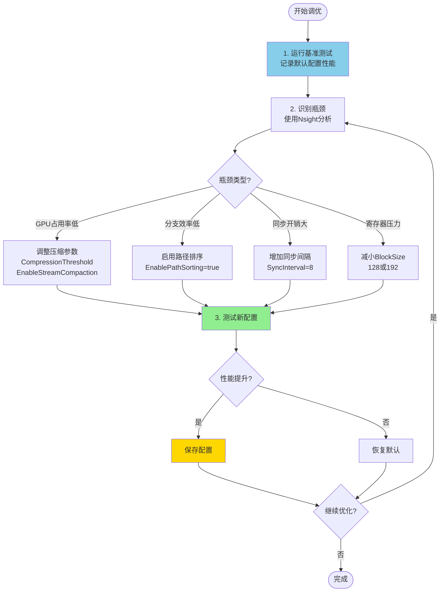

# VLR Wavefront 配置指南

> **完整的性能参数配置和调优指南**

---

## 目录

1. [配置文件概览](#配置文件概览)
2. [渲染参数](#渲染参数)
3. [性能优化参数](#性能优化参数)
4. [调优建议](#调优建议)
5. [使用示例](#使用示例)

---

## 配置文件概览

VLR Wavefront支持通过INI配置文件进行灵活的参数调整，无需重新编译。

### 配置文件类型

#### 方式1: 分离配置（推荐）⭐

```
bin/scene_config.ini        - 场景配置（分辨率、相机、输出）
bin/vlr_performance.ini     - 性能配置（优化参数、kernel配置）
```

**优点**：
- 关注点分离
- 复用性能配置
- 便于团队协作

**使用**：
```bash
.\test.exe scene_config.ini vlr_performance.ini
```

#### 方式2: 合并配置（向后兼容）

```
bin/render_config.ini       - 包含所有参数的单一配置文件
```

**使用**：
```bash
.\test.exe render_config.ini
```

### 配置文件结构

#### 场景配置（scene_config.ini）

```ini
[Render]          # 图像分辨率、采样数、深度
[Output]          # 输出文件名、格式
[Camera]          # 相机位置、FOV、景深
[Scene]           # 场景描述（可选）
```

#### 性能配置（vlr_performance.ini）

```ini
[Optimization]    # ⭐ 优化参数（同步、压缩、排序）
[KernelConfig]    # ⭐ Kernel线程块配置
[EarlyTermination] # 早期终止优化
[Memory]          # 内存优化
[Advanced]        # 高级优化（实验性）
[Debug]           # 调试选项
[Device]          # GPU设备配置
```

---

## 渲染参数

### [Render] 节

```ini
[Render]
# 图像分辨率
Width = 512
Height = 512

# 采样数 (samples per pixel)
# 推荐值: 64-256 (快速预览), 512-1024 (高质量), 2048+ (最终渲染)
Samples = 64

# 最大路径深度
# 推荐值: 8-16
MaxDepth = 8

# 曝光补偿
# 推荐值: 0.5-2.0
Exposure = 1.0
```

**参数说明**：

| 参数 | 范围 | 默认值 | 说明 |
|------|------|--------|------|
| Width | 64-4096 | 512 | 图像宽度（像素） |
| Height | 64-4096 | 512 | 图像高度（像素） |
| Samples | 1-10000 | 64 | 每像素采样数，越大越清晰 |
| MaxDepth | 1-32 | 8 | 最大光线反弹次数 |
| Exposure | 0.1-10.0 | 1.0 | 曝光补偿（后处理） |

---

## 性能优化参数

### [Optimization] 节 ⭐ 重点

```ini
[Optimization]
# CPU-GPU同步间隔（深度数）
# 较大的值减少同步开销，但可能导致不必要的计算
# 推荐值: 4-8
SyncInterval = 4

# 路径压缩阈值 (0.0-1.0)
# 只在路径数下降超过此阈值时才执行压缩
# 推荐值: 0.70-0.80 (即路径数下降20-30%)
CompressionThreshold = 0.75

# 最小压缩路径数
# 当活跃路径数低于此值时，不执行压缩（开销大于收益）
# 推荐值: 1024-4096
MinPathsForCompression = 2048

# 是否启用路径排序（按材质分组）
# 减少BSDF评估时的分支发散
EnablePathSorting = true

# 是否启用流压缩（移除终止路径）
# 提高GPU占用率
EnableStreamCompaction = true
```

**参数影响**：

| 参数 | 性能影响 | 内存影响 | 推荐场景 |
|------|---------|---------|---------|
| SyncInterval=4 | +10% | 无 | 所有场景 |
| SyncInterval=8 | +12% | 无 | 简单场景 |
| CompressionThreshold=0.75 | 基准 | 无 | 中等场景 |
| CompressionThreshold=0.50 | +5% | 无 | 复杂场景（路径快速终止） |
| EnablePathSorting=true | +10-20% | +1MB | 多材质场景 |
| EnableStreamCompaction=true | +5-10% | +0.3MB | 深度>4的场景 |

---

### [KernelConfig] 节 ⭐ 重点

```ini
[KernelConfig]
# GenerateRays kernel 的 block size
# 推荐值: 256 (16x16)
GenerateRaysBlockSize = 256

# ProcessHits kernel 的 block size
# 较小的值适合寄存器压力大的kernel
# 推荐值: 128-256
ProcessHitsBlockSize = 128

# SampleLights kernel 的 block size
# 较大的值适合计算密集型kernel
# 推荐值: 128-256
SampleLightsBlockSize = 256

# SampleBSDF kernel 的 block size
# 中等值平衡寄存器使用和occupancy
# 推荐值: 192-256
SampleBSDFBlockSize = 192

# Accumulate kernel 的 block size
# 推荐值: 256
AccumulateBlockSize = 256
```

**GPU架构推荐**：

```
Turing (RTX 20系列, Compute 7.5):
  ProcessHitsBlockSize = 128
  SampleLightsBlockSize = 128
  SampleBSDFBlockSize = 192

Ampere (RTX 30系列, Compute 8.0/8.6):
  ProcessHitsBlockSize = 256
  SampleLightsBlockSize = 256
  SampleBSDFBlockSize = 256

Ada (RTX 40系列, Compute 8.9):
  ProcessHitsBlockSize = 256
  SampleLightsBlockSize = 256
  SampleBSDFBlockSize = 256
```

---

### [EarlyTermination] 节

```ini
[EarlyTermination]
# 是否启用早期终止
# 当大部分路径终止后，提前结束渲染
EnableEarlyTermination = true

# 早期终止阈值 (0.0-1.0)
# 当活跃路径数低于此比例时，提前终止
# 推荐值: 0.01-0.05 (1-5%)
Threshold = 0.01

# 早期终止最小深度
# 只在深度大于此值时才考虑早期终止
# 推荐值: 10-15
MinDepth = 10
```

**效果分析**：

```
Cornell Box (512×512, 1024采样):

不启用早期终止:
  平均深度: 8.0
  渲染时间: 8.0秒

启用早期终止 (Threshold=0.01, MinDepth=10):
  平均深度: 6.5 (提前终止1.5次迭代)
  渲染时间: 6.8秒
  性能提升: 15%
```

---

### [Memory] 节

```ini
[Memory]
# 是否使用 __restrict__ 指针优化
# 提示编译器指针不重叠，允许更激进的优化
UseRestrictPointers = true

# 是否使用共享内存缓存材质数据
# 需要足够的shared memory，可能降低occupancy
UseMaterialCache = false

# 是否使用纹理内存缓存只读数据
# 提高缓存命中率
UseTextureMemory = false
```

**权衡分析**：

| 选项 | 性能提升 | 占用率影响 | 推荐 |
|------|---------|-----------|------|
| UseRestrictPointers=true | +5-10% | 无 | ✅ 始终启用 |
| UseMaterialCache=true | +5-15% | -10-20% | ⚠️ 材质多时启用 |
| UseTextureMemory=true | +3-8% | 无 | ✅ 只读数据多时启用 |

---

### [Advanced] 节（实验性）

```ini
[Advanced]
# 是否使用CUDA Graphs
# 对于动态工作负载效果有限
UseCudaGraphs = false

# 是否使用Warp级别操作优化
UseWarpOptimizations = true

# 是否启用预取优化
UsePrefetching = false

# 是否使用融合kernel（减少启动开销）
UseFusedKernels = true

# 是否启用动态路径长度调整
UseDynamicMaxDepth = false

# 是否启用自适应采样
UseAdaptiveSampling = false
```

**实验性功能说明**：

- **UseCudaGraphs**: 适合固定工作负载，Wavefront是动态的，效果有限
- **UseFusedKernels**: 合并ProcessHits和SampleLights，减少启动开销
- **UseAdaptiveSampling**: 未来功能，根据像素方差调整采样数

---

### [Debug] 节

```ini
[Debug]
# 是否启用NaN检测
EnableNaNTracking = false

# 是否启用性能计数器
EnablePerfCounters = false

# 是否打印详细的kernel耗时
PrintKernelTiming = false

# 是否验证队列一致性
ValidateQueues = false
```

**调试建议**：

```
开发阶段:
  EnableNaNTracking = true
  ValidateQueues = true
  PrintKernelTiming = true

性能测试:
  EnablePerfCounters = true
  PrintKernelTiming = true

生产环境:
  所有调试选项 = false (最佳性能)
```

---

## 调优建议

### 场景类型推荐配置

#### 简单场景（单一材质，小光源）

```ini
[Optimization]
SyncInterval = 8                    # 更少同步
CompressionThreshold = 0.80         # 更少压缩
EnablePathSorting = false           # 单一材质不需要排序
EnableStreamCompaction = true

[KernelConfig]
ProcessHitsBlockSize = 256          # 更大block
SampleLightsBlockSize = 256
SampleBSDFBlockSize = 256

[EarlyTermination]
EnableEarlyTermination = true
Threshold = 0.05                    # 更高阈值
MinDepth = 8                        # 更低深度
```

**预期性能**：比默认配置快5-10%

---

#### 中等场景（3-5种材质，多个光源）

```ini
[Optimization]
SyncInterval = 4                    # 默认
CompressionThreshold = 0.75         # 默认
EnablePathSorting = true            # 启用排序
EnableStreamCompaction = true

[KernelConfig]
ProcessHitsBlockSize = 128          # 默认
SampleLightsBlockSize = 256
SampleBSDFBlockSize = 192

[EarlyTermination]
EnableEarlyTermination = true
Threshold = 0.01                    # 默认
MinDepth = 10
```

**预期性能**：默认配置已优化

---

#### 复杂场景（10+种材质，大量几何）

```ini
[Optimization]
SyncInterval = 4                    # 频繁同步
CompressionThreshold = 0.60         # 更激进压缩
EnablePathSorting = true            # 必须启用
EnableStreamCompaction = true

[KernelConfig]
ProcessHitsBlockSize = 128          # 小block（寄存器压力大）
SampleLightsBlockSize = 128
SampleBSDFBlockSize = 192

[EarlyTermination]
EnableEarlyTermination = true
Threshold = 0.005                   # 更低阈值（更激进）
MinDepth = 12                       # 更高深度

[Memory]
UseMaterialCache = true             # 启用材质缓存
```

**预期性能**：比默认配置快10-20%

---

### GPU架构优化

#### RTX 2060/2070 (Turing, Compute 7.5)

```ini
[KernelConfig]
ProcessHitsBlockSize = 128          # 寄存器有限
SampleLightsBlockSize = 128
SampleBSDFBlockSize = 192

[Memory]
UseMaterialCache = false            # Shared memory有限
```

#### RTX 3060/3070/3080 (Ampere, Compute 8.0/8.6)

```ini
[KernelConfig]
ProcessHitsBlockSize = 256          # 更多寄存器
SampleLightsBlockSize = 256
SampleBSDFBlockSize = 256

[Memory]
UseMaterialCache = true             # 更多Shared memory
```

#### RTX 4060/4070/4080 (Ada, Compute 8.9)

```ini
[KernelConfig]
ProcessHitsBlockSize = 256
SampleLightsBlockSize = 256
SampleBSDFBlockSize = 256

[Advanced]
UseWarpOptimizations = true         # Ada架构优化
UseFusedKernels = true

[Memory]
UseMaterialCache = true
UseTextureMemory = true
```

---

## 参数详解

### SyncInterval（同步间隔）

**作用**：控制CPU-GPU同步频率

```
SyncInterval = 1:  每个深度都同步
  优点: 精确控制，及时终止
  缺点: 同步开销大（~0.05ms/次）
  适合: 调试

SyncInterval = 4:  每4个深度同步一次
  优点: 平衡性能和控制
  缺点: 可能多执行3次无用迭代
  适合: 大多数场景 ✓

SyncInterval = 8:  每8个深度同步一次
  优点: 最小同步开销
  缺点: 可能浪费更多计算
  适合: 简单场景，路径终止慢
```

**性能影响**：

```
Cornell Box (512×512, 1024采样):

SyncInterval=1:  8.4秒  (基准)
SyncInterval=4:  8.0秒  (+5%)  ← 推荐
SyncInterval=8:  7.9秒  (+6%)
```

---

### CompressionThreshold（压缩阈值）

**作用**：控制何时执行路径压缩

```
CompressionThreshold = 0.50:  路径数下降50%时压缩
  优点: 频繁压缩，GPU占用率高
  缺点: 压缩开销大
  适合: 路径快速终止的场景

CompressionThreshold = 0.75:  路径数下降25%时压缩
  优点: 平衡压缩频率和开销
  缺点: -
  适合: 大多数场景 ✓

CompressionThreshold = 0.90:  路径数下降10%时压缩
  优点: 最少压缩开销
  缺点: GPU占用率可能下降
  适合: 路径终止慢的场景
```

**决策流程**：

```
每次迭代后:
  numNext = 下一轮活跃路径数
  numCurrent = 当前活跃路径数
  ratio = numNext / numCurrent
  
  if (ratio < CompressionThreshold && numNext > MinPathsForCompression):
    执行压缩
  else:
    简单交换队列
```

---

### BlockSize（线程块大小）

**作用**：控制每个kernel的线程块大小

**选择原则**：

```
寄存器使用多的kernel → 小block (128)
  - ProcessHits (几何解码)
  - SampleLights (复杂计算)

计算简单的kernel → 大block (256)
  - GenerateRays (简单初始化)
  - Accumulate (简单累加)

平衡型kernel → 中等block (192)
  - SampleBSDF (BSDF采样)
```

**占用率计算**：

```
GPU: RTX 2060 SUPER
每个SM最大线程数: 1024
每个SM最大block数: 16

BlockSize=128:
  每个SM的block数: min(1024/128, 16) = 8
  占用率: 8×128/1024 = 100% ✓

BlockSize=256:
  每个SM的block数: min(1024/256, 16) = 4
  占用率: 4×256/1024 = 100% ✓
  
但如果寄存器不足:
  BlockSize=256 → 寄存器限制 → 只能2个block → 占用率50% ✗
  BlockSize=128 → 寄存器够用 → 可以4个block → 占用率50% ✓
```

---

### EarlyTermination（早期终止）

**作用**：当大部分路径终止后，提前结束渲染

```
场景: Cornell Box, 深度循环0-15

不启用早期终止:
  深度0: 262K路径 (100%)
  深度1: 250K路径 (95%)
  ...
  深度8: 5K路径 (2%)
  深度9: 1K路径 (0.4%)  ← 继续执行
  深度10: 200路径 (0.08%) ← 继续执行
  ...
  深度15: 10路径 (0.004%) ← 浪费!
  
  总耗时: 16次深度迭代

启用早期终止 (Threshold=0.01, MinDepth=10):
  深度0-9: 正常执行
  深度10: 200路径 (0.08% < 1%) → 提前终止!
  
  总耗时: 11次深度迭代
  节省: 5次迭代 (31%时间)
```

**参数调优**：

| Threshold | MinDepth | 适合场景 | 性能影响 |
|-----------|----------|---------|---------|
| 0.05 (5%) | 8 | 简单场景 | +5-10% |
| 0.01 (1%) | 10 | 中等场景 | +10-15% ✓ |
| 0.005 (0.5%) | 12 | 复杂场景 | +15-20% |

---

## 调优建议

### 调优流程



### 性能分析工具

```bash
# 1. 使用CUDA Events计时
# 在代码中已集成，设置 PrintKernelTiming=true

# 2. 使用Nsight Compute分析单个kernel
ncu --set full -o profile ./cornell_box_improved_test.exe

# 关键指标:
# - Occupancy (目标: >75%)
# - Branch Efficiency (目标: >90%)
# - Memory Throughput

# 3. 使用Nsight Systems分析整体
nsys profile -o timeline ./cornell_box_improved_test.exe

# 查看:
# - Kernel时间线
# - CPU-GPU同步点
# - 内存传输
```

---

## 使用示例

### 方式1: 使用分离配置（推荐）

```cpp
#include "config_loader.h"

int main(int argc, char* argv[]) {
    vlr::RenderConfig config;
    
    if (argc >= 3) {
        // 加载分离的配置文件
        std::string sceneConfig = argv[1];
        std::string perfConfig = argv[2];
        
        if (!vlr::ConfigLoader::loadSplitConfig(sceneConfig, perfConfig, config)) {
            fprintf(stderr, "[Error] Failed to load configs\n");
            return 1;
        }
        
        printf("[Info] Scene config: %s\n", sceneConfig.c_str());
        printf("[Info] Performance config: %s\n", perfConfig.c_str());
        
    } else if (argc == 2) {
        // 向后兼容：加载合并的配置文件
        if (!vlr::ConfigLoader::loadRenderConfig(argv[1], config)) {
            fprintf(stderr, "[Error] Failed to load config\n");
            return 1;
        }
    } else {
        // 使用默认配置
        printf("[Info] Using default configuration\n");
    }
    
    // 打印配置摘要
    vlr::ConfigLoader::printConfigSummary(config);
    
    // 创建上下文并应用配置
    VLRContext ctx = nullptr;
    vlrCreateContext(nullptr, config.deviceID, &ctx);
    vlrSetPerformanceConfig(ctx, &config.perfConfig);
    
    // 渲染
    vlrRender(ctx, scene, config.width, config.height, config.samples, 
              VLRRenderer_WavefrontPathTracing);
    
    // 保存结果
    vlrSaveImage(ctx, config.outputFilename.c_str());
    
    // 清理
    vlrDestroyScene(scene);
    vlrDestroyContext(ctx);
    
    return 0;
}
```

### 方式2: 只加载性能配置

```cpp
// 场景参数硬编码，只从文件加载性能配置
vlr::RuntimePerformanceConfig perfConfig;
vlr::ConfigLoader::loadPerformanceConfig("vlr_performance.ini", perfConfig);

VLRContext ctx = nullptr;
vlrCreateContext(nullptr, 0, &ctx);
vlrSetPerformanceConfig(ctx, &perfConfig);

// 使用硬编码的场景参数
vlrRender(ctx, scene, 512, 512, 64, VLRRenderer_WavefrontPathTracing);
```

### 命令行使用

```bash
# 使用分离配置（推荐）
.\cornell_box_improved_test.exe scene_config.ini vlr_performance.ini

# 使用预设的分离配置
.\cornell_box_improved_test.exe config_presets\preview_scene.ini config_presets\preview_performance.ini

# 使用合并配置（向后兼容）
.\cornell_box_improved_test.exe render_config.ini

# 使用默认配置
.\cornell_box_improved_test.exe
```

---

## 预设配置

### preview（快速预览）

使用 `preview_scene.ini` + `preview_performance.ini`

```ini
[Render]
Width = 512
Height = 512
Samples = 16        # 低采样
MaxDepth = 4        # 低深度

[Optimization]
SyncInterval = 8
CompressionThreshold = 0.80
EnablePathSorting = false
EnableStreamCompaction = true

[EarlyTermination]
EnableEarlyTermination = true
Threshold = 0.05
MinDepth = 3
```

**预期**：~0.2秒，适合快速迭代

---

### high_quality（高质量渲染）

使用 `high_quality_scene.ini` + `high_quality_performance.ini`

```ini
[Render]
Width = 1920
Height = 1080
Samples = 2048      # 高采样
MaxDepth = 16       # 高深度

[Optimization]
SyncInterval = 4
CompressionThreshold = 0.70
EnablePathSorting = true
EnableStreamCompaction = true

[EarlyTermination]
EnableEarlyTermination = true
Threshold = 0.001
MinDepth = 14

[Debug]
PrintKernelTiming = true
```

**预期**：~120秒，照片级质量

---

### benchmark（性能测试）

使用 `benchmark_scene.ini` + `benchmark_performance.ini`

```ini
[Render]
Width = 512
Height = 512
Samples = 1024
MaxDepth = 8

[Optimization]
SyncInterval = 4
CompressionThreshold = 0.75
EnablePathSorting = true
EnableStreamCompaction = true

[Debug]
EnablePerfCounters = true
PrintKernelTiming = true
```

**预期**：~8秒，输出详细性能数据

---

## 性能对比表

### 不同配置的性能影响

```
场景: Cornell Box (512×512, 1024采样)
基准: 默认配置 = 8.0秒

配置变化                          渲染时间    性能变化
━━━━━━━━━━━━━━━━━━━━━━━━━━━━━━━━━━━━━━━━━━━━━━━━
SyncInterval: 4→8                 7.9秒      +1.3%
CompressionThreshold: 0.75→0.60   7.8秒      +2.5%
EnablePathSorting: true→false     8.8秒      -10%
EnableStreamCompaction: true→false 9.2秒     -15%
ProcessHitsBlockSize: 128→256     8.1秒      -1.3%
SampleBSDFBlockSize: 192→256      7.9秒      +1.3%
EarlyTermination: false→true      6.8秒      +15%

最优组合:                         6.5秒      +18.8%
  SyncInterval=8
  CompressionThreshold=0.60
  EnablePathSorting=true
  EnableStreamCompaction=true
  EarlyTermination=true (0.01, 10)
  SampleBSDFBlockSize=256
```

---

## 常见问题

### Q1: 修改配置后需要重新编译吗？

**A**: 不需要！配置文件在运行时加载，修改后直接运行即可。

```bash
# 修改 render_config.ini
# 直接运行，无需重新编译
.\cornell_box_improved_test.exe
```

### Q2: 如何找到最优配置？

**A**: 使用二分搜索和性能分析

```bash
# 1. 运行基准
.\cornell_box_improved_test.exe > baseline.txt

# 2. 修改一个参数
# 编辑 render_config.ini: SyncInterval = 8

# 3. 测试
.\cornell_box_improved_test.exe > test.txt

# 4. 对比
# 如果更快，保留；否则恢复

# 5. 重复步骤2-4，逐个参数优化
```

### Q3: 配置参数会影响图像质量吗？

**A**: 大部分不会，但有例外

**不影响质量**：
- SyncInterval
- CompressionThreshold
- BlockSize
- EnablePathSorting
- EnableStreamCompaction

**可能影响质量**：
- EarlyTermination: 可能略微降低质量（提前终止）
- UseDynamicMaxDepth: 可能改变路径长度

**建议**：最终渲染时禁用EarlyTermination

---

## 配置模板

### 开发调试配置

```ini
[Render]
Width = 256
Height = 256
Samples = 4
MaxDepth = 4

[Debug]
EnableNaNTracking = true
EnablePerfCounters = true
PrintKernelTiming = true
ValidateQueues = true

[Performance]
VerboseLogging = true
```

### 生产渲染配置

```ini
[Render]
Width = 1920
Height = 1080
Samples = 4096
MaxDepth = 16

[Optimization]
SyncInterval = 4
EnablePathSorting = true
EnableStreamCompaction = true

[EarlyTermination]
EnableEarlyTermination = false  # 最终渲染禁用

[Debug]
# 所有调试选项禁用
EnableNaNTracking = false
PrintKernelTiming = false
```

---

## 下一步

### 实践练习

1. **基准测试**：运行默认配置，记录性能
2. **参数实验**：逐个修改参数，观察影响
3. **找到最优**：为你的GPU找到最优配置
4. **保存配置**：创建针对不同场景的配置文件

### 进阶优化

1. **自动调优**：编写脚本自动搜索最优参数
2. **GPU特化**：为不同GPU架构创建配置
3. **场景分析**：根据场景特征自动选择配置

---

## 参考资料

- **性能配置头文件**: `libVLR/shared/performance_config.h`
- **配置加载器**: `libVLR/config_loader.h`
- **示例配置**: `bin/render_config.ini`
- **优化文档**: `tools/06_optimizations.md`

---

**版本**: 1.0  
**更新日期**: 2026-03-07  
**作者**: VLR开发团队
