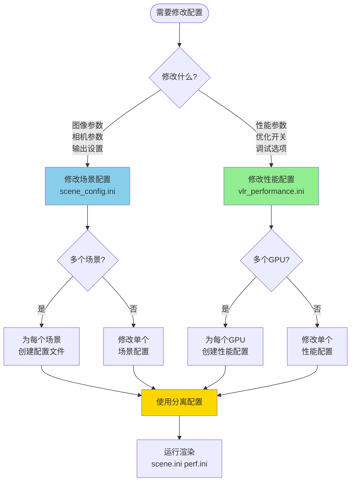

# 配置文件对照表

> **快速查找：哪个参数在哪个配置文件中**

---

## 配置文件分类

### 📄 场景配置文件

包含与具体场景相关的参数（测试程序级别）

**文件**：
- `bin/scene_config.ini` - 主场景配置
- `bin/config_presets/*_scene.ini` - 预设场景配置

**包含的节**：

| 节 | 参数 | 说明 |
|---|------|------|
| [Render] | Width, Height | 图像分辨率 |
| | Samples | 每像素采样数 |
| | MaxDepth | 最大路径深度 |
| | Exposure | 曝光补偿 |
| [Output] | Filename | 输出文件名 |
| | Format | 图像格式 (png/jpg/exr) |
| [Camera] | PositionX/Y/Z | 相机位置 |
| | TargetX/Y/Z | 相机目标点 |
| | FOV | 视场角 |
| | LensRadius | 镜头半径（景深） |
| | FocusDistance | 焦距 |
| [Scene] | SceneType | 场景类型（描述性） |
| | Description | 场景描述 |

---

### ⚙️ 性能配置文件

包含与渲染器核心性能相关的参数（库级别）

**文件**：
- `bin/vlr_performance.ini` - 主性能配置
- `bin/config_presets/*_performance.ini` - 预设性能配置

**包含的节**：

| 节 | 参数 | 说明 | 性能影响 |
|---|------|------|---------|
| **[Optimization]** | | | |
| | SyncInterval | CPU-GPU同步间隔 | +5-10% |
| | CompressionThreshold | 路径压缩阈值 | +2-5% |
| | MinPathsForCompression | 最小压缩路径数 | +1-3% |
| | EnablePathSorting | 路径排序开关 | +10-20% |
| | EnableStreamCompaction | 流压缩开关 | +5-10% |
| **[KernelConfig]** | | | |
| | GenerateRaysBlockSize | 生成光线线程块 | ±2% |
| | ProcessHitsBlockSize | 处理命中线程块 | ±5% |
| | SampleLightsBlockSize | 光源采样线程块 | ±3% |
| | SampleBSDFBlockSize | BSDF采样线程块 | ±3% |
| | AccumulateBlockSize | 累积结果线程块 | ±1% |
| **[EarlyTermination]** | | | |
| | EnableEarlyTermination | 早期终止开关 | +10-20% |
| | Threshold | 终止阈值 | - |
| | MinDepth | 最小深度 | - |
| **[Memory]** | | | |
| | UseRestrictPointers | __restrict__优化 | +5-10% |
| | UseMaterialCache | 材质缓存 | +5-15% |
| | UseTextureMemory | 纹理内存 | +3-8% |
| **[Advanced]** | | | |
| | UseCudaGraphs | CUDA Graphs | 有限 |
| | UseWarpOptimizations | Warp优化 | +5-10% |
| | UsePrefetching | 预取 | 实验性 |
| | UseFusedKernels | 融合kernel | +3-5% |
| | UseDynamicMaxDepth | 动态深度 | 未实现 |
| | UseAdaptiveSampling | 自适应采样 | 未实现 |
| **[Debug]** | | | |
| | EnableNaNTracking | NaN检测 | -5% |
| | EnablePerfCounters | 性能计数器 | -2% |
| | PrintKernelTiming | 打印耗时 | -1% |
| | ValidateQueues | 队列验证 | -10% |
| **[Device]** | | | |
| | DeviceID | GPU设备ID | - |
| | VerboseLogging | 详细日志 | -1% |

---

## 参数查找表

### 按功能分类

#### 图像质量相关 → 场景配置

```
想调整...                    修改文件                  参数
━━━━━━━━━━━━━━━━━━━━━━━━━━━━━━━━━━━━━━━━━━━━━━━━━━━━━━━━━━
图像分辨率                   scene_config.ini         [Render] Width, Height
图像清晰度                   scene_config.ini         [Render] Samples
光线反弹次数                 scene_config.ini         [Render] MaxDepth
图像亮度                     scene_config.ini         [Render] Exposure
输出文件名                   scene_config.ini         [Output] Filename
相机位置                     scene_config.ini         [Camera] PositionX/Y/Z
景深效果                     scene_config.ini         [Camera] LensRadius
```

#### 渲染速度相关 → 性能配置

```
想优化...                    修改文件                  参数
━━━━━━━━━━━━━━━━━━━━━━━━━━━━━━━━━━━━━━━━━━━━━━━━━━━━━━━━━━
CPU-GPU同步开销              vlr_performance.ini      [Optimization] SyncInterval
路径压缩频率                 vlr_performance.ini      [Optimization] CompressionThreshold
分支发散（多材质）           vlr_performance.ini      [Optimization] EnablePathSorting
GPU占用率                    vlr_performance.ini      [Optimization] EnableStreamCompaction
提前终止                     vlr_performance.ini      [EarlyTermination] 所有参数
Kernel性能                   vlr_performance.ini      [KernelConfig] 所有BlockSize
内存访问                     vlr_performance.ini      [Memory] 所有参数
```

#### 调试相关 → 性能配置

```
想调试...                    修改文件                  参数
━━━━━━━━━━━━━━━━━━━━━━━━━━━━━━━━━━━━━━━━━━━━━━━━━━━━━━━━━━
NaN问题                      vlr_performance.ini      [Debug] EnableNaNTracking
性能瓶颈                     vlr_performance.ini      [Debug] EnablePerfCounters
Kernel耗时                   vlr_performance.ini      [Debug] PrintKernelTiming
队列正确性                   vlr_performance.ini      [Debug] ValidateQueues
选择GPU                      vlr_performance.ini      [Device] DeviceID
```

---

## 使用决策树



---

## 实际示例

### 示例1: 调整图像质量

**需求**：提高图像质量，从64采样增加到1024采样

**修改文件**：`scene_config.ini`（场景配置）

```ini
[Render]
Samples = 1024      # 修改这里：64 → 1024
```

**不需要修改**：`vlr_performance.ini`（性能配置保持不变）

**运行**：
```bash
.\test.exe scene_config.ini vlr_performance.ini
```

---

### 示例2: 优化渲染速度

**需求**：提高渲染速度，启用路径排序

**修改文件**：`vlr_performance.ini`（性能配置）

```ini
[Optimization]
EnablePathSorting = true    # 修改这里：false → true
SyncInterval = 8            # 修改这里：4 → 8
```

**不需要修改**：`scene_config.ini`（场景配置保持不变）

**运行**：
```bash
.\test.exe scene_config.ini vlr_performance.ini
```

---

### 示例3: 切换GPU

**需求**：在RTX 2060和RTX 3080之间切换

**创建两个性能配置**：

`rtx2060_performance.ini`:
```ini
[KernelConfig]
ProcessHitsBlockSize = 128
SampleLightsBlockSize = 128
SampleBSDFBlockSize = 192

[Memory]
UseMaterialCache = false

[Device]
DeviceID = 0
```

`rtx3080_performance.ini`:
```ini
[KernelConfig]
ProcessHitsBlockSize = 256
SampleLightsBlockSize = 256
SampleBSDFBlockSize = 256

[Memory]
UseMaterialCache = true

[Device]
DeviceID = 0
```

**使用**：
```bash
# 在RTX 2060上运行
.\test.exe my_scene.ini rtx2060_performance.ini

# 在RTX 3080上运行
.\test.exe my_scene.ini rtx3080_performance.ini
```

---

### 示例4: 批量渲染多个场景

**场景配置**：
- `scene1.ini` - Cornell Box
- `scene2.ini` - Glass Spheres
- `scene3.ini` - Dragon

**性能配置**：
- `optimized_performance.ini` - 统一的优化配置

**批处理脚本** `render_all.bat`:
```batch
@echo off
set PERF=optimized_performance.ini

echo [1/3] Rendering Cornell Box...
cornell_box_test.exe scene1.ini %PERF%

echo [2/3] Rendering Glass Spheres...
glass_spheres_test.exe scene2.ini %PERF%

echo [3/3] Rendering Dragon...
dragon_test.exe scene3.ini %PERF%

echo Done!
```

---

## 配置文件对照表

### 完整参数映射

| 参数 | 场景配置 | 性能配置 | 说明 |
|------|---------|---------|------|
| Width | ✅ | ❌ | 图像宽度 |
| Height | ✅ | ❌ | 图像高度 |
| Samples | ✅ | ❌ | 采样数 |
| MaxDepth | ✅ | ❌ | 最大深度 |
| Exposure | ✅ | ❌ | 曝光 |
| Filename | ✅ | ❌ | 输出文件名 |
| Format | ✅ | ❌ | 图像格式 |
| Camera* | ✅ | ❌ | 所有相机参数 |
| SyncInterval | ❌ | ✅ | 同步间隔 |
| CompressionThreshold | ❌ | ✅ | 压缩阈值 |
| EnablePathSorting | ❌ | ✅ | 路径排序 |
| *BlockSize | ❌ | ✅ | 所有线程块大小 |
| EarlyTermination* | ❌ | ✅ | 所有早期终止参数 |
| Memory* | ❌ | ✅ | 所有内存优化 |
| Advanced* | ❌ | ✅ | 所有高级优化 |
| Debug* | ❌ | ✅ | 所有调试选项 |
| DeviceID | ❌ | ✅ | GPU设备ID |

---

## 快速查找

### 我想修改...

#### 图像相关

```
分辨率          → scene_config.ini → [Render] Width, Height
采样数          → scene_config.ini → [Render] Samples
路径深度        → scene_config.ini → [Render] MaxDepth
图像亮度        → scene_config.ini → [Render] Exposure
输出文件        → scene_config.ini → [Output] Filename, Format
```

#### 相机相关

```
相机位置        → scene_config.ini → [Camera] PositionX/Y/Z
相机朝向        → scene_config.ini → [Camera] TargetX/Y/Z
视野范围        → scene_config.ini → [Camera] FOV
景深效果        → scene_config.ini → [Camera] LensRadius, FocusDistance
```

#### 性能优化

```
同步频率        → vlr_performance.ini → [Optimization] SyncInterval
压缩策略        → vlr_performance.ini → [Optimization] CompressionThreshold
路径排序        → vlr_performance.ini → [Optimization] EnablePathSorting
流压缩          → vlr_performance.ini → [Optimization] EnableStreamCompaction
早期终止        → vlr_performance.ini → [EarlyTermination] 所有参数
```

#### Kernel优化

```
线程块大小      → vlr_performance.ini → [KernelConfig] *BlockSize
内存优化        → vlr_performance.ini → [Memory] 所有参数
高级优化        → vlr_performance.ini → [Advanced] 所有参数
```

#### 调试

```
NaN检测         → vlr_performance.ini → [Debug] EnableNaNTracking
性能计数        → vlr_performance.ini → [Debug] EnablePerfCounters
耗时统计        → vlr_performance.ini → [Debug] PrintKernelTiming
队列验证        → vlr_performance.ini → [Debug] ValidateQueues
GPU选择         → vlr_performance.ini → [Device] DeviceID
日志级别        → vlr_performance.ini → [Device] VerboseLogging
```

---

## 配置文件示例

### 最小场景配置

```ini
# minimal_scene.ini
[Render]
Width = 512
Height = 512
Samples = 64
MaxDepth = 8
Exposure = 1.0

[Output]
Filename = output.png
Format = png
```

### 最小性能配置

```ini
# minimal_performance.ini
[Optimization]
SyncInterval = 4
CompressionThreshold = 0.75
EnablePathSorting = true
EnableStreamCompaction = true

[KernelConfig]
ProcessHitsBlockSize = 128
SampleLightsBlockSize = 256
SampleBSDFBlockSize = 192
```

---

## 配置组合矩阵

### 预设配置组合

| 预设名称 | 场景配置 | 性能配置 | 用途 |
|---------|---------|---------|------|
| preview | preview_scene.ini | preview_performance.ini | 快速预览 |
| benchmark | benchmark_scene.ini | benchmark_performance.ini | 性能测试 |
| high_quality | high_quality_scene.ini | high_quality_performance.ini | 高质量渲染 |
| debug | debug_scene.ini | debug_performance.ini | 调试 |

### 自定义组合

```
场景配置              性能配置                    用途
━━━━━━━━━━━━━━━━━━━━━━━━━━━━━━━━━━━━━━━━━━━━━━━━━━━━━━━━━━━━━━
cornell_box.ini     rtx3080_optimized.ini      生产渲染
cornell_box.ini     debug_performance.ini      调试场景
glass_spheres.ini   rtx3080_optimized.ini      生产渲染
preview_scene.ini   rtx2060_performance.ini    在低端GPU预览
hq_scene.ini        high_quality_perf.ini      最终输出
```

---

## 迁移映射

### 从合并配置迁移

如果你有一个合并的配置文件（如`render_config.ini`），可以这样拆分：

```
render_config.ini (合并)
├── [Render]                → scene_config.ini
├── [Output]                → scene_config.ini
├── [Camera]                → scene_config.ini
├── [Performance]           → vlr_performance.ini ([Device])
├── [Optimization]          → vlr_performance.ini
├── [KernelConfig]          → vlr_performance.ini
├── [EarlyTermination]      → vlr_performance.ini
├── [Memory]                → vlr_performance.ini
├── [Advanced]              → vlr_performance.ini
└── [Debug]                 → vlr_performance.ini
```

**自动拆分脚本**：

```bash
python scripts\split_config.py render_config.ini scene_config.ini vlr_performance.ini
```

（注：需要创建此脚本，或手动拆分）

---

## 常见组合

### 开发阶段

```bash
# 快速迭代
.\test.exe preview_scene.ini preview_performance.ini

# 调试问题
.\test.exe debug_scene.ini debug_performance.ini
```

### 测试阶段

```bash
# 性能测试
.\test.exe benchmark_scene.ini benchmark_performance.ini

# 质量验证
.\test.exe benchmark_scene.ini high_quality_performance.ini
```

### 生产阶段

```bash
# 最终渲染
.\test.exe final_scene.ini high_quality_performance.ini
```

---

## 工具支持

### 验证工具

```bash
# 验证场景配置
python scripts\validate_config.py scene_config.ini

# 验证性能配置
python scripts\validate_config.py vlr_performance.ini
```

### 生成工具

```bash
# 生成场景配置
python scripts\generate_config.py --type scene --output my_scene.ini

# 生成性能配置
python scripts\generate_config.py --type performance --gpu ampere --output my_perf.ini
```

### 对比工具

```bash
# 对比不同性能配置（场景固定）
python scripts\compare_configs.py \
  --scene benchmark_scene.ini \
  perf1.ini perf2.ini perf3.ini
```

---

## 参考文档

- **[CONFIGURATION_GUIDE.md](CONFIGURATION_GUIDE.md)** - 完整配置指南
- **[CONFIG_USAGE_EXAMPLES.md](CONFIG_USAGE_EXAMPLES.md)** - 使用示例
- **[CONFIG_QUICK_REFERENCE.md](CONFIG_QUICK_REFERENCE.md)** - 快速参考
- **[CONFIG_SYSTEM_OVERVIEW.md](CONFIG_SYSTEM_OVERVIEW.md)** - 系统架构

---

**版本**: 1.0  
**更新日期**: 2026-03-07  
**作者**: VLR开发团队
