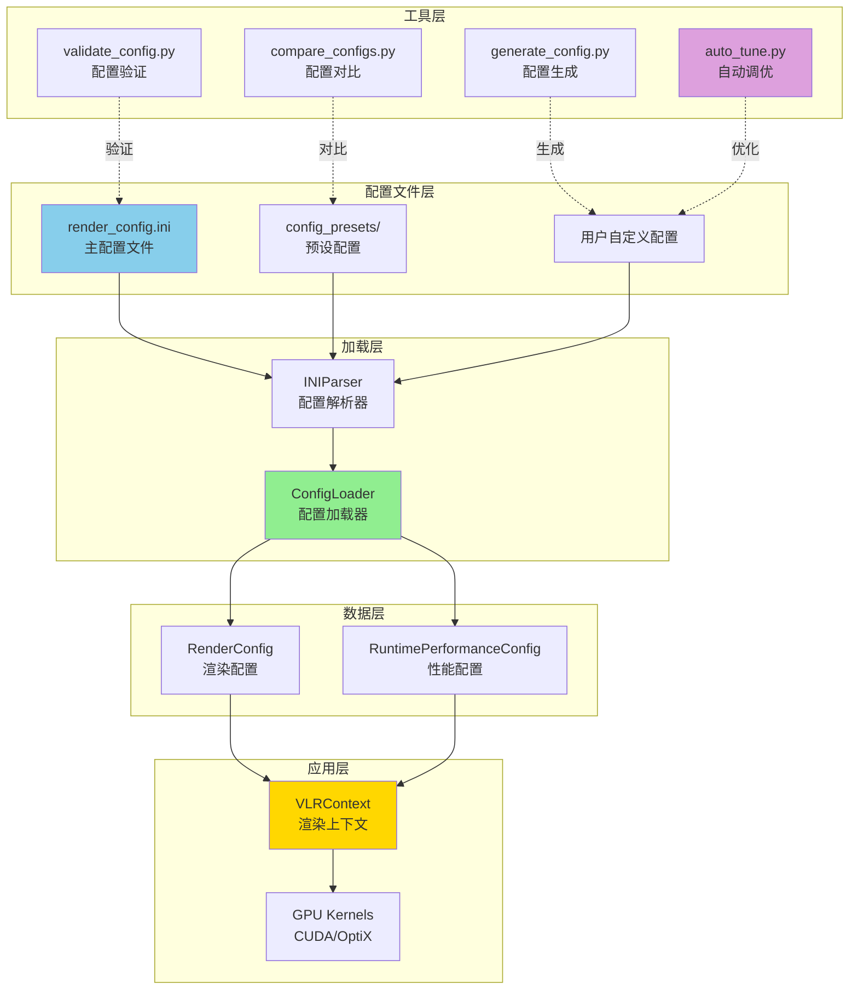
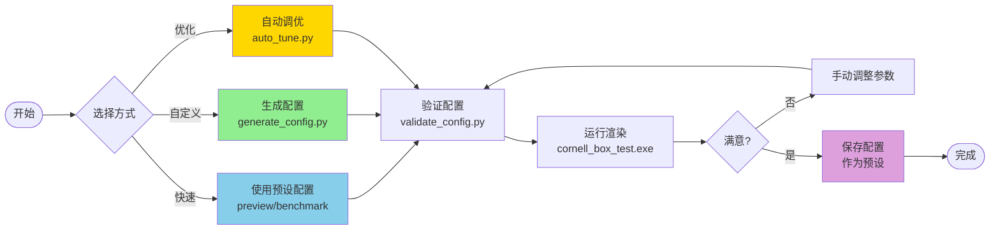
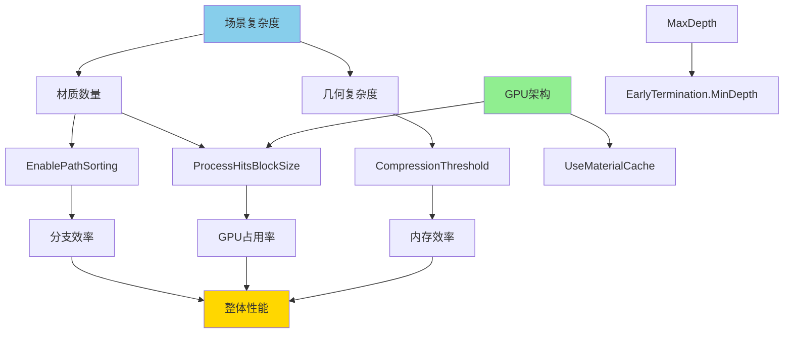
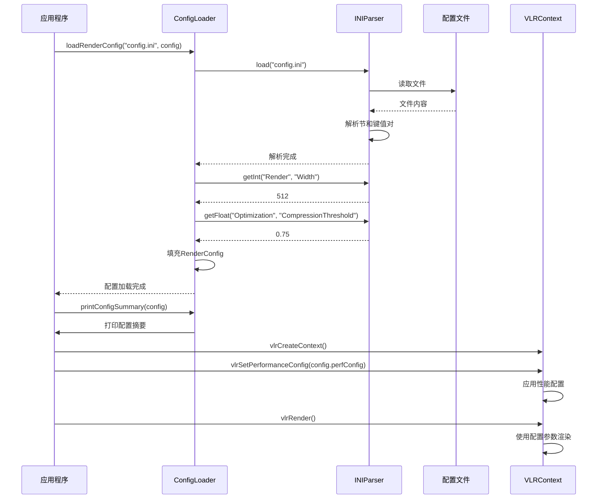
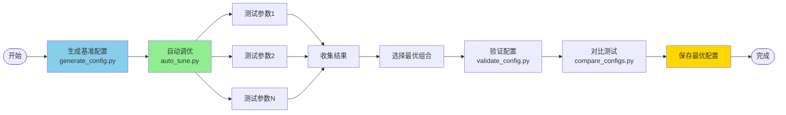

# 配置系统架构总览

> **VLR Wavefront 配置系统的完整设计和实现**

---

## 系统架构



---

## 配置文件结构

### 主配置文件（render_config.ini）

```
bin/render_config.ini
├── [Render]          # 基本渲染参数（分辨率、采样、深度）
├── [Output]          # 输出设置（文件名、格式）
├── [Camera]          # 相机参数（位置、FOV、景深）
├── [Performance]     # 性能设置（GPU ID、日志）
├── [Optimization]    # ⭐ 优化参数（同步、压缩、排序）
├── [KernelConfig]    # ⭐ Kernel配置（线程块大小）
├── [EarlyTermination] # 早期终止参数
├── [Memory]          # 内存优化开关
├── [Advanced]        # 高级优化（实验性）
└── [Debug]           # 调试选项
```

### 预设配置

```
bin/config_presets/
├── README.md           # 预设说明
├── preview.ini         # 快速预览（16采样，~0.2s）
├── benchmark.ini       # 性能测试（1024采样，~8s）
├── high_quality.ini    # 高质量（2048采样，~120s）
└── debug.ini           # 调试（4采样，~0.05s）
```

---

## 核心组件

### 1. INIParser（配置解析器）

**位置**：`libVLR/config_loader.h:71-130`

**功能**：
- 解析INI格式配置文件
- 支持节（Section）和键值对
- 支持注释（# 或 ;）
- 类型转换（string/int/float/bool）

**示例**：

```cpp
INIParser parser;
parser.load("render_config.ini");

int width = parser.getInt("Render", "Width", 512);
float threshold = parser.getFloat("Optimization", "CompressionThreshold", 0.75f);
bool sorting = parser.getBool("Optimization", "EnablePathSorting", true);
```

---

### 2. ConfigLoader（配置加载器）

**位置**：`libVLR/config_loader.h:132-227`

**功能**：
- 加载完整的渲染配置
- 映射INI参数到C++结构体
- 提供默认值
- 打印配置摘要

**API**：

```cpp
class ConfigLoader {
public:
    // 加载配置
    static bool loadRenderConfig(const std::string& filename, RenderConfig& config);
    
    // 保存配置
    static bool saveRenderConfig(const std::string& filename, const RenderConfig& config);
    
    // 打印摘要
    static void printConfigSummary(const RenderConfig& config);
};
```

**使用示例**：

```cpp
vlr::RenderConfig config;
if (vlr::ConfigLoader::loadRenderConfig("render_config.ini", config)) {
    vlr::ConfigLoader::printConfigSummary(config);
    // 使用config...
}
```

---

### 3. RuntimePerformanceConfig（性能配置）

**位置**：`libVLR/config_loader.h:18-59`

**结构**：

```cpp
struct RuntimePerformanceConfig {
    // 同步优化
    uint32_t syncInterval;
    
    // 路径压缩优化
    float compressionThreshold;
    uint32_t minPathsForCompression;
    bool enablePathSorting;
    bool enableStreamCompaction;
    
    // Kernel线程块配置
    uint32_t generateRaysBlockSize;
    uint32_t processHitsBlockSize;
    uint32_t sampleLightsBlockSize;
    uint32_t sampleBSDFBlockSize;
    uint32_t accumulateBlockSize;
    
    // 早期终止优化
    bool enableEarlyTermination;
    float earlyTerminationThreshold;
    uint32_t earlyTerminationMinDepth;
    
    // 内存优化
    bool useRestrictPointers;
    bool useMaterialCache;
    bool useTextureMemory;
    
    // 高级优化
    bool useCudaGraphs;
    bool useWarpOptimizations;
    bool usePrefetching;
    bool useFusedKernels;
    bool useDynamicMaxDepth;
    bool useAdaptiveSampling;
    
    // 调试选项
    bool enableNaNTracking;
    bool enablePerfCounters;
    bool printKernelTiming;
    bool validateQueues;
};
```

---

## 工具脚本

### 1. validate_config.py（配置验证）

**功能**：
- 验证参数范围
- 检查参数类型
- 检测参数冲突
- 提供优化建议

**用法**：

```bash
python scripts\validate_config.py my_config.ini
```

**输出**：

```
✓ 配置文件有效，没有发现问题
或
❌ 发现 2 个错误
⚠️  发现 3 个警告
```

---

### 2. generate_config.py（配置生成）

**功能**：
- 基于场景类型生成配置
- 基于GPU架构优化
- 快速创建配置文件

**用法**：

```bash
python scripts\generate_config.py --scene complex --gpu ampere --output my.ini
```

**场景类型**：
- `simple`: 简单场景
- `medium`: 中等场景
- `complex`: 复杂场景

**GPU架构**：
- `turing`: RTX 20系列
- `ampere`: RTX 30系列
- `ada`: RTX 40系列

---

### 3. compare_configs.py（配置对比）

**功能**：
- 运行多个配置的基准测试
- 对比性能差异
- 显示关键参数对比表

**用法**：

```bash
python scripts\compare_configs.py config1.ini config2.ini config3.ini
```

**输出**：

```
配置文件                       时间         吞吐量          相对性能
----------------------------------------------------------------------
preview.ini                    0.182s       143.8 Msamp/s   1.00x ✓
benchmark.ini                  8.020s       33.5 Msamp/s    0.02x
```

---

### 4. auto_tune.py（自动调优）

**功能**：
- 自动测试不同参数组合
- 找到最优配置
- 保存优化后的配置

**用法**：

```bash
python scripts\auto_tune.py --config benchmark.ini --output optimized.ini
```

**调优参数**：
- SyncInterval: [1, 2, 4, 8]
- CompressionThreshold: [0.50, 0.60, 0.70, 0.75, 0.80, 0.90]
- BlockSize: [128, 192, 256]
- EarlyTermination: [0.005, 0.01, 0.02, 0.05]

**预期耗时**：~15-30分钟

---

## 配置流程

### 开发流程



---

## 参数依赖关系

### 参数影响图



### 参数冲突

| 参数A | 参数B | 冲突 | 解决方案 |
|-------|-------|------|---------|
| UseMaterialCache=true | ProcessHitsBlockSize=256 | 可能降低occupancy | 使用BlockSize=192 |
| EarlyTermination.MinDepth | Render.MaxDepth | MinDepth >= MaxDepth | MinDepth < MaxDepth |
| UseCudaGraphs=true | 动态工作负载 | 效果有限 | 禁用CudaGraphs |
| CompressionThreshold=0.90 | EnableStreamCompaction=true | 压缩不频繁 | 降低阈值到0.75 |

---

## 性能矩阵

### 参数对性能的影响

```
                        简单场景  中等场景  复杂场景
━━━━━━━━━━━━━━━━━━━━━━━━━━━━━━━━━━━━━━━━━━━━━━━━
SyncInterval=8          +8%      +5%      +3%
CompressionThreshold=0.60  +2%   +3%      +5%
EnablePathSorting       -2%      +10%     +20%
EnableStreamCompaction  +5%      +8%      +10%
EarlyTermination        +10%     +15%     +20%
BlockSize=256           +5%      +2%      -3%
UseMaterialCache        +2%      +5%      +10%
━━━━━━━━━━━━━━━━━━━━━━━━━━━━━━━━━━━━━━━━━━━━━━━━

最优组合:               +15%     +25%     +35%
```

### GPU架构对比

```
                        Turing    Ampere    Ada
━━━━━━━━━━━━━━━━━━━━━━━━━━━━━━━━━━━━━━━━━━━━━━━━
推荐BlockSize           128       256       256
UseMaterialCache        false     true      true
UseWarpOptimizations    true      true      true
相对性能（基准=1.0x）    1.0x      1.3x      1.5x
━━━━━━━━━━━━━━━━━━━━━━━━━━━━━━━━━━━━━━━━━━━━━━━━
```

---

## 配置参数分类

### 第一优先级（必须调优）⭐⭐⭐

这些参数对性能影响最大：

| 参数 | 影响 | 推荐值 |
|------|------|--------|
| EnablePathSorting | +10-20% | true（多材质） |
| EarlyTermination | +10-20% | true（非最终渲染） |
| SyncInterval | +5-10% | 4-8 |
| CompressionThreshold | +2-5% | 0.60-0.80 |

### 第二优先级（GPU相关）⭐⭐

这些参数取决于GPU架构：

| 参数 | 影响 | Turing | Ampere/Ada |
|------|------|--------|-----------|
| ProcessHitsBlockSize | ±5% | 128 | 256 |
| SampleLightsBlockSize | ±3% | 128 | 256 |
| SampleBSDFBlockSize | ±3% | 192 | 256 |
| UseMaterialCache | +5-10% | false | true |

### 第三优先级（微调）⭐

这些参数影响较小：

| 参数 | 影响 | 说明 |
|------|------|------|
| MinPathsForCompression | +1-2% | 低于此值不压缩 |
| EarlyTermination.MinDepth | +1-2% | 最小深度 |
| UseTextureMemory | +1-3% | 只读数据缓存 |

### 实验性（不推荐修改）

| 参数 | 状态 | 说明 |
|------|------|------|
| UseCudaGraphs | ⚠️ 禁用 | 动态工作负载效果有限 |
| UseFusedKernels | ✓ 启用 | 减少启动开销 |
| UseDynamicMaxDepth | 🚧 未实现 | 未来功能 |
| UseAdaptiveSampling | 🚧 未实现 | 未来功能 |

---

## 配置加载流程

### 运行时流程



---

## 配置验证规则

### 必须满足的约束

```cpp
// 1. 分辨率
Width >= 64 && Width <= 8192
Height >= 64 && Height <= 8192
Width % 32 == 0  // 推荐
Height % 32 == 0 // 推荐

// 2. 采样和深度
Samples >= 1
MaxDepth >= 1 && MaxDepth <= 32

// 3. BlockSize
BlockSize % 32 == 0  // 必须是warp大小的倍数
BlockSize >= 32 && BlockSize <= 1024

// 4. 阈值
CompressionThreshold >= 0.0 && CompressionThreshold <= 1.0
EarlyTermination.Threshold >= 0.0 && EarlyTermination.Threshold <= 1.0

// 5. 逻辑约束
EarlyTermination.MinDepth < Render.MaxDepth
```

### 推荐范围

```cpp
// 性能推荐
SyncInterval: [4, 8]
CompressionThreshold: [0.60, 0.80]
ProcessHitsBlockSize: [128, 256]
EarlyTermination.Threshold: [0.005, 0.05]

// 质量推荐
Samples: [64, 2048]
MaxDepth: [8, 16]
```

---

## 调优工作流

### 手动调优


### 自动调优



---

## 扩展性

### 添加新参数

#### 1. 更新INI文件

```ini
[NewSection]
NewParameter = 42
```

#### 2. 更新RuntimePerformanceConfig

```cpp
struct RuntimePerformanceConfig {
    // ... 现有参数 ...
    
    // 新参数
    uint32_t newParameter = 42;
};
```

#### 3. 更新ConfigLoader

```cpp
static bool loadRenderConfig(...) {
    // ... 现有加载代码 ...
    
    // 加载新参数
    perf.newParameter = parser.getInt("NewSection", "NewParameter", 42);
    
    return true;
}
```

#### 4. 更新验证器

```python
def validate_new_section(self, config):
    """验证[NewSection]节"""
    section = 'NewSection'
    
    new_param = config.getint(section, 'NewParameter', fallback=42)
    if new_param < 0 or new_param > 100:
        self.errors.append(f"[{section}] NewParameter={new_param} 必须在 [0, 100]")
```

---

## 最佳实践

### 配置管理

```bash
# 1. 为每个项目创建配置目录
mkdir my_project_configs

# 2. 从预设开始
copy bin\config_presets\benchmark.ini my_project_configs\base.ini

# 3. 调优
python scripts\auto_tune.py --config my_project_configs\base.ini --output my_project_configs\optimized.ini

# 4. 验证
python scripts\validate_config.py my_project_configs\optimized.ini

# 5. 版本控制
git add my_project_configs\
git commit -m "Add optimized config for my project"
```

### 团队协作

```bash
# 团队成员A: 创建配置
python scripts\generate_config.py --scene complex --gpu ampere --output team_config.ini
git add team_config.ini
git commit -m "Add team config"
git push

# 团队成员B: 使用配置
git pull
.\cornell_box_improved_test.exe team_config.ini
```

---

## 性能监控

### 集成性能计数器

```cpp
// 在context.cpp中
if (perfConfig.enablePerfCounters) {
    cudaEvent_t start, stop;
    cudaEventCreate(&start);
    cudaEventCreate(&stop);
    
    cudaEventRecord(start);
    // ... kernel launch ...
    cudaEventRecord(stop);
    cudaEventSynchronize(stop);
    
    float ms = 0;
    cudaEventElapsedTime(&ms, start, stop);
    printf("Kernel time: %.3f ms\n", ms);
}
```

### 输出格式

```
═══════════════════════════════════════════════════════════
  VLR Wavefront 渲染配置
═══════════════════════════════════════════════════════════
  图像: 512x512, 1024 samples, max depth 8
  输出: cornell_box_improved.png
───────────────────────────────────────────────────────────
  优化配置:
    同步间隔: 4 深度
    压缩阈值: 0.75
    路径排序: 启用
    流压缩: 启用
    早期终止: 启用 (阈值=1.00%, 最小深度=10)
───────────────────────────────────────────────────────────
  Kernel配置:
    ProcessHits: 128 threads/block
    SampleLights: 256 threads/block
    SampleBSDF: 192 threads/block
═══════════════════════════════════════════════════════════
```

---

## 未来扩展

### 计划功能

1. **自适应配置**
   - 根据场景自动选择参数
   - 运行时动态调整

2. **配置模板**
   - 更多预设（室内、室外、玻璃、金属等）
   - GPU特化模板

3. **性能预测**
   - 根据配置预测渲染时间
   - 内存使用估算

4. **Web界面**
   - 图形化配置编辑器
   - 实时预览

---

## 参考文档

### 核心文档

1. **[CONFIGURATION_GUIDE.md](CONFIGURATION_GUIDE.md)** - 完整配置指南
2. **[CONFIG_QUICK_REFERENCE.md](CONFIG_QUICK_REFERENCE.md)** - 快速参考卡片
3. **[../scripts/README.md](../scripts/README.md)** - 工具脚本文档

### 相关文档

1. **[../tools/06_optimizations.md](../tools/06_optimizations.md)** - 优化技术
2. **[PERFORMANCE_REPORT.md](PERFORMANCE_REPORT.md)** - 性能报告
3. **[../tools/07_getting_started.md](../tools/07_getting_started.md)** - 入门教程

---

## 总结

### 配置系统优势

✅ **灵活性**：无需重新编译即可调整参数  
✅ **可维护性**：集中管理所有配置  
✅ **可复现性**：配置文件可版本控制  
✅ **易用性**：预设配置开箱即用  
✅ **可扩展性**：轻松添加新参数  

### 关键设计决策

1. **INI格式**：简单、易读、广泛支持
2. **预设配置**：覆盖常见使用场景
3. **验证工具**：防止无效配置
4. **自动调优**：降低调优门槛
5. **文档完善**：详细的使用指南

---

**版本**: 1.0  
**更新日期**: 2026-03-07  
**作者**: VLR开发团队
