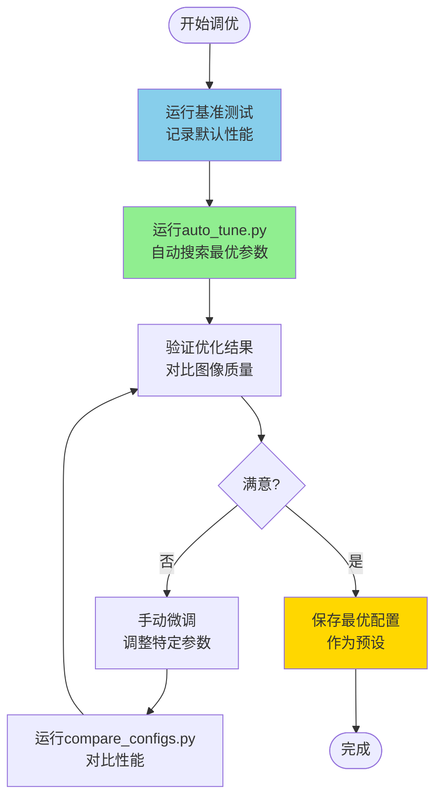

# 调优脚本

本目录包含用于性能分析和自动调优的Python脚本。

---

## 📁 脚本列表

### split_config.py - 配置拆分

将合并的配置文件拆分为场景配置和性能配置。

**功能**：
- 自动识别场景和性能参数
- 拆分为两个独立文件
- 保留所有参数和注释

**用法**：

```bash
# 拆分合并的配置
python split_config.py render_config.ini scene.ini performance.ini

# 拆分预设配置
python split_config.py config_presets\benchmark.ini benchmark_scene.ini benchmark_perf.ini

# 批量拆分
for %f in (*.ini) do python split_config.py %f %~nf_scene.ini %~nf_perf.ini
```

**示例输出**：

```
==============================================================
  VLR Wavefront 配置拆分工具
==============================================================
  输入: render_config.ini
  场景配置: scene.ini
  性能配置: performance.ini
==============================================================

✓ 场景配置已保存: scene.ini (15 个参数)
✓ 性能配置已保存: performance.ini (32 个参数)

==============================================================
  拆分摘要
==============================================================

场景配置包含:
  [Render]: 5 个参数
  [Output]: 2 个参数
  [Camera]: 8 个参数

性能配置包含:
  [Optimization]: 5 个参数
  [KernelConfig]: 5 个参数
  [EarlyTermination]: 3 个参数
  [Memory]: 3 个参数
  [Advanced]: 6 个参数
  [Debug]: 4 个参数
  [Device]: 2 个参数

==============================================================
  拆分完成 ✓
==============================================================

使用拆分后的配置:
  .\cornell_box_improved_test.exe scene.ini performance.ini
```

---

### validate_config.py - 配置验证

验证配置文件的有效性和合理性。

**功能**：
- 检查参数范围
- 验证参数类型
- 检测参数冲突
- 提供优化建议

**用法**：

```bash
# 验证配置文件
python validate_config.py ..\bin\render_config.ini

# 验证预设配置
python validate_config.py ..\bin\config_presets\benchmark.ini

# 验证自定义配置
python validate_config.py my_config.ini
```

**示例输出**：

```
==============================================================
  验证配置: render_config.ini
==============================================================

==============================================================
  验证结果
==============================================================

⚠️  发现 3 个警告:
  1. [Optimization] CompressionThreshold=0.90 过大，压缩不够频繁
  2. [KernelConfig] ProcessHitsBlockSize=64 超出推荐范围 [128, 256]
  3. [EarlyTermination] MinDepth=15 >= MaxDepth=8，早期终止永远不会触发

==============================================================
  状态: 配置有效，但建议检查警告
==============================================================
```

---

### generate_config.py - 配置生成器

根据场景类型和GPU架构生成优化配置。

**功能**：
- 基于场景类型选择参数
- 基于GPU架构优化
- 快速创建配置文件

**用法**：

```bash
# 基本用法（中等场景 + Ampere GPU）
python generate_config.py

# 为RTX 3080生成复杂场景配置
python generate_config.py --scene complex --gpu ampere --output complex.ini

# 为RTX 2060生成简单场景配置
python generate_config.py --scene simple --gpu turing --output simple.ini

# 高质量渲染配置
python generate_config.py --scene medium --gpu ampere --samples 2048 --max-depth 16 --output hq.ini

# 4K分辨率配置
python generate_config.py --width 3840 --height 2160 --samples 1024 --output 4k.ini
```

**场景类型**：
- `simple`: 简单场景（单一材质，小光源）
- `medium`: 中等场景（3-5种材质，多个光源）
- `complex`: 复杂场景（10+种材质，大量几何）

**GPU架构**：
- `turing`: RTX 20系列 (Compute 7.5)
- `ampere`: RTX 30系列 (Compute 8.0/8.6)
- `ada`: RTX 40系列 (Compute 8.9)

**示例输出**：

```
==============================================================
  VLR Wavefront 配置生成器
==============================================================
  场景类型: 复杂场景
  场景描述: 10+种材质，大量几何
  GPU架构: Ampere (RTX 30系列) (Compute 8.0/8.6)
  分辨率: 512×512
  采样数: 64
  最大深度: 8
==============================================================

✓ 配置已保存到: complex.ini

使用生成的配置:
  .\cornell_box_improved_test.exe complex.ini
```

---

### auto_tune.py - 自动调优

自动搜索最优性能参数配置。

**功能**：
- 自动测试不同参数组合
- 找到最优配置
- 保存优化后的配置文件

**用法**：

```bash
# 基本用法
python auto_tune.py

# 指定基准配置
python auto_tune.py --config ..\bin\config_presets\benchmark.ini

# 指定输出文件
python auto_tune.py --output optimized.ini

# 完整示例
python auto_tune.py \
  --exe ..\bin\cornell_box_improved_test.exe \
  --config ..\bin\render_config.ini \
  --output my_optimized.ini
```

**调优参数**：
- SyncInterval: [1, 2, 4, 8]
- CompressionThreshold: [0.50, 0.60, 0.70, 0.75, 0.80, 0.90]
- ProcessHitsBlockSize: [128, 192, 256]
- SampleLightsBlockSize: [128, 192, 256]
- SampleBSDFBlockSize: [128, 192, 256]
- EarlyTermination Threshold: [0.005, 0.01, 0.02, 0.05]
- EarlyTermination MinDepth: [8, 10, 12, 14]

**预期耗时**：~15-30分钟（取决于场景复杂度）

**示例输出**：

```
==============================================================
  VLR Wavefront 自动调优
==============================================================
  基准配置: benchmark.ini
  测试程序: cornell_box_improved_test.exe
==============================================================

==============================================================
调优参数: [Optimization] SyncInterval
==============================================================
  测试 SyncInterval=1... 8.450s (+5.7%)
  测试 SyncInterval=2... 8.200s (+2.5%)
  测试 SyncInterval=4... 8.000s ✓ 最优
  测试 SyncInterval=8... 7.950s (-0.6%)

  最优值: SyncInterval=8 (7.950s)

==============================================================
调优参数: [Optimization] CompressionThreshold
==============================================================
  测试 CompressionThreshold=0.50... 7.800s ✓ 最优
  测试 CompressionThreshold=0.60... 7.850s (+0.6%)
  测试 CompressionThreshold=0.70... 7.900s (+1.3%)
  测试 CompressionThreshold=0.75... 7.950s (+1.9%)
  测试 CompressionThreshold=0.80... 8.100s (+3.8%)
  测试 CompressionThreshold=0.90... 8.500s (+9.0%)

  最优值: CompressionThreshold=0.50 (7.800s)

...

==============================================================
  调优完成
==============================================================

最优参数:
  [Optimization] SyncInterval: 8 (7.950s)
  [Optimization] CompressionThreshold: 0.50 (7.800s)
  [KernelConfig] ProcessHitsBlockSize: 128 (8.000s)
  [KernelConfig] SampleLightsBlockSize: 256 (7.900s)
  [KernelConfig] SampleBSDFBlockSize: 256 (7.850s)
  [EarlyTermination] Threshold: 0.01 (7.800s)
  [EarlyTermination] MinDepth: 10 (7.800s)
==============================================================

总耗时: 1245.3秒
最优配置已保存到: optimized.ini
```

---

### compare_configs.py - 配置对比

对比多个配置文件的性能差异。

**功能**：
- 运行多个配置的基准测试
- 对比性能差异
- 显示关键参数对比表

**用法**：

```bash
# 对比预设配置
python compare_configs.py \
  ..\bin\config_presets\preview.ini \
  ..\bin\config_presets\benchmark.ini \
  ..\bin\config_presets\high_quality.ini

# 对比自定义配置
python compare_configs.py config1.ini config2.ini config3.ini

# 指定运行次数（取平均）
python compare_configs.py --runs 5 config1.ini config2.ini

# 完整示例
python compare_configs.py \
  --exe ..\bin\cornell_box_improved_test.exe \
  --runs 3 \
  ..\bin\render_config.ini \
  optimized.ini
```

**示例输出**：

```
======================================================================
  VLR Wavefront 配置性能对比
======================================================================

测试配置: preview.ini
  运行 1/3... 0.185s (141.6 Msamp/s)
  运行 2/3... 0.180s (145.8 Msamp/s)
  运行 3/3... 0.182s (144.0 Msamp/s)

测试配置: benchmark.ini
  运行 1/3... 8.050s (33.4 Msamp/s)
  运行 2/3... 7.990s (33.6 Msamp/s)
  运行 3/3... 8.020s (33.5 Msamp/s)

测试配置: high_quality.ini
  运行 1/3... 125.5s (34.2 Msamp/s)
  运行 2/3... 124.8s (34.4 Msamp/s)
  运行 3/3... 125.2s (34.3 Msamp/s)

======================================================================
  性能对比结果
======================================================================

配置文件                       时间         吞吐量          相对性能
----------------------------------------------------------------------
preview.ini                    0.182s       143.8 Msamp/s   1.00x ✓
benchmark.ini                  8.020s       33.5 Msamp/s    0.02x
high_quality.ini               125.167s     34.3 Msamp/s    0.00x

======================================================================
  关键参数对比
======================================================================

配置                 同步间隔   压缩阈值     路径排序   早期终止
----------------------------------------------------------------------
preview              8          0.80         禁用       启用
benchmark            4          0.75         启用       启用
high_quality         4          0.70         启用       禁用

======================================================================
  最快配置: preview.ini
  渲染时间: 0.182s
  吞吐量: 143.8 Msamp/s
======================================================================
```

---

## 🎯 使用场景

### 场景1: 为新GPU找最优配置

```bash
# 1. 运行自动调优
python auto_tune.py --output rtx4090_optimized.ini

# 2. 验证结果
..\bin\cornell_box_improved_test.exe rtx4090_optimized.ini

# 3. 保存为预设
copy rtx4090_optimized.ini ..\bin\config_presets\
```

### 场景2: 对比不同优化策略

```bash
# 创建测试配置
# config_a.ini: 启用所有优化
# config_b.ini: 禁用路径排序
# config_c.ini: 禁用早期终止

# 运行对比
python compare_configs.py config_a.ini config_b.ini config_c.ini

# 查看哪个优化影响最大
```

### 场景3: 调优特定场景

```bash
# 1. 创建场景特定的配置
copy ..\bin\render_config.ini my_scene.ini

# 2. 运行自动调优
python auto_tune.py --config my_scene.ini --output my_scene_optimized.ini

# 3. 使用优化后的配置
..\bin\cornell_box_improved_test.exe my_scene_optimized.ini
```

---

## 📊 调优策略

### 快速调优（5分钟）

只调优关键参数：

```python
# 修改 auto_tune.py，只测试关键参数
def quick_tune(self):
    config = self.load_config(str(self.base_config))
    
    # 只调优这3个参数
    self.tune_parameter('Optimization', 'SyncInterval', [4, 8], config)
    self.tune_parameter('Optimization', 'CompressionThreshold', [0.70, 0.75, 0.80], config)
    self.tune_parameter('EarlyTermination', 'Threshold', [0.01, 0.02], config)
    
    return config
```

### 完整调优（30分钟）

测试所有参数组合（使用默认的`auto_tune()`方法）。

### 网格搜索（2小时）

测试所有参数的笛卡尔积：

```python
sync_intervals = [1, 2, 4, 8]
compression_thresholds = [0.60, 0.70, 0.75, 0.80]
block_sizes = [128, 192, 256]

# 总测试数: 4 × 4 × 3 × 3 × 3 = 432 次
# 每次~15秒 → 总计~2小时
```

---

## 💡 调优技巧

### 1. 从粗到细

```bash
# 第一轮: 粗粒度搜索
SyncInterval: [1, 4, 8]
CompressionThreshold: [0.60, 0.75, 0.90]

# 第二轮: 细粒度搜索（围绕最优值）
假设最优 CompressionThreshold=0.75
再测试: [0.70, 0.72, 0.75, 0.78, 0.80]
```

### 2. 参数依赖

某些参数相互影响：

```
SyncInterval 和 EarlyTermination:
  SyncInterval=8 → 早期终止检查频率低 → 需要更激进的阈值
  
CompressionThreshold 和 MinPathsForCompression:
  CompressionThreshold=0.60 → 频繁压缩 → MinPaths可以更小
```

### 3. 场景特化

不同场景需要不同配置：

```
简单场景（单一材质）:
  EnablePathSorting = false  # 不需要排序
  SyncInterval = 8           # 更少同步
  
复杂场景（多材质）:
  EnablePathSorting = true   # 必须启用
  CompressionThreshold = 0.60 # 更激进压缩
```

---

## 🔧 自定义调优

### 添加新参数

编辑`auto_tune.py`，添加新的参数调优：

```python
def auto_tune(self):
    config = self.load_config(str(self.base_config))
    
    # 现有参数...
    
    # 添加新参数
    self.tune_parameter('Memory', 'UseMaterialCache',
                       [True, False], config)
    
    self.tune_parameter('Advanced', 'UseFusedKernels',
                       [True, False], config)
    
    return config
```

### 自定义参数范围

```python
# 更细粒度的压缩阈值
self.tune_parameter('Optimization', 'CompressionThreshold',
                   [0.60, 0.65, 0.70, 0.72, 0.75, 0.78, 0.80, 0.85, 0.90], 
                   config)

# 更多的block size选项
self.tune_parameter('KernelConfig', 'ProcessHitsBlockSize',
                   [64, 96, 128, 160, 192, 224, 256], config)
```

---

## 📈 性能分析

### 使用Nsight Compute

```bash
# 分析单个kernel
ncu --set full -o profile_baseline ..\bin\cornell_box_improved_test.exe baseline.ini

ncu --set full -o profile_optimized ..\bin\cornell_box_improved_test.exe optimized.ini

# 对比
ncu --import profile_baseline.ncu-rep profile_optimized.ncu-rep
```

### 使用Nsight Systems

```bash
# 分析整体时间线
nsys profile -o timeline_baseline ..\bin\cornell_box_improved_test.exe baseline.ini

nsys profile -o timeline_optimized ..\bin\cornell_box_improved_test.exe optimized.ini

# 查看
nsys-ui timeline_baseline.nsys-rep
```

---

## 🚀 快速开始

### 1. 安装Python依赖

```bash
# 脚本只使用标准库，无需额外依赖
python --version  # 确保Python 3.6+
```

### 2. 运行配置对比

```bash
cd scripts

# 对比所有预设配置
python compare_configs.py ^
  ..\bin\config_presets\preview.ini ^
  ..\bin\config_presets\benchmark.ini ^
  ..\bin\config_presets\high_quality.ini
```

### 3. 自动调优

```bash
# 基于benchmark配置进行调优
python auto_tune.py ^
  --config ..\bin\config_presets\benchmark.ini ^
  --output my_gpu_optimized.ini

# 使用优化后的配置
cd ..\bin
.\cornell_box_improved_test.exe ..\scripts\my_gpu_optimized.ini
```

---

## 📝 注意事项

1. **测试环境**：
   - 确保GPU空闲（关闭其他GPU程序）
   - 关闭电源管理（设置为高性能模式）
   - 多次运行取平均值

2. **配置验证**：
   - 调优后验证图像质量
   - 对比优化前后的输出图像
   - 确保没有引入artifacts

3. **参数范围**：
   - BlockSize必须是32的倍数（warp大小）
   - SyncInterval不宜过大（>16）
   - CompressionThreshold范围 [0.5, 0.95]

---

## 🎓 学习资源

### 相关文档

- **配置指南**: [../docs/CONFIGURATION_GUIDE.md](../docs/CONFIGURATION_GUIDE.md)
- **优化技术**: [../tools/06_optimizations.md](../tools/06_optimizations.md)
- **性能报告**: [../docs/PERFORMANCE_REPORT.md](../docs/PERFORMANCE_REPORT.md)

### 调优流程



---

## 💻 示例工作流

### 完整调优工作流

```bash
# 1. 进入scripts目录
cd scripts

# 2. 运行基准测试
python compare_configs.py ..\bin\render_config.ini
# 输出: 8.000s (baseline)

# 3. 自动调优
python auto_tune.py --config ..\bin\render_config.ini --output tuned.ini
# 输出: 找到最优配置，保存到 tuned.ini

# 4. 验证调优结果
python compare_configs.py ..\bin\render_config.ini tuned.ini
# 输出:
#   render_config.ini: 8.000s (1.00x)
#   tuned.ini:         6.500s (1.23x) ✓

# 5. 保存为预设
copy tuned.ini ..\bin\config_presets\my_gpu_optimized.ini

# 6. 使用优化配置
cd ..\bin
.\cornell_box_improved_test.exe config_presets\my_gpu_optimized.ini
```

---

## 🐛 故障排查

### 问题1: 脚本无法运行

```bash
# 检查Python版本
python --version  # 需要3.6+

# 检查exe路径
dir ..\bin\cornell_box_improved_test.exe

# 检查配置文件
type ..\bin\render_config.ini
```

### 问题2: 无法解析输出

确保测试程序输出包含：
```
Total time: X.XXXs
Throughput: XX.X Msamp/s
```

如果没有，修改测试程序添加这些输出。

### 问题3: 调优结果不稳定

```bash
# 增加运行次数
python compare_configs.py --runs 5 config1.ini config2.ini

# 关闭后台程序
# 设置GPU为高性能模式
```

---

## 📚 扩展阅读

- **CUDA性能优化**: [CUDA C++ Best Practices Guide](https://docs.nvidia.com/cuda/cuda-c-best-practices-guide/)
- **参数调优理论**: [Hyperparameter Optimization](https://en.wikipedia.org/wiki/Hyperparameter_optimization)
- **GPU架构**: [NVIDIA GPU Architecture](https://developer.nvidia.com/blog/inside-volta/)

---

**更新日期**: 2026-03-07  
**维护者**: VLR开发团队
