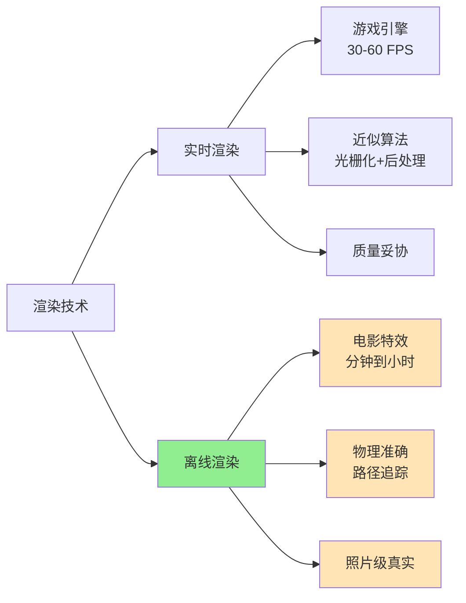
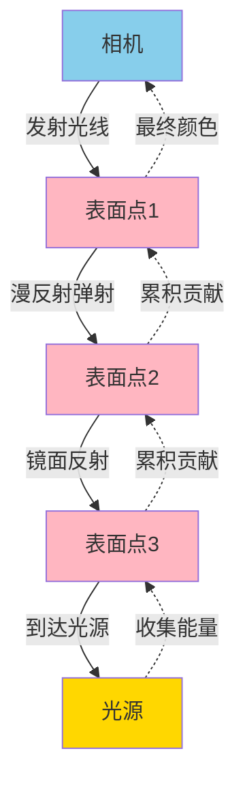
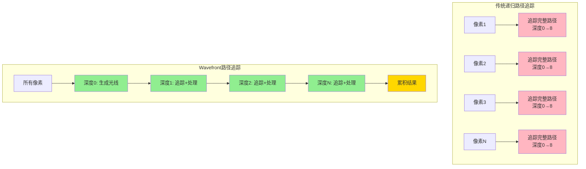
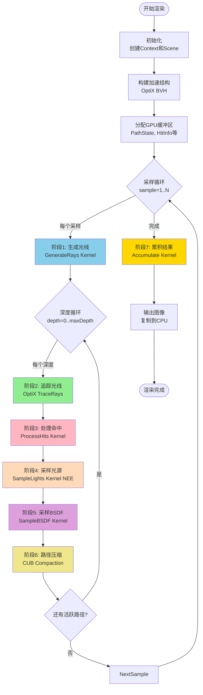
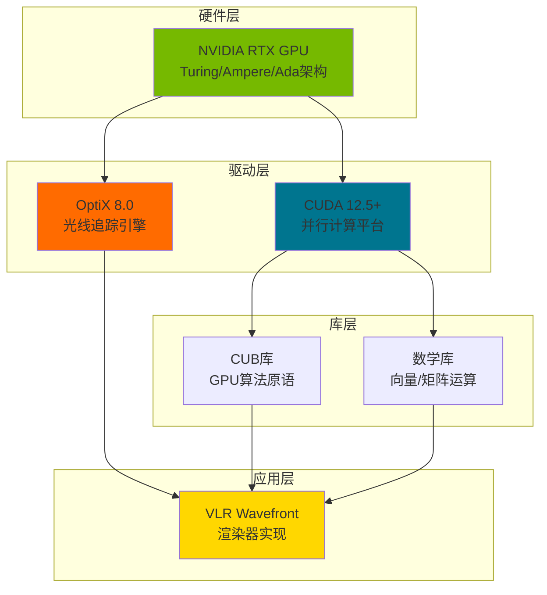
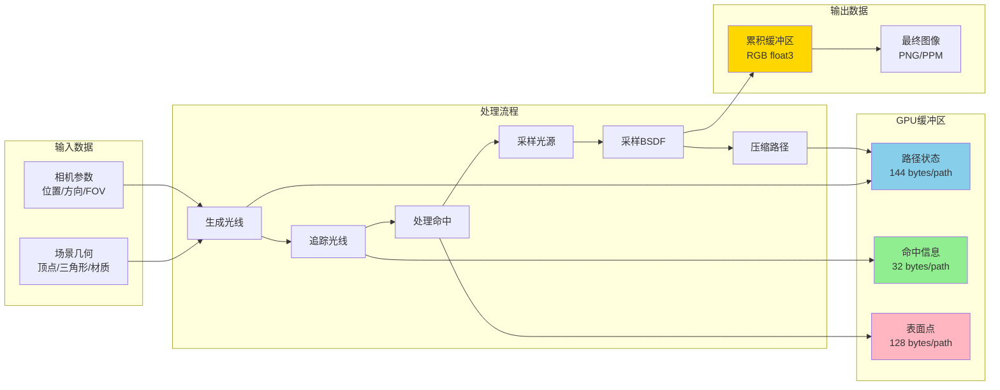
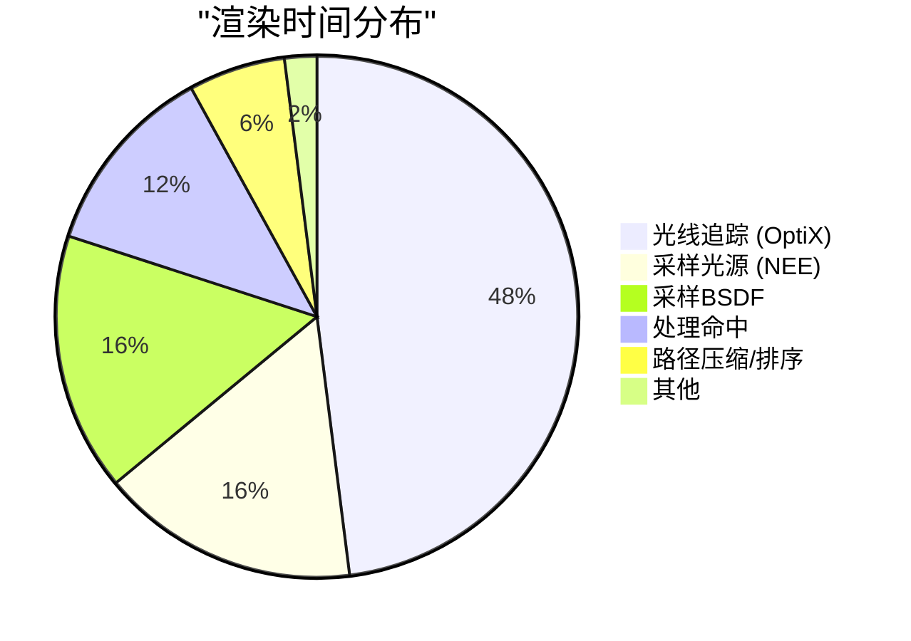
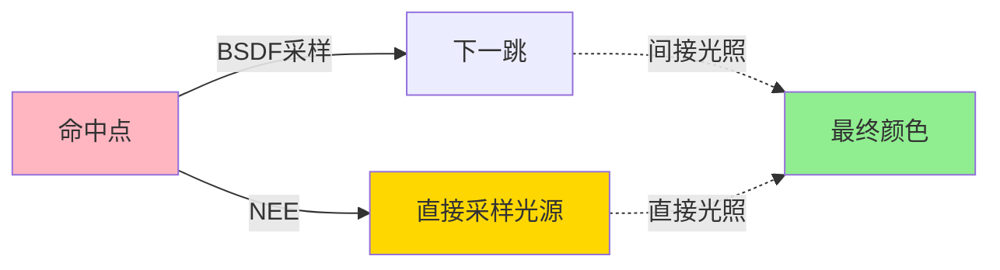
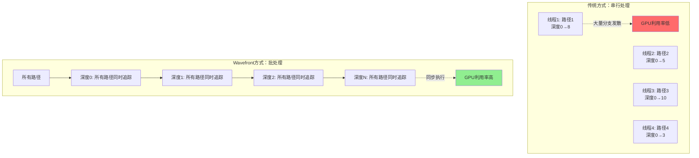

# VLR Wavefront 渲染器 - 总览

> **面向初学者的离线渲染教学文档**  
> 本文档系列旨在帮助初学者理解现代GPU加速的物理渲染技术

---

## 目录

1. [什么是离线渲染](#什么是离线渲染)
2. [什么是路径追踪](#什么是路径追踪)
3. [VLR Wavefront 架构概览](#vlr-wavefront-架构概览)
4. [渲染流程全景](#渲染流程全景)
5. [文档导航](#文档导航)

---

## 什么是离线渲染

**离线渲染（Offline Rendering）** 是一种高质量的图像生成技术，不要求实时性，追求物理准确性和视觉真实感。

### 离线渲染 vs 实时渲染



### 应用场景

| 领域 | 用途 | 典型软件 |
|------|------|---------|
| **电影工业** | 特效、动画 | RenderMan, V-Ray |
| **建筑可视化** | 效果图、漫游 | Corona, Octane |
| **产品设计** | 产品渲染 | KeyShot, Arnold |
| **科学可视化** | 数据可视化 | ParaView, VTK |

---

## 什么是路径追踪

**路径追踪（Path Tracing）** 是一种基于物理的渲染算法，通过模拟光线在场景中的传播来生成图像。

### 核心思想

光线从相机出发，在场景中弹射，最终到达光源：



### 渲染方程

路径追踪求解的是**渲染方程（Rendering Equation）**：

%20=%20L_e(p,%5Comega_o)%20+%20%5Cint_%7B%5COmega%7D%20f_r(p,%5Comega_i,%5Comega_o)%20L_i(p,%5Comega_i)%20%7C%5Ccos%5Ctheta_i%7C%20d%5Comega_i)

其中：
- `L_o(p, ω_o)`: 从点p沿方向ω_o出射的辐射亮度
- `L_e(p, ω_o)`: 点p自身发光
- `f_r`: BSDF（双向散射分布函数）
- `L_i(p, ω_i)`: 从方向ω_i入射的辐射亮度
- `|cos θ_i|`: 入射角余弦（Lambert余弦定律）

### 蒙特卡洛积分

由于积分无法解析求解，使用**蒙特卡洛方法**进行数值估计：

%20L_i(%5Comega_i)%20%7C%5Ccos%5Ctheta_i%7C%7D%7Bp(%5Comega_i)%7D)

- N: 采样数量（越多越准确）
- p(ω_i): 采样概率密度函数（PDF）

---

## VLR Wavefront 架构概览

### 传统递归 vs Wavefront



### 性能优势

| 指标 | 递归路径追踪 | Wavefront路径追踪 | 提升 |
|------|-------------|------------------|------|
| **GPU占用率** | 40-60% | 80-95% | **+50%** |
| **渲染速度** | 基准 | 2.5x更快 | **+150%** |
| **分支发散** | 严重 | 轻微 | **显著改善** |
| **内存使用** | 低 (~20MB) | 中 (~62MB) | +210% |

**核心优势**：所有线程执行相同操作，减少GPU的分支发散（warp divergence）。

---

## 渲染流程全景

### 完整渲染管线



### 关键阶段说明

| 阶段 | 名称 | 功能 | 技术 |
|------|------|------|------|
| **1** | GenerateRays | 为每个像素生成初始相机光线 | CUDA Kernel |
| **2** | TraceRays | 光线与场景求交，找到命中点 | OptiX 硬件加速 |
| **3** | ProcessHits | 计算表面属性、材质分类 | CUDA Kernel |
| **4** | SampleLights | 直接光照采样（NEE） | CUDA Kernel |
| **5** | SampleBSDF | 采样BSDF生成下一跳方向 | CUDA Kernel |
| **6** | CompactPaths | 移除终止路径，按材质排序 | CUB库优化 |
| **7** | Accumulate | 将所有贡献累加到输出 | CUDA Kernel |

---

## 核心技术栈



---

## 数据流动

### 单次采样的数据流



---

## 性能特征

### 渲染时间分解（512×512，1024采样）



### 内存使用（512×512分辨率）

```
总路径数: 262,144 paths

┌─────────────────────────────────────────┐
│ GPU内存分配 (~62 MB)                     │
├─────────────────────────────────────────┤
│ PathState Buffer    16.0 MB  ████████   │
│ HitInfo Buffer      20.0 MB  ██████████ │
│ SurfacePoint Buffer 32.0 MB  ████████████│
│ Active Indices       1.0 MB  █          │
│ Next Indices         1.0 MB  █          │
│ Accum Buffer         3.0 MB  ██         │
│ CUB Temp Storage     1.0 MB  █          │
│ 场景数据            ~20.0 MB  ██████     │
└─────────────────────────────────────────┘
```

---

## 关键概念速查

### 1. 路径（Path）

一条从相机出发的光线序列：

```
Camera → Surface1 → Surface2 → ... → Light
```

每次弹射称为一个**深度（Depth）**或**反弹（Bounce）**。

### 2. BSDF（双向散射分布函数）

描述光线如何在表面反射/折射的函数：

- **漫反射（Diffuse）**: Lambert模型，均匀散射
- **镜面反射（Specular）**: 完美镜面，反射角=入射角
- **光滑反射（Glossy）**: 微表面模型（GGX）
- **透射（Transmission）**: 玻璃、水等透明材质

### 3. NEE（Next Event Estimation）

**显式光源采样**技术，每次弹射时直接采样光源：



**优势**：显著减少噪声，加速收敛。

### 4. MIS（Multiple Importance Sampling）

结合多种采样策略的技术，使用**权重**平衡不同策略的贡献：


避免某个策略在特定情况下表现不佳。

### 5. 俄罗斯轮盘赌（Russian Roulette）

概率性终止路径的技术：

```
if (路径吞吐量 < 阈值):
    以概率 q 终止路径
    以概率 (1-q) 继续，但吞吐量 /= (1-q)
```

**目的**：避免追踪贡献极小的路径，提高效率。

---

## Wavefront 核心创新

### 批处理执行模型



### 三大优化技术

1. **路径排序（Path Sorting）**
   - 按材质类型排序路径
   - 减少BSDF评估时的分支发散
   - 性能提升：~10-20%

2. **流压缩（Stream Compaction）**
   - 移除已终止的路径
   - 保持GPU高占用率
   - 性能提升：~5-10%

3. **内存优化（Memory Optimization）**
   - 使用`__restrict__`指针
   - 减少CPU-GPU同步
   - 性能提升：~5-15%

---

## 文档导航

本系列文档按难度递进，建议按顺序阅读：

### 📚 基础篇

1. **[00_overview.md](00_overview.md)** ⭐ 当前文档
   - 离线渲染基础概念
   - 路径追踪原理
   - Wavefront架构概览

2. **[01_wavefront_architecture.md](01_wavefront_architecture.md)** ⭐⭐
   - Wavefront vs 递归详细对比
   - 执行模型深入分析
   - 性能特征解析

### 🔧 实现篇

3. **[02_data_structures.md](02_data_structures.md)** ⭐⭐
   - 核心数据结构详解
   - 内存布局优化
   - 缓冲区管理

4. **[03_kernel_pipeline.md](03_kernel_pipeline.md)** ⭐⭐⭐
   - 7个内核详细实现
   - 每个阶段的算法流程
   - OptiX集成细节

### 📐 算法篇

5. **[04_lighting_algorithms.md](04_lighting_algorithms.md)** ⭐⭐⭐
   - Next Event Estimation (NEE)
   - Multiple Importance Sampling (MIS)
   - 光源采样算法
   - 完整数学推导

6. **[05_bsdf_sampling.md](05_bsdf_sampling.md)** ⭐⭐⭐
   - BSDF采样理论
   - Lambert/Specular/GGX实现
   - 重要性采样技术
   - 数学公式详解

### ⚡ 优化篇

7. **[06_optimizations.md](06_optimizations.md)** ⭐⭐⭐⭐
   - CUB库集成（排序/压缩）
   - 内存对齐问题解决
   - 性能调优技巧
   - 实测性能数据

### 🚀 实践篇

8. **[07_getting_started.md](07_getting_started.md)** ⭐
   - 环境搭建
   - 编译运行
   - 第一个场景
   - 常见问题解答

---

## 快速开始

### 最小示例

```cpp
#include <vlr/vlr.h>

int main() {
    // 1. 创建上下文
    VLRContext ctx = nullptr;
    vlrCreateContext(nullptr, 0, &ctx);
    
    // 2. 创建场景
    VLRScene scene = nullptr;
    vlrCreateScene(ctx, &scene);
    
    // 3. 添加几何和材质（见完整示例）
    // ...
    
    // 4. 渲染
    vlrRender(ctx, scene, 512, 512, 64, 
              VLRRenderer_WavefrontPathTracing);
    
    // 5. 获取结果
    void* output = vlrGetOutputBuffer(ctx);
    
    // 6. 清理
    vlrDestroyScene(scene);
    vlrDestroyContext(ctx);
    
    return 0;
}
```

完整示例请参考：`test/cornell_box_improved_test.cpp`

---

## 学习路径建议

### 初学者（0-3个月）

1. 阅读 00_overview.md（本文档）
2. 运行示例程序，观察渲染效果
3. 阅读 07_getting_started.md，搭建环境
4. 修改简单参数（分辨率、采样数）观察变化
5. 阅读 01_wavefront_architecture.md，理解架构

### 进阶学习（3-6个月）

1. 阅读 02_data_structures.md，理解内存布局
2. 阅读 03_kernel_pipeline.md，理解每个内核
3. 阅读 04_lighting_algorithms.md，学习光照算法
4. 阅读 05_bsdf_sampling.md，学习材质采样
5. 尝试修改内核代码，添加简单功能

### 高级研究（6个月+）

1. 阅读 06_optimizations.md，学习优化技术
2. 研究CUB库源码，理解GPU算法
3. 实现新的材质类型
4. 实现新的优化策略
5. 贡献代码到项目

---

## 推荐资源

### 书籍

1. **"Physically Based Rendering" (PBRT)** - Matt Pharr et al.
   - 渲染领域的圣经
   - 第4版包含完整的Wavefront实现

2. **"Ray Tracing Gems"** - NVIDIA
   - 现代光线追踪技术合集
   - 免费在线阅读

3. **"Real-Time Rendering"** - Tomas Akenine-Möller et al.
   - 实时渲染技术
   - 理解GPU架构

### 在线课程

1. **GAMES101** - 闫令琪
   - 计算机图形学入门
   - 中文授课，适合国内学习者

2. **SIGGRAPH Courses**
   - 每年最新的渲染技术
   - 论文和演示文稿

### 论文

1. **"Megakernels Considered Harmful"** - Laine et al. (2013)
   - Wavefront架构的奠基论文
   - 必读经典

2. **"The Design and Evolution of Disney's Hyperion Renderer"** - Burley et al. (2018)
   - 工业级渲染器设计

---

## 术语表

| 术语 | 英文 | 解释 |
|------|------|------|
| **路径追踪** | Path Tracing | 模拟光线传播的渲染算法 |
| **光线追踪** | Ray Tracing | 计算光线与场景交点的技术 |
| **BSDF** | Bidirectional Scattering Distribution Function | 双向散射分布函数 |
| **NEE** | Next Event Estimation | 显式光源采样技术 |
| **MIS** | Multiple Importance Sampling | 多重重要性采样 |
| **BVH** | Bounding Volume Hierarchy | 包围体层次结构（加速结构） |
| **Wavefront** | - | 批处理执行模型 |
| **Stream Compaction** | - | 流压缩（移除无效元素） |
| **Warp Divergence** | - | 线程束分支发散 |
| **Monte Carlo** | - | 蒙特卡洛方法（随机采样） |

---

## 系统要求

### 硬件要求

- **GPU**: NVIDIA RTX 20系列或更新（支持OptiX）
- **显存**: 4GB最低，8GB推荐
- **CPU**: 任意现代x64处理器
- **内存**: 8GB最低，16GB推荐

### 软件要求

- **操作系统**: Windows 10/11 (64位)
- **CUDA Toolkit**: 12.5或更高
- **OptiX SDK**: 8.0.0
- **Visual Studio**: 2022（MSVC 19.41+）
- **CMake**: 3.18或更高

### 测试配置

本项目在以下配置测试通过：

```
GPU:      NVIDIA GeForce RTX 2060 SUPER (8GB)
OS:       Windows 10 Build 26200
CUDA:     13.1.80
OptiX:    8.0.0
Compiler: MSVC 19.41 (Visual Studio 2022)
```

---

## 性能基准

### Cornell Box场景（512×512）

| 采样数 | 渲染时间 | 吞吐量 | 图像质量 |
|--------|---------|--------|---------|
| 64 | 0.5秒 | 34.5 Msamp/s | 轻微噪声 |
| 128 | 1.0秒 | 33.5 Msamp/s | 清晰 |
| 256 | 2.0秒 | 33.6 Msamp/s | 非常清晰 |
| 1024 | 8.0秒 | 33.6 Msamp/s | 照片级 |

**峰值吞吐量**: 33.6百万采样/秒

### 分辨率缩放

| 分辨率 | 像素数 | 渲染时间(128采样) | 内存使用 |
|--------|--------|------------------|---------|
| 512×512 | 262K | 1.0秒 | 62 MB |
| 1280×720 | 922K | 3.5秒 | 218 MB |
| 1920×1080 | 2.07M | 7.8秒 | 490 MB |
| 2560×1440 | 3.69M | 14.0秒 | 872 MB |

---

## 下一步

### 推荐阅读顺序

1. ✅ 完成本文档，理解基本概念
2. 📖 阅读 [01_wavefront_architecture.md](01_wavefront_architecture.md)
3. 🔧 阅读 [07_getting_started.md](07_getting_started.md)，动手实践
4. 📐 阅读算法篇（04-05），深入理解数学原理
5. ⚡ 阅读优化篇（06），学习性能调优

### 实践建议

1. **先运行，再理解**：先编译运行示例，看到效果
2. **修改参数**：调整采样数、分辨率，观察变化
3. **阅读代码**：从简单的测试代码开始
4. **逐步深入**：从整体到细节，从概念到实现
5. **动手实验**：修改场景、添加物体、调整材质

---

## 致谢

本项目基于以下优秀工作：

- **NVIDIA OptiX**: 硬件加速光线追踪
- **NVIDIA CUB**: 高性能GPU算法库
- **PBRT-v4**: Wavefront架构参考实现
- **Samuli Laine**: Wavefront论文作者

---

## 联系方式

- **项目主页**: [GitHub - VLR_WF](https://github.com/trianglestrip/VLR_WF)
- **问题反馈**: [Issues](https://github.com/trianglestrip/VLR_WF/issues)
- **文档目录**: `tools/` 和 `docs/`

---

**版本**: 1.0  
**更新日期**: 2026-03-07  
**作者**: VLR开发团队

**下一篇**: [01_wavefront_architecture.md - Wavefront架构详解](01_wavefront_architecture.md) →
