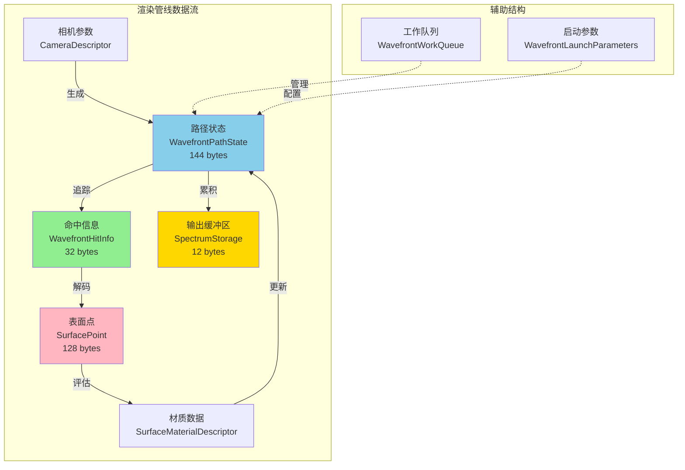
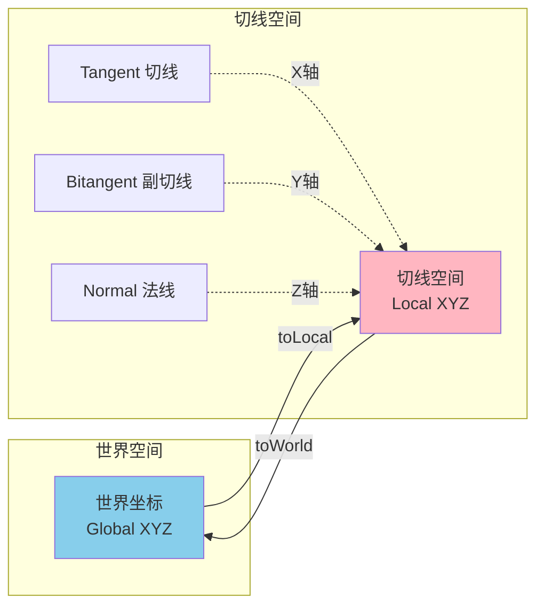
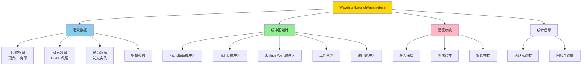
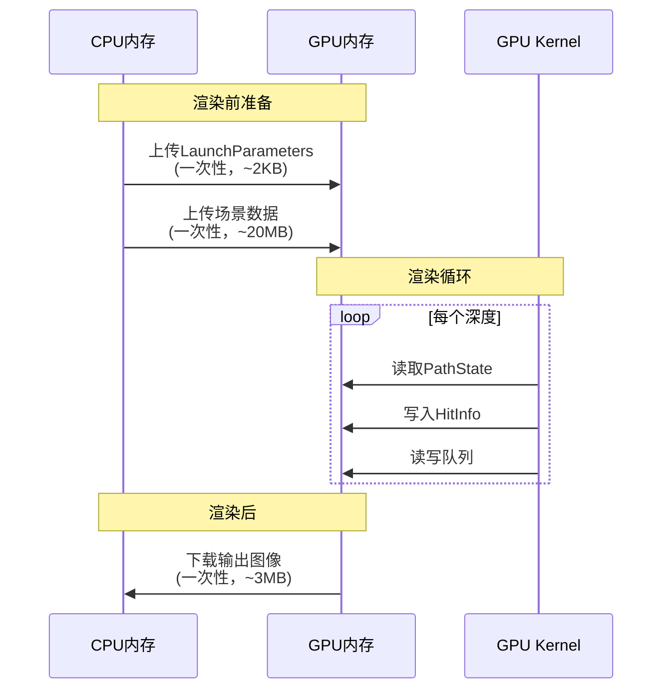
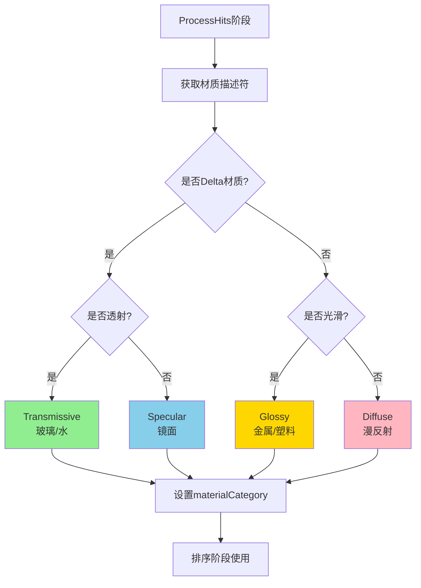
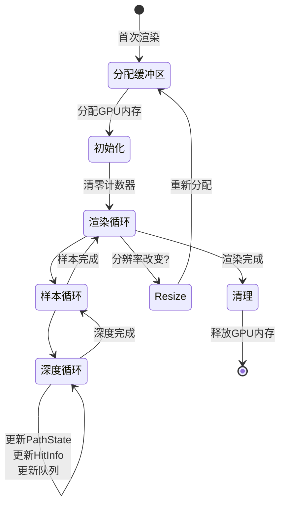
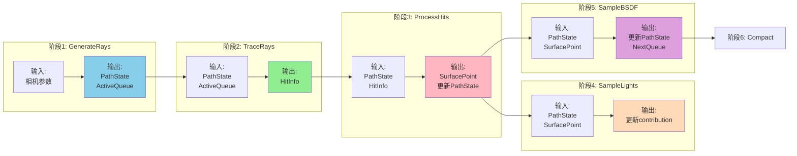

# 数据结构详解

> **深入理解Wavefront渲染器的核心数据结构和内存布局**

---

## 目录

1. [核心数据结构概览](#核心数据结构概览)
2. [WavefrontPathState详解](#wavefrontpathstate详解)
3. [WavefrontHitInfo详解](#wavefronthitinfo详解)
4. [SurfacePoint详解](#surfacepoint详解)
5. [工作队列管理](#工作队列管理)
6. [内存布局优化](#内存布局优化)

---

## 核心数据结构概览

### 数据结构关系图



### 数据大小对比

```
单个路径的数据占用 (512×512场景):

WavefrontPathState:     144 bytes  ████████████████
WavefrontHitInfo:        32 bytes  ████
SurfacePoint:           128 bytes  ██████████████
输出累积:                12 bytes  ██
────────────────────────────────────────────
单路径总计:             316 bytes

262,144个路径:          ~82.8 MB
加上场景数据:           ~100 MB 总计
```

---

## WavefrontPathState详解

### 结构定义

```cpp
struct alignas(16) WavefrontPathState {
    // 光线信息 (32 bytes)
    Point3D origin;              // 12 bytes: 光线起点 (x, y, z)
    Vector3D direction;          // 12 bytes: 光线方向 (x, y, z)
    float _padding1[2];          // 8 bytes: 对齐填充
    
    // 光谱信息 (64 bytes)
    SampledSpectrum throughput;  // 16 bytes: 路径吞吐量
    SampledSpectrum contribution;// 16 bytes: 累积贡献
    WavelengthSamples wls;       // 24 bytes: 波长采样
    float initImportance;        // 4 bytes: 初始重要性
    float selectWLPDF;           // 4 bytes: 波长选择PDF
    
    // 随机数生成器 (16 bytes)
    KernelRNG rng;               // 16 bytes: PCG32 RNG状态
    
    // 路径历史 (16 bytes)
    float prevDirPDF;            // 4 bytes: 前一次方向PDF
    DirectionType prevSampledType; // 4 bytes: 前一次采样类型
    uint32_t pathLength;         // 4 bytes: 当前路径长度
    uint32_t _padding2;          // 4 bytes: 对齐填充
    
    // 像素坐标 (8 bytes)
    uint32_t pixelX;             // 4 bytes: X坐标
    uint32_t pixelY;             // 4 bytes: Y坐标
    
    // 状态标志 (8 bytes)
    uint32_t flags;              // 4 bytes: 状态标志位
    uint32_t materialCategory;   // 4 bytes: 材质分类
    
    // 总计: 144 bytes
};
```

### 内存布局可视化

```
PathState内存布局 (144 bytes):

Offset  Field                Size    Purpose
──────────────────────────────────────────────────────
0x00    origin.x             4       光线起点X
0x04    origin.y             4       光线起点Y
0x08    origin.z             4       光线起点Z
0x0C    direction.x          4       光线方向X
0x10    direction.y          4       光线方向Y
0x14    direction.z          4       光线方向Z
0x18    _padding1[0]         4       对齐填充
0x1C    _padding1[1]         4       对齐填充
──────────────────────────────────────────────────────
0x20    throughput[0]        4       吞吐量分量0
0x24    throughput[1]        4       吞吐量分量1
0x28    throughput[2]        4       吞吐量分量2
0x2C    throughput[3]        4       吞吐量分量3
0x30    contribution[0]      4       贡献分量0
0x34    contribution[1]      4       贡献分量1
0x38    contribution[2]      4       贡献分量2
0x3C    contribution[3]      4       贡献分量3
0x40    wls (波长采样)       24      4个波长+选择索引+PDF
0x58    initImportance       4       初始重要性
0x5C    selectWLPDF          4       波长选择PDF
──────────────────────────────────────────────────────
0x60    rng.state            8       RNG状态
0x68    rng.inc              8       RNG增量
──────────────────────────────────────────────────────
0x70    prevDirPDF           4       前一方向PDF
0x74    prevSampledType      4       前一采样类型
0x78    pathLength           4       路径长度
0x7C    _padding2            4       对齐填充
──────────────────────────────────────────────────────
0x80    pixelX               4       像素X坐标
0x84    pixelY               4       像素Y坐标
──────────────────────────────────────────────────────
0x88    flags                4       状态标志
0x8C    materialCategory     4       材质分类
──────────────────────────────────────────────────────
总计: 0x90 = 144 bytes
```

### 标志位定义

```
flags (32 bits):

Bit     Name                    Description
─────────────────────────────────────────────────────
0       isActive                路径是否活跃
1       isTerminated            路径是否终止
2       maxLengthReached        是否达到最大长度
3       singleWlSelected        是否选择单一波长(色散)
4       hitEmissive             是否击中发光表面
5-31    (reserved)              保留位
```

### 关键字段说明

#### 1. throughput（路径吞吐量）

**物理意义**：路径传输的能量衰减系数

```
初始: throughput = (1, 1, 1)  // 白色，无衰减

每次弹射后更新:
throughput *= BSDF_value * |cos(θ)| / PDF

例如:
深度0: (1.0, 1.0, 1.0)
深度1: (0.8, 0.6, 0.4)  // 击中红色漫反射表面
深度2: (0.4, 0.3, 0.2)  // 击中灰色表面
深度3: (0.1, 0.08, 0.05) // 能量衰减，接近终止
```

**用途**：
- 累积路径权重
- 俄罗斯轮盘赌判断
- 最终颜色计算

#### 2. contribution（累积贡献）

**物理意义**：路径收集的总辐射量

```
每次采样光源后累加:
contribution += throughput × L_emission × BSDF × G × MIS_weight

最终输出:
pixelColor = contribution / numSamples
```

#### 3. rng（随机数生成器）

使用**PCG32算法**（高质量伪随机数）：

```cpp
struct KernelRNG {
    uint64_t state;  // 当前状态
    uint64_t inc;    // 增量（确保不同像素不同序列）
    
    float getFloat0cTo1o() {
        // 生成[0, 1)范围的浮点数
        uint32_t r = pcg32();
        return r * (1.0f / 4294967296.0f);
    }
};
```

**重要性**：
- 每个像素独立的RNG序列
- 避免相关性导致的图案（artifacts）
- 支持渐进式渲染

#### 4. wls（波长采样）

**光谱渲染**：不使用RGB，而是采样4个波长

```
WavelengthSamples:
├─ lambda[0]: 例如 450nm (蓝色)
├─ lambda[1]: 例如 520nm (绿色)
├─ lambda[2]: 例如 600nm (红色)
├─ lambda[3]: 例如 680nm (深红)
├─ selectedIndex: 主波长索引 (用于重要性)
└─ PDF: 采样概率密度

最终转换为RGB:
RGB = wavelengthsToRGB(lambda[], values[])
```

**优势**：
- 物理准确的色散效果（玻璃棱镜）
- 更真实的颜色表现
- 支持光谱纹理

---

## WavefrontHitInfo详解

### 结构定义

```cpp
struct alignas(16) WavefrontHitInfo {
    // 几何索引 (16 bytes)
    uint32_t instIndex;          // 4 bytes: 实例索引
    uint32_t geomInstIndex;      // 4 bytes: 几何实例索引
    uint32_t primIndex;          // 4 bytes: 图元(三角形)索引
    uint32_t hitFlags;           // 4 bytes: 命中标志
    
    // 参数化坐标 (16 bytes)
    float u, v;                  // 8 bytes: 重心坐标
    float t;                     // 4 bytes: 光线参数(距离)
    float _padding;              // 4 bytes: 对齐填充
    
    // 总计: 32 bytes
};
```

### 重心坐标（Barycentric Coordinates）

三角形内的点可以用重心坐标表示：

```
三角形顶点: V0, V1, V2
重心坐标: (u, v)

点P的位置:
P = V0 × (1 - u - v) + V1 × u + V2 × v

其中: u ≥ 0, v ≥ 0, u + v ≤ 1
```

**用途**：
- 插值顶点法线：`N = N0×(1-u-v) + N1×u + N2×v`
- 插值纹理坐标：`UV = UV0×(1-u-v) + UV1×u + UV2×v`
- 插值顶点颜色

### 命中标志位

```
hitFlags (32 bits):

Bit     Name                Description
──────────────────────────────────────────────
0       hasHit              是否命中几何体
1       hitInfinity         是否命中无限远(环境)
2       hitEmissive         是否命中发光表面
3       hitTransmissive     是否命中透明表面
4-31    (reserved)          保留
```

### 使用示例

```cpp
// OptiX Closest Hit程序填充HitInfo
__closesthit__closestHit() {
    uint32_t pathIndex = payload.pathIndex;
    WavefrontHitInfo& hitInfo = wlp.hitInfoBuffer[pathIndex];
    
    // 记录几何信息
    hitInfo.instIndex = optixGetInstanceId();
    hitInfo.geomInstIndex = getGeomInstIndex();
    hitInfo.primIndex = optixGetPrimitiveIndex();
    
    // 记录重心坐标
    float2 barycentrics = optixGetTriangleBarycentrics();
    hitInfo.u = barycentrics.x;
    hitInfo.v = barycentrics.y;
    
    // 记录光线参数
    hitInfo.t = optixGetRayTmax();
    
    // 设置标志
    hitInfo.hitFlags = 0x1;  // hasHit = true
}
```

---

## SurfacePoint详解

### 结构定义

```cpp
struct SurfacePoint {
    // 位置和法线 (48 bytes)
    Point3D position;            // 12 bytes: 世界空间位置
    Normal3D geometricNormal;    // 12 bytes: 几何法线
    Normal3D shadingNormal;      // 12 bytes: 着色法线(插值)
    Vector3D tangent;            // 12 bytes: 切线
    
    // 着色坐标系 (36 bytes)
    ReferenceFrame shadingFrame; // 36 bytes: 切线空间矩阵
    
    // 纹理坐标 (8 bytes)
    TexCoord2D texCoord;         // 8 bytes: UV坐标
    
    // 几何属性 (36 bytes)
    float curvature;             // 4 bytes: 曲率
    float area;                  // 4 bytes: 微分面积
    // ... 其他属性
    
    // 总计: ~128 bytes
};
```

### 坐标系转换



**为什么需要切线空间？**

BSDF计算在**局部坐标系**中进行：
- Z轴 = 法线方向
- X轴 = 切线方向
- Y轴 = 副切线方向

```cpp
// 世界空间 → 切线空间
Vector3D dirLocal = surfPt.shadingFrame.toLocal(dirWorld);

// 在切线空间中，法线总是 (0, 0, 1)
// 简化BSDF计算: cos(θ) = dirLocal.z
```

### 几何法线 vs 着色法线

```
几何法线 (Geometric Normal):
  - 三角形平面的真实法线
  - 用于判断光线方向(正面/背面)
  - 用于偏移光线起点(避免自相交)

着色法线 (Shading Normal):
  - 顶点法线的插值结果
  - 用于BSDF计算
  - 创造平滑的视觉效果

示例:
      V1 (N1)
      /\
     /  \
    /    \
   /  P   \   ← P点的着色法线 = 插值(N0, N1, N2)
  /   ↑    \
 /    │     \
V0────┼──────V2
(N0)  │     (N2)
      │
  几何法线 (垂直于三角形平面)
```

---

## 工作队列管理

### WavefrontWorkQueue结构

```cpp
struct WavefrontWorkQueue {
    uint32_t* pathIndices;   // GPU内存: 路径索引数组
    uint32_t* counter;       // GPU内存: 原子计数器
    uint32_t capacity;       // 队列容量
    
    // 入队操作 (GPU端)
    __device__ uint32_t enqueue(uint32_t pathIndex) {
        uint32_t slot = atomicAdd(counter, 1);
        if (slot < capacity) {
            pathIndices[slot] = pathIndex;
            return slot;
        }
        return 0xFFFFFFFF;  // 队列满
    }
    
    // 获取大小 (GPU端)
    __device__ uint32_t size() const {
        return *counter;
    }
};
```

### Ping-Pong队列模式

```mermaid
graph TB
    subgraph "深度N: 处理阶段"
        ActiveN[ActiveQueue<br/>pathIndices[0..199999]<br/>counter=200000]
        NextN[NextQueue<br/>pathIndices[空]<br/>counter=0]
        
        ActiveN -->|读取路径索引| Kernel[SampleBSDF Kernel]
        Kernel -->|写入新路径索引| NextN
    end
    
    subgraph "深度N与N+1之间: 交换"
        Swap[交换指针<br/>std::swap]
    end
    
    subgraph "深度N+1: 处理阶段"
        ActiveN1[ActiveQueue<br/>pathIndices[0..179999]<br/>counter=180000]
        NextN1[NextQueue<br/>pathIndices[空]<br/>counter=0]
        
        ActiveN1 -->|读取路径索引| Kernel2[SampleBSDF Kernel]
        Kernel2 -->|写入新路径索引| NextN1
    end
    
    NextN -.->|变成| ActiveN1
    ActiveN -.->|变成| NextN1
    
    style ActiveN fill:#87CEEB
    style NextN fill:#FFE4B5
    style ActiveN1 fill:#87CEEB
    style NextN1 fill:#FFE4B5
```

**优势**：
- 零拷贝：只交换指针
- 无竞争：读写不同缓冲区
- 高效：O(1)时间复杂度

### 队列操作示例

```cpp
// 主机端代码 (context.cpp)
void Context::executeWavefrontRender() {
    auto& wf = m_optix.wavefrontPathTracing;
    
    for (uint32_t depth = 0; depth < maxDepth; depth++) {
        // 1. 读取当前活跃路径数
        uint32_t numActive = 0;
        cudaMemcpy(&numActive, 
                   wf.queueCounters->getDevicePointerAt(0),
                   sizeof(uint32_t), 
                   cudaMemcpyDeviceToHost);
        
        if (numActive == 0) break;  // 所有路径终止
        
        // 2. 执行各阶段kernel
        launchTraceRays(numActive);
        launchProcessHits(numActive);
        launchSampleLights(numActive);
        launchSampleBSDF(numActive);
        
        // 3. 压缩和排序
        if (useStreamCompaction) {
            compactPathsCUB(...);  // 移除终止路径
        }
        
        // 4. 交换队列
        std::swap(wf.activePathIndices, wf.nextActivePathIndices);
        
        // 5. 重置下一队列计数器
        uint32_t zero = 0;
        cudaMemcpy(wf.queueCounters->getDevicePointerAt(1),
                   &zero, sizeof(uint32_t),
                   cudaMemcpyHostToDevice);
    }
}
```

---

## 内存布局优化

### AoS vs SoA

#### Array of Structures (AoS) - 当前实现

```
PathState数组 (AoS):

内存地址:
0x0000: [Path0: origin|direction|throughput|...|flags]  144 bytes
0x0090: [Path1: origin|direction|throughput|...|flags]  144 bytes
0x0120: [Path2: origin|direction|throughput|...|flags]  144 bytes
...

访问模式:
  读取Path0的所有字段: 连续访问 ✓
  读取所有Path的origin: 跨步访问 (stride=144) ✗
```

**优点**：
- 代码简单直观
- 单个路径的所有数据连续
- 易于调试

**缺点**：
- 访问单个字段时跨步较大
- 缓存利用率较低

#### Structure of Arrays (SoA) - 可选优化

```
PathState数组 (SoA):

内存地址:
origins:       0x0000: [Path0.origin|Path1.origin|Path2.origin|...]
directions:    0x0C00: [Path0.dir|Path1.dir|Path2.dir|...]
throughputs:   0x1800: [Path0.throughput|Path1.throughput|...]
...

访问模式:
  读取Path0的所有字段: 跨多个数组 ✗
  读取所有Path的origin: 连续访问 ✓
```

**优点**：
- 访问单个字段时完全连续
- 内存合并效率最高
- 缓存利用率高

**缺点**：
- 代码复杂度增加
- 需要管理多个数组
- 调试困难

**VLR选择**：当前使用AoS，未来可选SoA优化（预计5-15%性能提升）。

---

### 内存对齐

#### 为什么需要16字节对齐？

GPU内存访问最高效的对齐方式：

```
未对齐 (性能差):
地址: 0x1001  [数据]  需要2次内存事务
地址: 0x1011  [数据]  需要2次内存事务

16字节对齐 (性能好):
地址: 0x1000  [数据]  只需1次内存事务
地址: 0x1010  [数据]  只需1次内存事务
```

**实现**：

```cpp
// 结构体对齐
struct alignas(16) WavefrontPathState { ... };

// 动态分配对齐
size_t alignedSize = (size + 15) & ~15;  // 向上取整到16倍数

// CUB库要求
void* d_tempStorage = ...;
size_t alignedOffset = (offset + 15) & ~15;
void* d_aligned = (uint8_t*)d_tempStorage + alignedOffset;
```

**重要性**：
- 未对齐会导致性能下降50%+
- CUB库要求16字节对齐，否则崩溃
- 现代GPU架构的硬性要求

---

## 启动参数（WavefrontLaunchParameters）

### 结构组成



### 内存传输



**优化**：
- 最小化CPU-GPU数据传输
- 所有计算在GPU完成
- 只在开始和结束时传输数据

---

## 材质分类系统

### MaterialCategory枚举

```cpp
enum MaterialCategory : uint32_t {
    MaterialCategory_Diffuse = 0,      // 漫反射
    MaterialCategory_Glossy = 1,       // 光滑反射
    MaterialCategory_Specular = 2,     // 镜面反射
    MaterialCategory_Transmissive = 3, // 透射
    MaterialCategory_Emissive = 4,     // 发光
    MaterialCategory_Mixed = 5,        // 混合
    NumMaterialCategories = 6
};
```

### 分类流程



### 排序后的内存布局

```
排序前 (随机顺序):
pathIndices: [0, 1, 2, 3, 4, 5, 6, 7, ...]
materials:   [D, S, G, D, T, D, S, G, ...]
             (D=Diffuse, S=Specular, G=Glossy, T=Transmissive)

排序后 (按材质分组):
pathIndices: [0, 3, 5, ..., 2, 7, ..., 1, 6, ..., 4, ...]
materials:   [D, D, D, ..., G, G, ..., S, S, ..., T, ...]
             └─ Diffuse ─┘  └─ Glossy ┘  └─ Specular┘  └T┘

Warp执行时:
  Warp 0 (线程0-31):  全部处理Diffuse材质  ✓ 无分支发散
  Warp 1 (线程32-63): 全部处理Diffuse材质  ✓ 无分支发散
  ...
  Warp N:             全部处理Glossy材质    ✓ 无分支发散
```

**性能提升**：10-20%（取决于材质多样性）

---

## 缓冲区生命周期

### 完整渲染周期



### 缓冲区重用

```cpp
// 多次渲染时重用缓冲区
void Context::render(uint32_t width, uint32_t height) {
    auto& wf = m_optix.wavefrontPathTracing;
    
    // 检查是否需要调整大小
    if (wf.currentWidth != width || wf.currentHeight != height) {
        resizeWavefrontBuffers(width, height);  // 重新分配
    } else {
        resetWavefrontQueues();  // 重用现有缓冲区
    }
    
    // 执行渲染...
}
```

**优势**：
- 避免频繁分配/释放
- 减少内存碎片
- 提高渲染启动速度

---

## 数据依赖关系

### 各阶段的数据流



**关键依赖**：
- TraceRays **必须在** GenerateRays **之后**
- ProcessHits **必须在** TraceRays **之后**
- SampleLights 和 SampleBSDF **可以并行**（未来优化）
- Compact **必须在** SampleBSDF **之后**

---

## 内存访问模式

### 读写模式分析

```
阶段1: GenerateRays
  写: PathState (所有字段)
  写: ActiveQueue (pathIndices)
  模式: 顺序写入，合并效率高 ✓

阶段2: TraceRays (OptiX)
  读: PathState (origin, direction)
  写: HitInfo (所有字段)
  模式: 随机读，顺序写 (OptiX优化) ✓

阶段3: ProcessHits
  读: PathState (部分字段)
  读: HitInfo (所有字段)
  写: SurfacePoint (所有字段)
  读写: PathState (flags, materialCategory)
  模式: 顺序读写，合并效率高 ✓

阶段4: SampleLights
  读: PathState (throughput, rng, wls)
  读: SurfacePoint (position, normal)
  写: PathState (contribution, rng)
  模式: 随机读写 (受材质分布影响) ⚠

阶段5: SampleBSDF
  读: PathState (所有字段)
  读: SurfacePoint (所有字段)
  写: PathState (所有字段)
  写: NextQueue (pathIndices)
  模式: 顺序读写 ✓

阶段6: Compact
  读: PathState (flags)
  读: ActiveQueue
  写: NextQueue
  模式: CUB优化，高效 ✓
```

### 优化策略

**使用`__restrict__`指针**：

```cpp
// 告诉编译器指针不重叠
__global__ void sampleBSDF(WavefrontLaunchParameters* params) {
    WavefrontPathState* __restrict__ pathStatePtr = 
        &params->pathStateBuffer[pathIndex];
    const WavefrontHitInfo* __restrict__ hitInfoPtr = 
        &params->hitInfoBuffer[pathIndex];
    const SurfacePoint* __restrict__ surfPtPtr = 
        &params->surfacePointBuffer[pathIndex];
    
    // 编译器可以更激进地优化内存访问
}
```

**效果**：5-10%性能提升

---

## 实际内存占用示例

### Cornell Box场景（512×512）

```
GPU内存分配详情:

核心缓冲区:
├─ PathState Buffer         37.7 MB  ████████████████
├─ HitInfo Buffer            8.4 MB  ████
├─ SurfacePoint Buffer      33.6 MB  ██████████████
├─ Active Indices            1.0 MB  █
├─ Next Indices              1.0 MB  █
├─ Queue Counters            8 bytes ▏
├─ Accum Buffer              3.0 MB  ██
├─ RNG Buffer                4.2 MB  ██
└─ 小计                     88.9 MB

CUB临时存储:
├─ Sort Temp Storage         1.0 MB  █
└─ Compact Temp Storage      0.3 MB  ▏

场景数据:
├─ 顶点位置                  0.5 MB  ▏
├─ 顶点法线                  0.5 MB  ▏
├─ 三角形索引                0.2 MB  ▏
├─ 材质描述符                0.1 MB  ▏
├─ BVH加速结构               5.0 MB  ███
└─ 小计                      6.3 MB

═══════════════════════════════════════
总计:                       ~96 MB
═══════════════════════════════════════

可用显存 (RTX 2060 SUPER): 8192 MB
使用率:                     1.2%
剩余:                       ~8096 MB
```

**结论**：即使在8GB显存的GPU上，也有充足的空间。

---

## 数据结构设计原则

### 1. 缓存行对齐（Cache Line Alignment）

现代GPU的L1缓存行大小：128 bytes

```
理想情况:
PathState (144 bytes) ≈ 1.125个缓存行
  → 访问1个PathState，加载2个缓存行
  → 效率: 144/256 = 56%

优化方案:
PathState (128 bytes) = 1个缓存行
  → 访问1个PathState，加载1个缓存行
  → 效率: 128/128 = 100%

但是: 128 bytes不够存储所有必要数据
结论: 144 bytes是合理的权衡
```

### 2. 最小化填充（Padding）

```cpp
// 不好的布局 (40 bytes → 48 bytes)
struct BadLayout {
    float a;      // 4 bytes
    double b;     // 8 bytes (需要8字节对齐，前面填充4字节)
    float c;      // 4 bytes
    double d;     // 8 bytes (需要8字节对齐，前面填充4字节)
};
// 实际大小: 4 + [4 padding] + 8 + 4 + [4 padding] + 8 = 32 bytes
// 加上结构体对齐到8字节: 32 bytes

// 好的布局 (40 bytes)
struct GoodLayout {
    double b;     // 8 bytes
    double d;     // 8 bytes
    float a;      // 4 bytes
    float c;      // 4 bytes
};
// 实际大小: 8 + 8 + 4 + 4 = 24 bytes
```

**VLR的设计**：
- 大字段在前（Point3D, Vector3D）
- 小字段在后（uint32_t, flags）
- 显式填充确保对齐

### 3. 热数据分离（Hot/Cold Data Separation）

```cpp
// 热数据 (频繁访问)
struct HotData {
    Point3D origin;
    Vector3D direction;
    SampledSpectrum throughput;
    uint32_t flags;
};

// 冷数据 (偶尔访问)
struct ColdData {
    float initImportance;
    float selectWLPDF;
    DirectionType prevSampledType;
};
```

**未来优化**：
- 将热数据和冷数据分离存储
- 热数据缓存命中率更高
- 预计5-10%性能提升

---

## 实战示例

### 访问PathState

```cpp
__global__ void exampleKernel(WavefrontLaunchParameters* params) {
    uint32_t workIndex = blockIdx.x * blockDim.x + threadIdx.x;
    
    // 1. 从活跃队列获取路径索引
    uint32_t pathIndex = params->activePathQueue.pathIndices[workIndex];
    
    // 2. 访问PathState
    WavefrontPathState& path = params->pathStateBuffer[pathIndex];
    
    // 3. 检查状态
    if (!path.isActive()) return;
    
    // 4. 读取数据
    Point3D origin = path.origin;
    Vector3D direction = path.direction;
    SampledSpectrum throughput = path.throughput;
    
    // 5. 修改数据
    path.throughput *= 0.5f;  // 衰减50%
    path.pathLength++;
    
    // 6. 更新标志
    if (path.pathLength >= MAX_DEPTH) {
        path.setTerminated();
    }
}
```

### 队列操作

```cpp
__global__ void sampleBSDFKernel(WavefrontLaunchParameters* params) {
    uint32_t workIndex = blockIdx.x * blockDim.x + threadIdx.x;
    uint32_t pathIndex = params->activePathQueue.pathIndices[workIndex];
    
    WavefrontPathState& path = params->pathStateBuffer[pathIndex];
    
    // ... BSDF采样逻辑 ...
    
    // 将路径加入下一轮队列
    if (path.isActive()) {
        params->nextActivePathQueue.enqueue(pathIndex);
    }
}
```

---

## 性能考虑

### 缓冲区访问频率

```
每次深度迭代的访问次数 (262K路径):

PathState:
  读取: 5次 (Trace, Process, SampleLights, SampleBSDF, Compact)
  写入: 3次 (Process, SampleBSDF, Compact)
  总计: 8次 × 144 bytes × 262K = 302 MB 数据传输

HitInfo:
  读取: 2次 (Process, SampleLights)
  写入: 1次 (Trace)
  总计: 3次 × 32 bytes × 262K = 25 MB 数据传输

SurfacePoint:
  读取: 2次 (SampleLights, SampleBSDF)
  写入: 1次 (Process)
  总计: 3次 × 128 bytes × 262K = 101 MB 数据传输

═══════════════════════════════════════════════════
单次深度迭代总数据传输: ~428 MB
8次深度迭代: ~3.4 GB
1024次采样: ~3.4 TB (分摊到8秒，平均425 GB/s)
```

**RTX 2060 SUPER内存带宽**：448 GB/s

**结论**：接近带宽极限，内存访问是性能瓶颈之一。

---

## 调试技巧

### 打印PathState

```cpp
__device__ void debugPrintPath(const WavefrontPathState& path) {
    if (path.pixelX == 256 && path.pixelY == 256) {  // 只打印中心像素
        printf("[Path] px=(%u,%u) depth=%u active=%d\n",
               path.pixelX, path.pixelY, path.pathLength, path.isActive());
        printf("  origin=(%.3f, %.3f, %.3f)\n",
               path.origin.x, path.origin.y, path.origin.z);
        printf("  direction=(%.3f, %.3f, %.3f)\n",
               path.direction.x, path.direction.y, path.direction.z);
        printf("  throughput=(%.3f, %.3f, %.3f, %.3f)\n",
               path.throughput.values[0], path.throughput.values[1],
               path.throughput.values[2], path.throughput.values[3]);
    }
}
```

### 验证数据完整性

```cpp
__device__ bool validatePathState(const WavefrontPathState& path) {
    // 检查NaN/Inf
    if (isnan(path.origin.x) || isinf(path.origin.x)) return false;
    if (isnan(path.direction.x) || isinf(path.direction.x)) return false;
    
    // 检查方向归一化
    float lenSq = dot(path.direction, path.direction);
    if (fabsf(lenSq - 1.0f) > 0.01f) return false;
    
    // 检查吞吐量非负
    for (int i = 0; i < 4; i++) {
        if (path.throughput.values[i] < 0.0f) return false;
    }
    
    return true;
}
```

---

## 下一步

### 继续学习

1. **[03_kernel_pipeline.md](03_kernel_pipeline.md)**
   - 学习如何使用这些数据结构
   - 理解每个kernel的具体实现

2. **[06_optimizations.md](06_optimizations.md)**
   - 学习如何优化内存访问
   - 理解CUB库的使用

### 实践练习

1. **修改PathState大小**：尝试添加新字段
2. **实现简单kernel**：读取PathState并打印
3. **分析内存使用**：使用NVIDIA Nsight分析工具

---

## 参考代码

- **PathState定义**: `libVLR/shared/path_types.h:50-122`
- **HitInfo定义**: `libVLR/shared/path_types.h:129-174`
- **队列管理**: `libVLR/shared/path_types.h:181-214`
- **缓冲区分配**: `libVLR/context.cpp:562-712`

---

**上一篇**: [01_wavefront_architecture.md](01_wavefront_architecture.md)  
**下一篇**: [03_kernel_pipeline.md - 内核管线详解](03_kernel_pipeline.md) →

---

**版本**: 1.0  
**更新日期**: 2026-03-07  
**作者**: VLR开发团队
