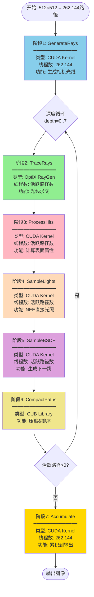
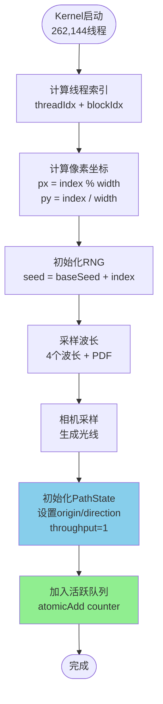
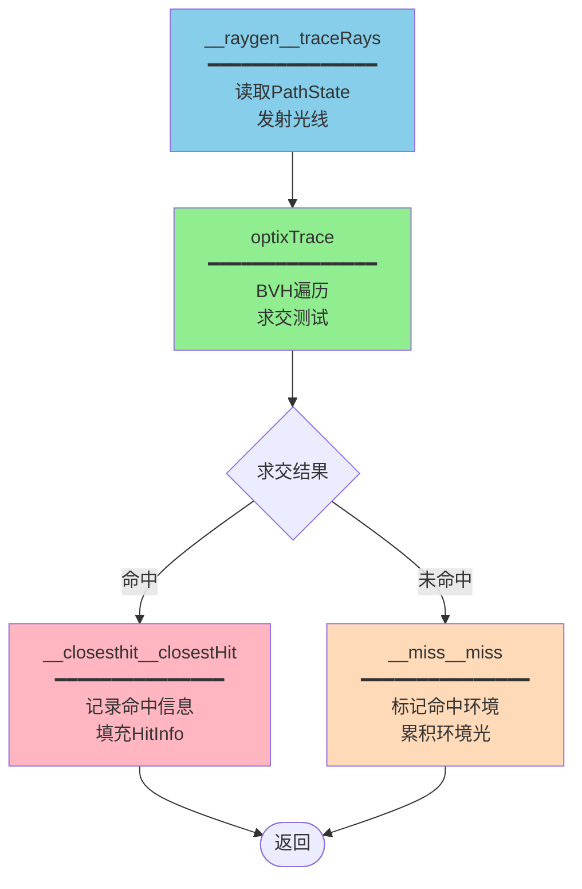
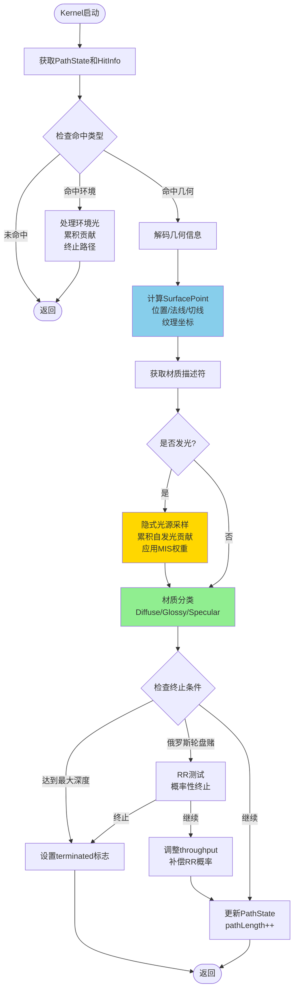
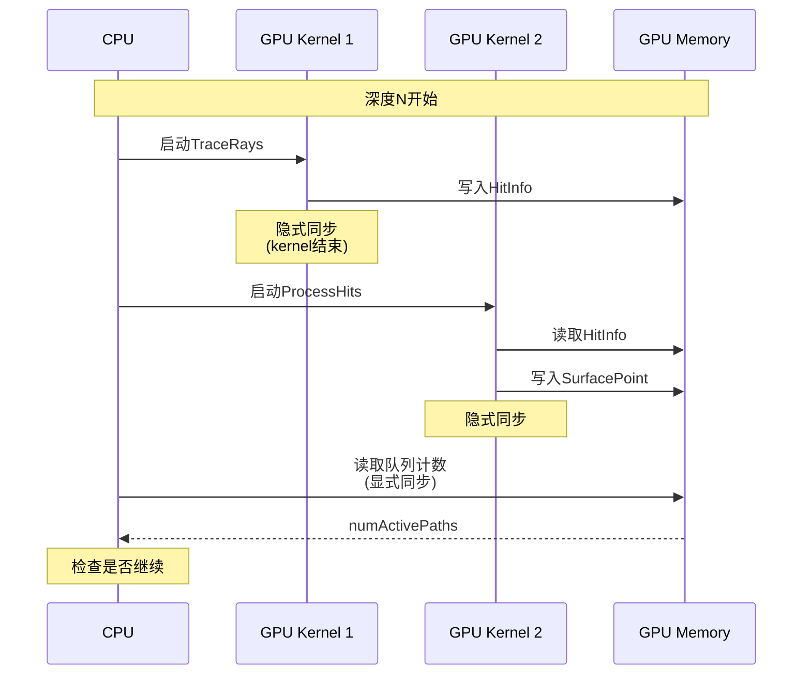

# 内核管线详解

> **深入理解Wavefront渲染器的7个核心内核实现**

---

## 目录

1. [管线概览](#管线概览)
2. [阶段1: GenerateRays](#阶段1-generaterays)
3. [阶段2: TraceRays](#阶段2-tracerays)
4. [阶段3: ProcessHits](#阶段3-processhits)
5. [阶段4: SampleLights](#阶段4-samplelights)
6. [阶段5: SampleBSDF](#阶段5-samplebsdf)
7. [阶段6: CompactPaths](#阶段6-compactpaths)
8. [阶段7: Accumulate](#阶段7-accumulate)

---

## 管线概览

### 完整执行流程



### 各阶段耗时（单次深度迭代）

```
总耗时: ~2.5ms (512×512, RTX 2060 SUPER)

阶段2: TraceRays       ████████████████████████  1.20ms (48%)
阶段4: SampleLights    ████████                  0.40ms (16%)
阶段5: SampleBSDF      ████████                  0.40ms (16%)
阶段3: ProcessHits     ██████                    0.30ms (12%)
阶段6: CompactPaths    ██                        0.10ms (4%)
阶段1: GenerateRays    █                         0.05ms (2%)
阶段7: Accumulate      █                         0.05ms (2%)
```

---

## 阶段1: GenerateRays

### 功能说明

为每个像素生成初始的相机光线，初始化PathState。

### 执行流程



### 伪代码

```cpp
__global__ void generateRays(WavefrontLaunchParameters* params) {
    // 1. 计算像素坐标
    uint32_t pathIndex = blockIdx.x * blockDim.x + threadIdx.x;
    uint32_t px = pathIndex % params->imageSize.x;
    uint32_t py = pathIndex / params->imageSize.x;
    
    // 2. 初始化RNG (每个像素独立种子)
    uint64_t seed = baseSeed + pathIndex;
    KernelRNG rng;
    rng.init(seed);
    
    // 3. 波长采样 (光谱渲染)
    float wlPDF;
    WavelengthSamples wls = WavelengthSamples::create(
        rng.getFloat(), rng.getFloat(), &wlPDF);
    
    // 4. 相机采样
    float2 pixelSample = make_float2(
        px + rng.getFloat(),  // 像素内随机采样(抗锯齿)
        py + rng.getFloat()
    );
    
    Camera camera(params->cameraDescriptor);
    Ray ray = camera.generateRay(
        pixelSample, 
        params->imageSize.x, 
        params->imageSize.y
    );
    
    // 5. 初始化PathState
    WavefrontPathState& path = params->pathStateBuffer[pathIndex];
    path.origin = ray.origin;
    path.direction = ray.direction;
    path.throughput = SampledSpectrum(1.0f);  // 初始无衰减
    path.contribution = SampledSpectrum::Zero();
    path.rng = rng;
    path.wls = wls;
    path.initImportance = 1.0f;
    path.prevDirPDF = 1.0f;
    path.pathLength = 0;
    path.pixelX = px;
    path.pixelY = py;
    path.flags = 0x1;  // isActive = true
    path.materialCategory = 0;
    
    // 6. 加入活跃队列
    params->activePathQueue.enqueue(pathIndex);
}
```

### 关键点

1. **像素内随机采样**：`px + random()`实现抗锯齿
2. **独立RNG**：每个像素不同种子，避免相关性
3. **光谱采样**：4个波长，物理准确
4. **原子操作**：`enqueue`使用`atomicAdd`，线程安全

---

## 阶段2: TraceRays

### 功能说明

使用OptiX进行硬件加速的光线求交，填充HitInfo。

### OptiX程序流程



### RayGen程序

```cpp
extern "C" __global__ void __raygen__traceRays() {
    // 1. 获取启动参数
    const WavefrontLaunchParameters& wlp = 
        *reinterpret_cast<WavefrontLaunchParameters*>(
            optixGetSbtDataPointer());
    
    // 2. 获取工作索引
    uint32_t workIndex = optixGetLaunchIndex().x;
    if (workIndex >= wlp.activePathQueue.size()) return;
    
    // 3. 获取路径索引
    uint32_t pathIndex = wlp.activePathQueue.pathIndices[workIndex];
    WavefrontPathState& path = wlp.pathStateBuffer[pathIndex];
    
    if (!path.isActive()) return;
    
    // 4. 准备Payload
    WFTracePayload payload;
    payload.pathIndex = pathIndex;
    payload.wls = path.wls;
    
    // 5. 发射光线
    optixTrace(
        wlp.topGroup,              // 加速结构句柄
        path.origin,               // 光线起点
        path.direction,            // 光线方向
        0.001f,                    // tmin (避免自相交)
        1e20f,                     // tmax (无限远)
        0.0f,                      // rayTime (运动模糊)
        OptixVisibilityMask(255),  // 可见性掩码
        OPTIX_RAY_FLAG_NONE,       // 光线标志
        WFRayType_Closest,         // SBT偏移
        NumWFRayTypes,             // SBT步长
        WFRayType_Closest,         // Miss索引
        payload.pathIndex,         // Payload...
        payload.wls.lambda[0],
        // ... 更多payload字段
    );
}
```

### ClosestHit程序

```cpp
extern "C" __global__ void __closesthit__closestHit() {
    // 1. 获取Payload
    uint32_t pathIndex = optixGetPayload_0();
    const WavefrontLaunchParameters& wlp = ...;
    
    // 2. 获取命中信息
    uint32_t instIndex = optixGetInstanceId();
    uint32_t primIndex = optixGetPrimitiveIndex();
    float2 barycentrics = optixGetTriangleBarycentrics();
    float t = optixGetRayTmax();
    
    // 3. 获取几何实例
    const HitPointParameter hp = HitPointParameter::get();
    uint32_t geomInstIndex = hp.sbtr->geomInst.geomInstIndex;
    
    // 4. 填充HitInfo
    WavefrontHitInfo& hitInfo = wlp.hitInfoBuffer[pathIndex];
    hitInfo.instIndex = instIndex;
    hitInfo.geomInstIndex = geomInstIndex;
    hitInfo.primIndex = primIndex;
    hitInfo.u = barycentrics.x;
    hitInfo.v = barycentrics.y;
    hitInfo.t = t;
    hitInfo.hitFlags = 0x1;  // hasHit = true
    
    // 5. 检查是否命中发光表面
    const GeometryInstance& geomInst = wlp.geomInstBuffer[geomInstIndex];
    const SurfaceMaterialDescriptor& mat = 
        wlp.materialDescriptorBuffer[geomInst.materialIndex];
    
    if (hasEmission(mat)) {
        hitInfo.hitFlags |= 0x4;  // hitEmissive = true
    }
}
```

### Miss程序

```cpp
extern "C" __global__ void __miss__miss() {
    // 1. 获取Payload
    uint32_t pathIndex = optixGetPayload_0();
    const WavefrontLaunchParameters& wlp = ...;
    
    // 2. 标记命中环境
    WavefrontHitInfo& hitInfo = wlp.hitInfoBuffer[pathIndex];
    hitInfo.hitFlags = 0x3;  // hasHit=true, hitInfinity=true
    
    // 3. 采样环境光（如果有）
    WavefrontPathState& path = wlp.pathStateBuffer[pathIndex];
    Vector3D rayDir = path.direction;
    
    // 简单天空模型：上方亮，下方暗
    float t = 0.5f * (rayDir.y + 1.0f);
    SampledSpectrum skyColor = lerp(
        SampledSpectrum(1.0f, 1.0f, 1.0f),  // 白色
        SampledSpectrum(0.5f, 0.7f, 1.0f),  // 天蓝色
        t
    );
    
    // 4. 累积贡献并终止路径
    path.contribution += path.throughput * skyColor;
    path.setTerminated();
}
```

---

## 阶段3: ProcessHits

### 功能说明

处理光线命中点，计算表面属性，准备后续计算。

### 执行流程



### 核心算法

#### 1. 解码几何信息

```cpp
__device__ void decodeHitPoint(
    const WavefrontHitInfo& hitInfo,
    const WavefrontLaunchParameters& wlp,
    SurfacePoint* surfPt)
{
    // 获取几何实例
    const GeometryInstance& geomInst = wlp.geomInstBuffer[hitInfo.geomInstIndex];
    
    // 获取三角形顶点索引
    uint32_t triIndex = hitInfo.primIndex;
    uint32_t i0 = geomInst.triangleBuffer[triIndex * 3 + 0];
    uint32_t i1 = geomInst.triangleBuffer[triIndex * 3 + 1];
    uint32_t i2 = geomInst.triangleBuffer[triIndex * 3 + 2];
    
    // 获取顶点数据
    Point3D v0 = wlp.vertexPositions[i0];
    Point3D v1 = wlp.vertexPositions[i1];
    Point3D v2 = wlp.vertexPositions[i2];
    
    Normal3D n0 = wlp.vertexNormals[i0];
    Normal3D n1 = wlp.vertexNormals[i1];
    Normal3D n2 = wlp.vertexNormals[i2];
    
    // 重心坐标插值
    float u = hitInfo.u;
    float v = hitInfo.v;
    float w = 1.0f - u - v;
    
    // 计算位置
    surfPt->position = v0 * w + v1 * u + v2 * v;
    
    // 计算几何法线 (三角形平面法线)
    Vector3D edge1 = v1 - v0;
    Vector3D edge2 = v2 - v0;
    surfPt->geometricNormal = normalize(cross(edge1, edge2));
    
    // 计算着色法线 (插值顶点法线)
    surfPt->shadingNormal = normalize(n0 * w + n1 * u + n2 * v);
    
    // 构建切线空间
    surfPt->shadingFrame = ReferenceFrame(surfPt->shadingNormal);
}
```

#### 2. 隐式光源采样

当路径直接击中发光表面时：

```cpp
__device__ void handleImplicitLightHit(
    WavefrontPathState& path,
    const SurfacePoint& surfPt,
    const SurfaceMaterialDescriptor& mat,
    const WavefrontLaunchParameters& wlp)
{
    // 1. 评估发光
    EDF edf(mat, surfPt, path.wls);
    SampledSpectrum emission = edf.evaluateEmittance();
    
    if (!emission.hasNonZero()) return;
    
    // 2. 计算出射方向 (局部坐标)
    Vector3D dirOutLocal = surfPt.shadingFrame.toLocal(-path.direction);
    
    // 3. 评估EDF
    EDFQuery query(DirectionType::All(), path.wls);
    SampledSpectrum Le = emission * edf.evaluate(query, dirOutLocal);
    
    // 4. MIS权重 (平衡隐式和显式采样)
    float misWeight = 1.0f;
    if (path.pathLength > 0) {  // 非首次弹射
        float lightPDF = computeLightPDF(surfPt, path, wlp);
        float bsdfPDF = path.prevDirPDF;
        misWeight = powerHeuristic(bsdfPDF, lightPDF);
    }
    
    // 5. 累积贡献
    path.contribution += path.throughput * Le * misWeight;
}
```

**MIS权重公式**：


#### 3. 俄罗斯轮盘赌（Russian Roulette）

```cpp
__device__ bool russianRouletteTermination(WavefrontPathState& path) {
    // 只在一定深度后启用RR
    if (path.pathLength < 3) return false;
    
    // 计算继续概率 (基于路径重要性)
    float importance = path.throughput.importance(path.wls.selectedIndex);
    float continueProb = min(importance / path.initImportance, 1.0f);
    
    // 最小继续概率 (避免过早终止)
    continueProb = max(continueProb, 0.05f);
    
    // 随机测试
    if (path.rng.getFloat() >= continueProb) {
        path.setTerminated();
        return true;  // 终止
    }
    
    // 继续，但补偿概率
    path.throughput /= continueProb;
    return false;  // 继续
}
```

**数学原理**：

%20%5Ccdot%200%20=%20L)

通过除以继续概率，保持期望值不变（无偏估计）。

---

## 阶段4: SampleLights

### 功能说明

显式光源采样（NEE - Next Event Estimation），计算直接光照贡献。

### 执行流程

```mermaid
flowchart TD
    Start([Kernel启动]) --> GetPath[获取PathState<br/>SurfacePoint]
    
    GetPath --> CheckDelta{材质是否Delta?}
    CheckDelta -->|是| Return1([返回<br/>Delta材质跳过NEE])
    
    CheckDelta -->|否| SelectLight[选择光源<br/>随机选择一个光源<br/>概率=1/numLights]
    
    SelectLight --> SamplePos[采样光源位置<br/>在光源表面随机采样<br/>获取位置/法线/面积]
    
    SamplePos --> CalcDir[计算方向和距离<br/>toLight = lightPos - hitPos<br/>distance = length(toLight)]
    
    CalcDir --> EvalEmission[评估光源辐射<br/>Le = emission × EDF]
    
    EvalEmission --> CheckZero{Le是否为零?}
    CheckZero -->|是| Return1
    
    CheckZero -->|否| VisTest[可见性测试<br/>发射阴影光线<br/>检查遮挡]
    
    VisTest --> CheckVisible{是否可见?}
    CheckVisible -->|否| Return1
    
    CheckVisible -->|是| EvalBSDF[评估BSDF<br/>f = BSDF(dirIn, dirOut)]
    
    EvalBSDF --> CalcMIS[计算MIS权重<br/>平衡光源和BSDF采样]
    
    CalcMIS --> CalcGeom[计算几何项<br/>G = cos×cos/dist²]
    
    CalcGeom --> Accumulate[累积贡献<br/>contribution += <br/>throughput×Le×f×G×MIS/PDF]
    
    Accumulate --> Return2([返回])
    
    style SelectLight fill:#87CEEB
    style EvalBSDF fill:#90EE90
    style CalcMIS fill:#FFD700
    style Accumulate fill:#FFB6C1
```

### 核心算法

#### 1. 光源选择

```cpp
__device__ bool selectLight(
    float u,
    LightSelectResult* result,
    const WavefrontLaunchParameters& wlp)
{
    // 简单均匀分布 (所有光源等概率)
    uint32_t numLights = wlp.lightInstDist.numValues;
    if (numLights == 0) return false;
    
    uint32_t lightIndex = min(
        (uint32_t)(u * numLights),
        numLights - 1
    );
    
    result->lightIndex = wlp.instIndices[lightIndex];
    result->selectProb = 1.0f / numLights;
    
    return true;
}
```

#### 2. 光源位置采样

```cpp
__device__ bool sampleLightPosition(
    const LightDescriptor& light,
    const Point3D& shadingPoint,
    float u0, float u1,
    LightSampleResult* result)
{
    // 区域光：在三角形上均匀采样
    // 使用重心坐标采样
    float sqrtU0 = sqrtf(u0);
    float bary_u = 1.0f - sqrtU0;
    float bary_v = u1 * sqrtU0;
    float bary_w = 1.0f - bary_u - bary_v;
    
    // 获取光源三角形顶点
    Point3D v0 = light.vertices[0];
    Point3D v1 = light.vertices[1];
    Point3D v2 = light.vertices[2];
    
    // 计算采样点
    result->lightSurfPt.position = 
        v0 * bary_w + v1 * bary_u + v2 * bary_v;
    
    // 计算法线
    Vector3D edge1 = v1 - v0;
    Vector3D edge2 = v2 - v0;
    result->lightSurfPt.geometricNormal = normalize(cross(edge1, edge2));
    
    // 计算面积PDF
    float area = 0.5f * length(cross(edge1, edge2));
    result->areaPDF = 1.0f / area;
    
    return true;
}
```

#### 3. 几何项计算

```cpp
__device__ float computeGeometryTerm(
    const SurfacePoint& shadingPt,
    const SurfacePoint& lightPt,
    const Vector3D& dirToLight,
    float squaredDistance)
{
    // G = |cos(θ_shading)| × |cos(θ_light)| / distance²
    
    float cosShading = absDot(shadingPt.shadingNormal, dirToLight);
    float cosLight = absDot(lightPt.geometricNormal, -dirToLight);
    
    float G = (cosShading * cosLight) / max(squaredDistance, 1e-8f);
    
    return G;
}
```

**物理意义**：

%20=%20%5Cfrac%7B%7C%5Ccos%5Ctheta_p%7C%20%5Ccdot%20%7C%5Ccos%5Ctheta_%7Bp%27%7D%7C%7D%7B%7C%7Cp%20-%20p%27%7C%7C%5E2%7D)

- 考虑两个表面的朝向
- 距离平方衰减（逆平方定律）

---

## 阶段5: SampleBSDF

### 功能说明

采样BSDF生成下一跳光线方向，更新路径吞吐量。

### 执行流程

```mermaid
flowchart TD
    Start([Kernel启动]) --> GetData[获取PathState<br/>SurfacePoint<br/>Material]
    
    GetData --> BuildCtx[构建BSDF上下文<br/>局部坐标系<br/>入射方向]
    
    BuildCtx --> SampleBSDF[BSDF采样<br/>输入: 入射方向 + 随机数<br/>输出: 出射方向 + PDF]
    
    SampleBSDF --> CheckValid{PDF > 0?}
    CheckValid -->|否| Terminate1[终止路径]
    
    CheckValid -->|是| CheckDispersive{是否色散材质?}
    
    CheckDispersive -->|是| HandleDispersion[处理色散<br/>选择单一波长<br/>调整PDF]
    CheckDispersive -->|否| UpdateThroughput
    
    HandleDispersion --> UpdateThroughput[更新吞吐量<br/>throughput *= <br/>f × |cos| / PDF]
    
    UpdateThroughput --> CheckFinite{吞吐量有限?}
    CheckFinite -->|否| Terminate1
    
    CheckFinite -->|是| GenNextRay[生成下一跳光线<br/>origin = 偏移位置<br/>direction = 出射方向]
    
    GenNextRay --> UpdateHistory[更新路径历史<br/>prevDirPDF = PDF<br/>prevSampledType]
    
    UpdateHistory --> Enqueue[加入下一队列<br/>nextActiveQueue.enqueue]
    
    Enqueue --> End([返回])
    Terminate1 --> End
    
    style SampleBSDF fill:#DDA0DD
    style UpdateThroughput fill:#FFD700
    style GenNextRay fill:#90EE90
```

### 核心算法

#### 1. BSDF采样

```cpp
__device__ void sampleBSDF(
    const BSDFContext& ctx,
    const Vector3D& dirInLocal,  // 入射方向(局部)
    float u0, float u1, float u2,
    BSDFSampleResult* result)
{
    // 根据材质类型采样
    switch (ctx.material.type) {
        case MaterialType_Matte: {
            // Lambert漫反射: 余弦加权半球采样
            float phi = 2.0f * M_PI * u0;
            float cosTheta = sqrtf(u1);
            float sinTheta = sqrtf(1.0f - u1);
            
            result->dirLocal = make_float3(
                cosf(phi) * sinTheta,
                sinf(phi) * sinTheta,
                cosTheta
            );
            
            // PDF = cosθ / π
            result->pdf = cosTheta / M_PI;
            
            // BSDF = albedo / π
            result->f = ctx.material.albedo / M_PI;
            result->sampledBSDFType = BSDFType_DiffuseReflection;
            break;
        }
        
        case MaterialType_Mirror: {
            // 镜面反射: 完美反射方向
            result->dirLocal = reflect(dirInLocal, make_float3(0, 0, 1));
            result->pdf = 1.0f;  // Delta分布
            result->f = ctx.material.albedo;
            result->sampledBSDFType = BSDFType_SpecularReflection;
            break;
        }
        
        // ... 其他材质类型
    }
}
```

#### 2. 吞吐量更新

```cpp
__device__ void updateThroughput(
    WavefrontPathState& path,
    const BSDFSampleResult& result,
    const Normal3D& geomNormalLocal)
{
    // 计算余弦项
    float cosFactor = dot(result.dirLocal, geomNormalLocal);
    float cosAbs = fabsf(cosFactor);
    
    // 更新吞吐量: throughput *= BSDF × |cos| / PDF
    path.throughput *= result.f * (cosAbs / result.pdf);
    
    // 特殊处理: 透射材质的Adjoint BSDF校正
    if (result.sampledBSDFType == BSDFType_SpecularTransmission) {
        float cosShading = fabsf(result.dirLocal.z);
        float cosGeometric = fabsf(dot(result.dirLocal, geomNormalLocal));
        
        if (cosShading > 1e-6f && cosGeometric > 1e-6f) {
            float correction = cosGeometric / cosShading;
            path.throughput *= correction;
        }
    }
}
```

**物理解释**：

渲染方程的蒙特卡洛估计：

%20%7C%5Ccos%5Ctheta_o%7C%7D%7Bp(%5Comega_o)%7D)

#### 3. 光线偏移（避免自相交）

```cpp
__device__ Point3D offsetRayOriginForNextBounce(
    const SurfacePoint& surfPt,
    float cosFactor)  // dot(outDir, geomNormal)
{
    // 根据光线方向选择法线方向
    Normal3D offsetNormal = (cosFactor > 0.0f) ? 
        surfPt.geometricNormal : -surfPt.geometricNormal;
    
    // 沿法线偏移一个小距离
    const float epsilon = 1e-4f;
    return surfPt.position + offsetNormal * epsilon;
}
```

**为什么需要偏移？**

```
不偏移的问题:
  新光线起点 = 命中点
  → 可能再次击中同一表面 (浮点误差)
  → 产生"acne"伪影

偏移后:
  新光线起点 = 命中点 + ε×法线
  → 确保在表面外侧
  → 避免自相交
```

---

## 阶段6: CompactPaths

### 功能说明

使用CUB库进行路径压缩和排序，优化下一轮迭代。

### 两种操作模式

```mermaid
graph TB
    Start[CompactPaths阶段] --> Decision{选择操作}
    
    Decision -->|压缩率<75%| Compact[流压缩<br/>Stream Compaction]
    Decision -->|深度>0| Sort[路径排序<br/>Path Sorting]
    Decision -->|其他| Swap[简单交换<br/>Swap Queues]
    
    subgraph "流压缩 (CUB DeviceSelect)"
        Compact --> C1[提取活跃标志<br/>flags[i] = isActive]
        C1 --> C2[CUB筛选<br/>只保留active=1的路径]
        C2 --> C3[更新队列计数]
    end
    
    subgraph "路径排序 (CUB RadixSort)"
        Sort --> S1[提取材质键<br/>keys[i] = materialCategory]
        S1 --> S2[CUB基数排序<br/>按材质分组]
        S2 --> S3[更新队列]
    end
    
    subgraph "简单交换"
        Swap --> SW1[交换指针<br/>swap active/next]
        SW1 --> SW2[重置计数器]
    end
    
    C3 --> End([完成])
    S3 --> End
    SW2 --> End
    
    style Compact fill:#90EE90
    style Sort fill:#DDA0DD
    style Swap fill:#87CEEB
```

### 流压缩算法

```cpp
__host__ cudaError_t compactPathsCUB(
    const uint32_t* d_pathIndicesIn,   // 输入路径索引
    uint32_t numPathsIn,                // 输入路径数
    const WavefrontPathState* d_pathStates,
    uint32_t* d_pathIndicesOut,         // 输出路径索引
    uint32_t* d_numSelectedOut,         // 输出路径数
    void* d_tempStorage,
    size_t tempStorageBytes,
    cudaStream_t stream)
{
    // 1. 提取活跃标志
    uint8_t* d_flags = allocateFlagsBuffer(d_tempStorage, tempStorageBytes);
    
    fillActiveFlagsKernel<<<blocks, threads, 0, stream>>>(
        d_pathIndicesIn, d_pathStates, d_flags, numPathsIn);
    
    // 2. CUB流压缩
    cub::DeviceSelect::Flagged(
        d_tempStorage,           // 临时存储
        tempStorageBytes,        // 大小
        d_pathIndicesIn,         // 输入索引
        d_flags,                 // 标志数组
        d_pathIndicesOut,        // 输出索引
        d_numSelectedOut,        // 输出数量
        numPathsIn,              // 输入数量
        stream
    );
    
    return cudaGetLastError();
}

// 辅助kernel: 填充标志数组
__global__ void fillActiveFlagsKernel(
    const uint32_t* pathIndices,
    const WavefrontPathState* pathStates,
    uint8_t* flags,
    uint32_t numPaths)
{
    uint32_t idx = blockIdx.x * blockDim.x + threadIdx.x;
    if (idx >= numPaths) return;
    
    uint32_t pathIndex = pathIndices[idx];
    flags[idx] = pathStates[pathIndex].isActive() ? 1 : 0;
}
```

**CUB DeviceSelect工作原理**：

```
输入:
  pathIndices: [0, 1, 2, 3, 4, 5, 6, 7]
  flags:       [1, 0, 1, 1, 0, 1, 0, 1]
               (1=保留, 0=移除)

输出:
  pathIndices: [0, 2, 3, 5, 7]
  numSelected: 5

效率: O(n) 时间，高度优化的GPU实现
```

### 路径排序算法

```cpp
__host__ cudaError_t sortPathsByMaterial(
    const uint32_t* d_pathIndicesIn,
    uint32_t numPaths,
    const WavefrontPathState* d_pathStates,
    uint32_t* d_pathIndicesOut,
    void* d_tempStorage,
    size_t tempStorageBytes,
    cudaStream_t stream)
{
    // 1. 提取材质键
    uint32_t* d_keys = allocateKeysBuffer(d_tempStorage, tempStorageBytes);
    
    fillMaterialKeysKernel<<<blocks, threads, 0, stream>>>(
        d_pathIndicesIn, d_pathStates, d_keys, numPaths);
    
    // 2. CUB基数排序
    cub::DeviceRadixSort::SortPairs(
        d_tempStorage,
        tempStorageBytes,
        d_keys, d_keys,              // 键 (in-place)
        d_pathIndicesIn, d_pathIndicesOut,  // 值
        numPaths,
        0, 8,  // 排序低8位 (材质类别0-255)
        stream
    );
    
    return cudaGetLastError();
}

// 辅助kernel: 提取材质键
__global__ void fillMaterialKeysKernel(
    const uint32_t* pathIndices,
    const WavefrontPathState* pathStates,
    uint32_t* keys,
    uint32_t numPaths)
{
    uint32_t idx = blockIdx.x * blockDim.x + threadIdx.x;
    if (idx >= numPaths) return;
    
    uint32_t pathIndex = pathIndices[idx];
    keys[idx] = pathStates[pathIndex].materialCategory;
}
```

**CUB RadixSort工作原理**：

```
输入:
  keys (材质):    [2, 0, 1, 0, 2, 1, 0, 2]
  values (索引):  [0, 1, 2, 3, 4, 5, 6, 7]

输出:
  keys:           [0, 0, 0, 1, 1, 2, 2, 2]
  values:         [1, 3, 6, 2, 5, 0, 4, 7]
                   └─ Diffuse ┘ └Glossy┘ └Specular┘

效率: O(n) 时间，基数排序，非常快
```

---

## 阶段7: Accumulate

### 功能说明

将所有路径的贡献值累加到输出缓冲区，完成一次采样。

### 执行流程

```mermaid
flowchart TD
    Start([Kernel启动<br/>262,144线程]) --> GetPath[获取PathState]
    
    GetPath --> CheckFinite{贡献值有限?}
    CheckFinite -->|否| Return1([返回<br/>跳过无效贡献])
    
    CheckFinite -->|是| GetPixel[计算像素索引<br/>idx = pixelY×width + pixelX]
    
    GetPixel --> CheckFirst{首次累积?}
    
    CheckFirst -->|是| Reset[重置累积缓冲区<br/>accumBuffer[idx] = 0]
    CheckFirst -->|否| Add
    
    Reset --> Add[累积贡献<br/>accumBuffer[idx] += <br/>contribution]
    
    Add --> Average[平均化<br/>accumBuffer[idx] /= <br/>numAccumFrames]
    
    Average --> UpdateRNG[更新RNG状态<br/>保存到rngBuffer]
    
    UpdateRNG --> End([返回])
    
    style Add fill:#FFD700
    style Average fill:#90EE90
```

### 核心算法

```cpp
__global__ void accumulateResults(WavefrontLaunchParameters* params) {
    uint32_t pathIndex = blockIdx.x * blockDim.x + threadIdx.x;
    uint32_t totalPaths = params->imageSize.x * params->imageSize.y;
    
    if (pathIndex >= totalPaths) return;
    
    WavefrontPathState& path = params->pathStateBuffer[pathIndex];
    
    // 1. 验证贡献值
    if (!path.contribution.allFinite()) {
        return;  // 跳过NaN/Inf
    }
    
    // 2. 计算像素索引
    uint32_t pixelIndex = path.pixelY * params->imageSize.x + path.pixelX;
    
    // 3. 累积到输出 (使用原子操作避免竞争)
    SpectrumStorage& output = params->accumBuffer.data[pixelIndex];
    
    // 首次累积时重置
    if (params->numAccumFrames == 1) {
        output.reset();
    }
    
    // 累加贡献
    output.add(path.wls, path.contribution);
    
    // 4. 平均化 (多采样)
    if (params->numAccumFrames > 1) {
        float scale = 1.0f / params->numAccumFrames;
        output.scale(scale);
    }
    
    // 5. 更新RNG状态 (用于下一次采样)
    uint2 pixelCoord = make_uint2(path.pixelX, path.pixelY);
    params->rngBuffer.write(pixelCoord, path.rng);
}
```

### 光谱到RGB转换

```cpp
__device__ float3 spectrumToRGB(
    const WavelengthSamples& wls,
    const SampledSpectrum& spectrum)
{
    // 使用CIE XYZ色彩匹配函数
    float X = 0.0f, Y = 0.0f, Z = 0.0f;
    
    for (int i = 0; i < NumSpectralSamples; i++) {
        float lambda = wls.lambda[i];
        float value = spectrum.values[i];
        
        // 查表或插值获取匹配函数值
        float x_bar = lookupCMF_X(lambda);
        float y_bar = lookupCMF_Y(lambda);
        float z_bar = lookupCMF_Z(lambda);
        
        X += value * x_bar;
        Y += value * y_bar;
        Z += value * z_bar;
    }
    
    // XYZ → RGB (使用sRGB矩阵)
    float R =  3.2406f * X - 1.5372f * Y - 0.4986f * Z;
    float G = -0.9689f * X + 1.8758f * Y + 0.0415f * Z;
    float B =  0.0557f * X - 0.2040f * Y + 1.0570f * Z;
    
    return make_float3(R, G, B);
}
```

---

## 内核间同步

### 同步点



### 优化：减少同步频率

```cpp
// 优化前: 每次深度迭代都同步
for (depth = 0; depth < maxDepth; depth++) {
    launchKernels();
    cudaMemcpy(&numActive, ...);  // 同步! 性能损失
    if (numActive == 0) break;
}

// 优化后: 每N次深度才同步
constexpr uint32_t SYNC_INTERVAL = 4;
uint32_t numActive = numPixels;

for (depth = 0; depth < maxDepth; depth++) {
    launchKernels();
    
    // 只在间隔时同步
    if (depth % SYNC_INTERVAL == 0 && depth > 0) {
        cudaMemcpy(&numActive, ...);
        if (numActive == 0) break;
    }
}
```

**性能提升**：减少75%的同步次数，提升~10%性能。

---

## 内核配置

### 线程块大小

```cpp
// 不同kernel的最优配置
constexpr uint32_t BLOCK_SIZE_GENERATE = 256;
constexpr uint32_t BLOCK_SIZE_PROCESS = 256;
constexpr uint32_t BLOCK_SIZE_SAMPLE_LIGHTS = 128;
constexpr uint32_t BLOCK_SIZE_SAMPLE_BSDF = 256;
constexpr uint32_t BLOCK_SIZE_ACCUMULATE = 256;
```

**选择依据**：
- **寄存器使用**：复杂kernel用小block（128）
- **内存访问**：简单kernel用大block（256）
- **占用率**：平衡寄存器和共享内存

### 网格大小计算

```cpp
uint32_t numBlocks = (numThreads + blockSize - 1) / blockSize;

// 示例: 200,000个活跃路径，blockSize=256
numBlocks = (200000 + 255) / 256 = 782 blocks
```

---

## 错误处理

### CUDA错误检查

```cpp
#define CUDA_CHECK(call) do { \
    cudaError_t err = (call); \
    if (err != cudaSuccess) { \
        fprintf(stderr, "[CUDA Error] %s at %s:%d\n", \
                cudaGetErrorString(err), __FILE__, __LINE__); \
        return err; \
    } \
} while(0)

// 使用
CUDA_CHECK(cudaMemcpy(...));
CUDA_CHECK(cudaStreamSynchronize(stream));
```

### OptiX错误检查

```cpp
#define OPTIX_CHECK(call) do { \
    OptixResult res = (call); \
    if (res != OPTIX_SUCCESS) { \
        fprintf(stderr, "[OptiX Error] %s at %s:%d\n", \
                optixGetErrorName(res), __FILE__, __LINE__); \
        throw std::runtime_error("OptiX error"); \
    } \
} while(0)

// 使用
OPTIX_CHECK(optixLaunch(...));
```

### 内核内错误检测

```cpp
__global__ void sampleBSDFKernel(...) {
    // ... 计算 ...
    
    // 检测NaN/Inf
    if (!path.throughput.allFinite()) {
        #ifdef VLR_DEBUG_NAN_TRACKING
        if (atomicAdd(&g_nanCount, 1) < 5) {
            printf("[NaN] Path %u: throughput invalid\n", pathIndex);
        }
        #endif
        path.setTerminated();
        return;
    }
}
```

---

## 性能剖析

### 使用CUDA Events计时

```cpp
// 创建事件
cudaEvent_t start, stop;
cudaEventCreate(&start);
cudaEventCreate(&stop);

// 记录开始
cudaEventRecord(start, stream);

// 执行kernel
launchTraceRays(...);

// 记录结束
cudaEventRecord(stop, stream);
cudaEventSynchronize(stop);

// 计算耗时
float milliseconds = 0;
cudaEventElapsedTime(&milliseconds, start, stop);

printf("TraceRays: %.2f ms\n", milliseconds);
```

### 各阶段性能分析

```
Cornell Box (512×512, 单次深度迭代):

GenerateRays:
  线程数: 262,144
  耗时: 0.05ms
  吞吐量: 5.2 Gpaths/s
  瓶颈: 内存写入

TraceRays (OptiX):
  线程数: 200,000 (平均)
  耗时: 1.20ms
  吞吐量: 167 Mrays/s
  瓶颈: BVH遍历

ProcessHits:
  线程数: 200,000
  耗时: 0.30ms
  吞吐量: 667 Mpaths/s
  瓶颈: 几何解码

SampleLights:
  线程数: 200,000
  耗时: 0.40ms
  吞吐量: 500 Mpaths/s
  瓶颈: BSDF评估

SampleBSDF:
  线程数: 200,000
  耗时: 0.40ms
  吞吐量: 500 Mpaths/s
  瓶颈: BSDF采样

CompactPaths (CUB):
  线程数: 可变
  耗时: 0.10ms
  吞吐量: 2 Gpaths/s
  瓶颈: 内存带宽

Accumulate:
  线程数: 262,144
  耗时: 0.05ms
  吞吐量: 5.2 Gpaths/s
  瓶颈: 原子操作
```

---

## 内核启动代码

### Context中的调用

```cpp
void Context::executeWavefrontRender(uint32_t numSamples) {
    auto& wf = m_optix.wavefrontPathTracing;
    uint32_t numPixels = wf.currentWidth * wf.currentHeight;
    
    // 重置队列
    resetWavefrontQueues();
    
    // 阶段1: 生成光线
    launchGenerateRays(numPixels);
    
    // 主循环
    uint32_t numActivePaths = numPixels;
    
    for (uint32_t depth = 0; depth < wf.maxPathLength; depth++) {
        // 定期同步检查活跃路径数
        if (depth % SYNC_INTERVAL == 0 && depth > 0) {
            cudaMemcpy(&numActivePaths, 
                       wf.queueCounters->getDevicePointerAt(0),
                       sizeof(uint32_t), cudaMemcpyDeviceToHost);
            
            if (numActivePaths == 0) break;
        }
        
        // 阶段2-5: 核心渲染
        launchTraceRays(numActivePaths);
        launchProcessHits(numActivePaths);
        launchSampleLights(numActivePaths);
        launchSampleBSDF(numActivePaths);
        
        // 阶段6: 压缩/排序
        uint32_t numNextPaths = getNextQueueSize();
        
        float compressionRatio = (float)numNextPaths / numActivePaths;
        
        if (compressionRatio < 0.75f && numNextPaths > 1000) {
            // 压缩模式
            compactPathsCUB(...);
        } else if (depth > 0) {
            // 排序模式
            sortPathsByMaterial(...);
        } else {
            // 简单交换
            swapQueues();
        }
    }
    
    // 阶段7: 累积结果
    launchAccumulate(numPixels);
}
```

### Kernel启动辅助函数

```cpp
void Context::launchTraceRays(uint32_t numActivePaths) {
    auto& wf = m_optix.wavefrontPathTracing;
    
    // OptiX启动 (1D)
    OPTIX_CHECK(optixLaunch(
        wf.pipeline,
        m_stream,
        (CUdeviceptr)wf.launchParamsBuffer,
        sizeof(WavefrontLaunchParameters),
        &wf.sbt,
        numActivePaths,  // width
        1,               // height
        1                // depth
    ));
}

void Context::launchProcessHits(uint32_t numActivePaths) {
    // CUDA Kernel启动
    dim3 blockSize(256);
    dim3 gridSize((numActivePaths + 255) / 256);
    
    processHitsKernel<<<gridSize, blockSize, 0, m_stream>>>(
        wf.launchParamsBuffer,
        numActivePaths
    );
    
    CUDA_CHECK(cudaGetLastError());
}
```

---

## 数据依赖图

### 各阶段的读写依赖

```mermaid
graph TB
    subgraph "数据缓冲区"
        PS[PathState]
        HI[HitInfo]
        SP[SurfacePoint]
        AQ[ActiveQueue]
        NQ[NextQueue]
        OUT[OutputBuffer]
    end
    
    subgraph "GenerateRays"
        G1[写: PathState] --> PS
        G2[写: ActiveQueue] --> AQ
    end
    
    subgraph "TraceRays"
        T1[读: PathState] --> PS
        PS --> T1
        T2[写: HitInfo] --> HI
    end
    
    subgraph "ProcessHits"
        P1[读: PathState] --> PS
        P2[读: HitInfo] --> HI
        HI --> P2
        P3[写: SurfacePoint] --> SP
        P4[读写: PathState] --> PS
        PS --> P4
    end
    
    subgraph "SampleLights"
        L1[读: PathState] --> PS
        L2[读: SurfacePoint] --> SP
        SP --> L2
        L3[写: PathState.contribution] --> PS
    end
    
    subgraph "SampleBSDF"
        B1[读写: PathState] --> PS
        PS --> B1
        B2[读: SurfacePoint] --> SP
        SP --> B2
        B3[写: NextQueue] --> NQ
    end
    
    subgraph "CompactPaths"
        C1[读: PathState.flags] --> PS
        C2[读: ActiveQueue] --> AQ
        C3[写: NextQueue] --> NQ
    end
    
    subgraph "Accumulate"
        A1[读: PathState] --> PS
        A2[写: OutputBuffer] --> OUT
    end
    
    style PS fill:#87CEEB
    style HI fill:#90EE90
    style SP fill:#FFB6C1
    style OUT fill:#FFD700
```



**关键依赖**：
- ProcessHits **必须在** TraceRays **之后**（需要HitInfo）
- SampleLights 和 SampleBSDF **都需要** SurfacePoint
- CompactPaths **必须在** SampleBSDF **之后**（需要NextQueue）

---

## 调试技巧

### 1. 单像素调试

```cpp
__global__ void debugKernel(WavefrontLaunchParameters* params) {
    uint32_t pathIndex = ...;
    WavefrontPathState& path = params->pathStateBuffer[pathIndex];
    
    // 只打印中心像素
    if (path.pixelX == 256 && path.pixelY == 256) {
        printf("[Debug] Depth %u: throughput=(%.3f, %.3f, %.3f)\n",
               path.pathLength,
               path.throughput.values[0],
               path.throughput.values[1],
               path.throughput.values[2]);
    }
}
```

### 2. 验证队列一致性

```cpp
__global__ void validateQueuesKernel(
    const uint32_t* activeIndices,
    uint32_t numActive,
    const WavefrontPathState* pathStates)
{
    uint32_t idx = blockIdx.x * blockDim.x + threadIdx.x;
    if (idx >= numActive) return;
    
    uint32_t pathIndex = activeIndices[idx];
    
    // 验证: 队列中的路径必须是活跃的
    if (!pathStates[pathIndex].isActive()) {
        printf("[Error] Queue contains inactive path %u at slot %u\n",
               pathIndex, idx);
    }
}
```

### 3. 性能计数器

```cpp
// 在kernel中统计
__global__ void sampleBSDFKernel(...) {
    // ... 正常逻辑 ...
    
    // 统计材质类型
    if (params->perfStatsBuffer) {
        uint32_t category = path.materialCategory;
        atomicAdd(&params->perfStatsBuffer[category], 1);
    }
}

// 在CPU端读取
uint32_t stats[NumMaterialCategories];
cudaMemcpy(stats, wf.perfStatsBuffer->getDevicePointer(),
           sizeof(stats), cudaMemcpyDeviceToHost);

printf("Diffuse: %u, Glossy: %u, Specular: %u\n",
       stats[0], stats[1], stats[2]);
```

---

## 常见问题

### Q1: 为什么TraceRays最慢？

**A**: OptiX光线追踪涉及：
1. **BVH遍历**：树形结构，内存访问随机
2. **三角形求交**：浮点密集计算
3. **实例变换**：矩阵乘法

这是路径追踪的固有开销，已经是硬件加速的最优实现。

### Q2: 能否并行SampleLights和SampleBSDF？

**A**: 理论上可以，但有依赖：
- SampleLights需要当前的PathState
- SampleBSDF会修改PathState

**可能的优化**：
```cpp
// 使用双缓冲PathState
PathState* readBuffer = ...;
PathState* writeBuffer = ...;

// 并行执行
cudaStream_t stream1, stream2;
sampleLightsKernel<<<..., stream1>>>(readBuffer, ...);
sampleBSDFKernel<<<..., stream2>>>(readBuffer, writeBuffer, ...);
```

但实际测试中，收益不明显（~2-3%），复杂度增加不值得。

### Q3: 为什么需要SurfacePoint缓冲区？

**A**: 避免重复计算

```
不使用SurfacePoint:
  ProcessHits: 解码几何 (0.1ms)
  SampleLights: 解码几何 (0.1ms)  ← 重复!
  SampleBSDF: 解码几何 (0.1ms)    ← 重复!
  总计: 0.3ms

使用SurfacePoint:
  ProcessHits: 解码几何并缓存 (0.1ms)
  SampleLights: 读取缓存 (0.01ms)
  SampleBSDF: 读取缓存 (0.01ms)
  总计: 0.12ms
  
节省: 0.18ms (60%加速)
```

---

## 实战示例

### 完整的Kernel实现模板

```cpp
extern "C" __global__ void myCustomKernel(
    WavefrontLaunchParameters* params,
    uint32_t numActivePaths)
{
    // 1. 计算线程索引
    uint32_t workIndex = blockIdx.x * blockDim.x + threadIdx.x;
    if (workIndex >= numActivePaths) return;
    
    // 2. 获取路径索引
    uint32_t pathIndex = params->activePathQueue.pathIndices[workIndex];
    
    // 3. 访问数据 (使用__restrict__优化)
    WavefrontPathState* __restrict__ pathPtr = 
        &params->pathStateBuffer[pathIndex];
    WavefrontPathState& path = *pathPtr;
    
    // 4. 检查状态
    if (!path.isActive()) return;
    
    // 5. 执行逻辑
    // ... 你的代码 ...
    
    // 6. 更新状态
    path.pathLength++;
    
    // 7. 可选: 加入下一队列
    if (needsContinue) {
        params->nextActivePathQueue.enqueue(pathIndex);
    }
}
```

### 主机端启动

```cpp
void Context::launchMyCustomKernel(uint32_t numActivePaths) {
    auto& wf = m_optix.wavefrontPathTracing;
    
    // 配置线程块
    dim3 blockSize(256);
    dim3 gridSize((numActivePaths + 255) / 256);
    
    // 启动kernel
    myCustomKernel<<<gridSize, blockSize, 0, m_stream>>>(
        static_cast<WavefrontLaunchParameters*>(wf.launchParamsBuffer),
        numActivePaths
    );
    
    // 检查错误
    CUDA_CHECK(cudaGetLastError());
}
```

---

## 优化检查清单

### Kernel优化

- [ ] 使用`__restrict__`指针
- [ ] 最小化分支（提前return）
- [ ] 合并内存访问（连续访问）
- [ ] 避免bank conflicts（共享内存）
- [ ] 使用寄存器而非局部内存
- [ ] 循环展开（`#pragma unroll`）

### 启动配置优化

- [ ] 选择合适的block size（128-256）
- [ ] 确保占用率>50%
- [ ] 平衡寄存器和共享内存使用
- [ ] 使用CUDA Occupancy Calculator

### 同步优化

- [ ] 减少CPU-GPU同步频率
- [ ] 使用异步操作（cudaMemcpyAsync）
- [ ] 批量处理多个kernel
- [ ] 使用CUDA Streams并行

---

## 下一步

### 继续学习

1. **[04_lighting_algorithms.md](04_lighting_algorithms.md)**
   - 深入理解NEE和MIS算法
   - 学习光源采样的数学原理

2. **[05_bsdf_sampling.md](05_bsdf_sampling.md)**
   - 学习各种BSDF的采样方法
   - 理解重要性采样

3. **[06_optimizations.md](06_optimizations.md)**
   - 学习CUB库的使用
   - 理解内存对齐问题

### 实践练习

1. **修改GenerateRays**：添加景深效果（DOF）
2. **扩展ProcessHits**：添加法线贴图支持
3. **优化SampleBSDF**：实现新的材质类型
4. **性能分析**：使用NVIDIA Nsight Compute

---

## 参考代码

### 内核实现

- **GenerateRays**: `libVLR/GPU_kernels/kernel_launch.cu:initializeRNGBuffer`
- **TraceRays**: `libVLR/GPU_kernels/trace_rays.cu`
- **ProcessHits**: `libVLR/GPU_kernels/process_hits.cu`
- **SampleLights**: `libVLR/GPU_kernels/sample_lights.cu:77-242`
- **SampleBSDF**: `libVLR/GPU_kernels/sample_bsdf.cu:38-200`
- **CompactPaths**: `libVLR/GPU_kernels/compact.cu:96-170`

### 主机端调用

- **渲染循环**: `libVLR/context.cpp:1180-1379`
- **Kernel启动**: `libVLR/context.cpp:1386-1485`

---

**上一篇**: [02_data_structures.md](02_data_structures.md)  
**下一篇**: [04_lighting_algorithms.md - 光照算法详解](04_lighting_algorithms.md) →

---

**版本**: 1.0  
**更新日期**: 2026-03-07  
**作者**: VLR开发团队
