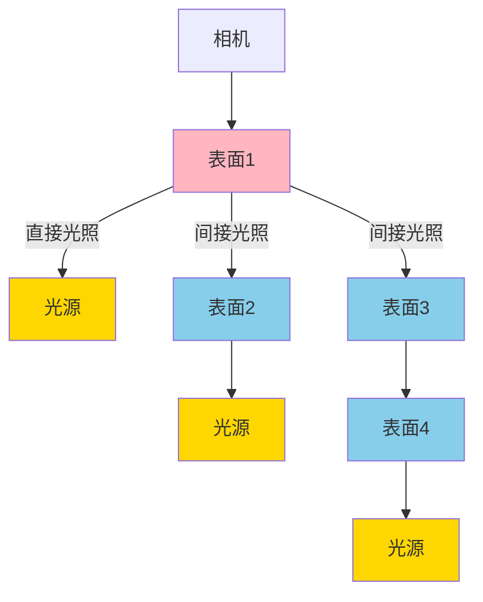
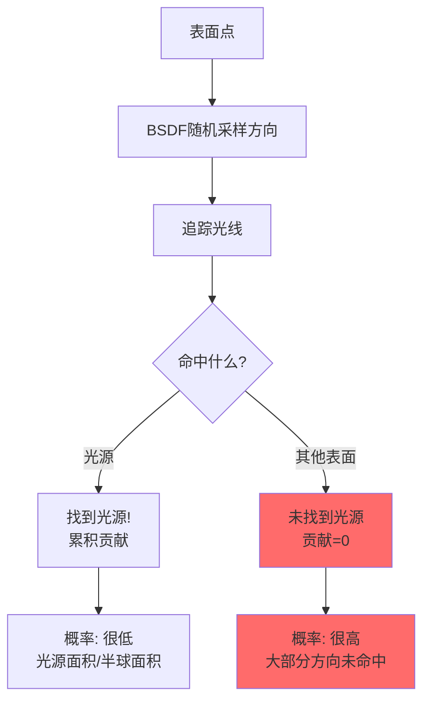
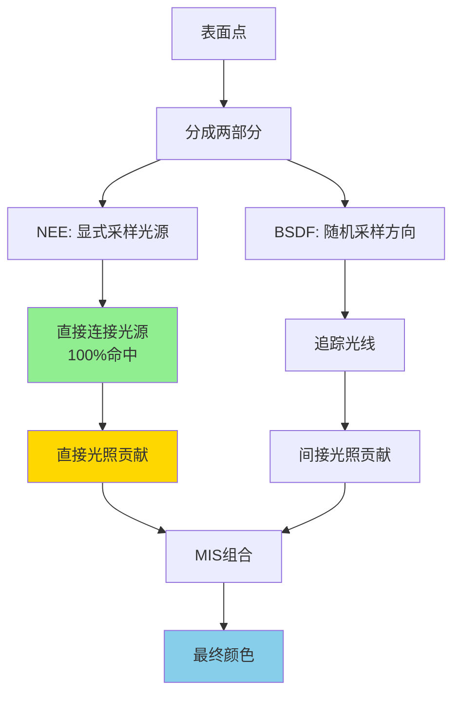
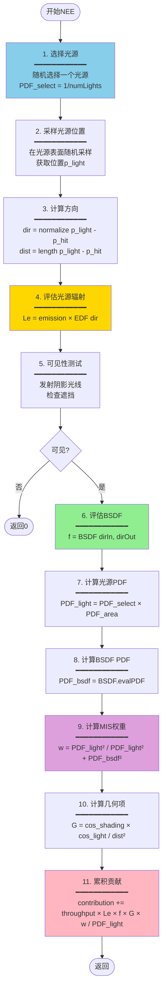
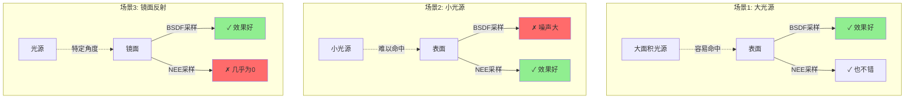
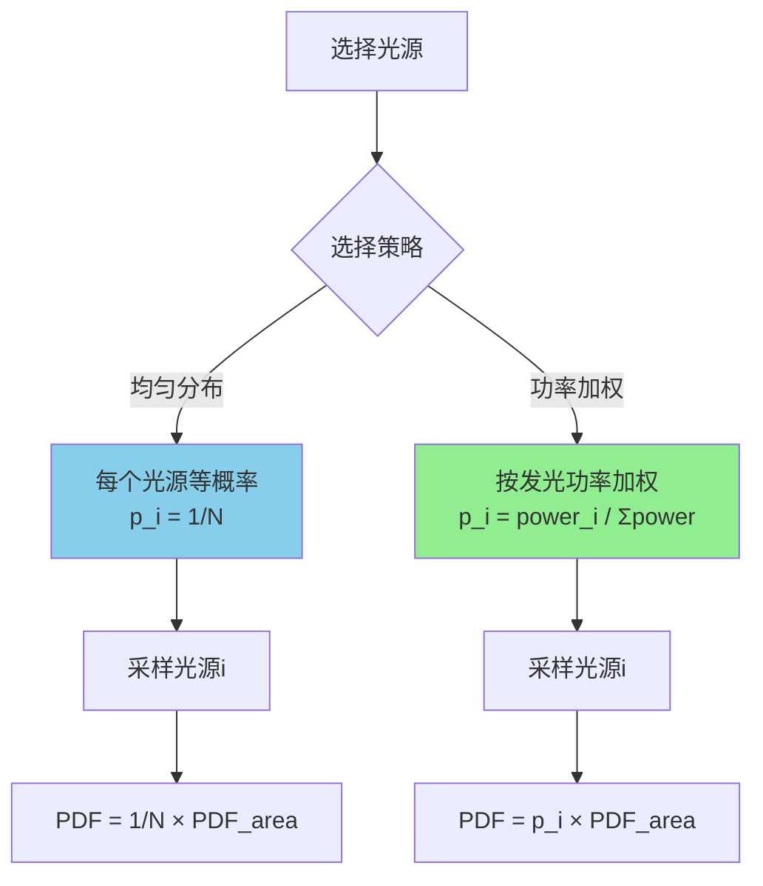
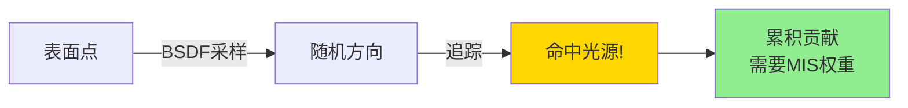

# 光照算法详解

> **深入理解Next Event Estimation和Multiple Importance Sampling**

---

## 目录

1. [光照基础](#光照基础)
2. [直接光照 vs 间接光照](#直接光照-vs-间接光照)
3. [Next Event Estimation (NEE)](#next-event-estimation-nee)
4. [Multiple Importance Sampling (MIS)](#multiple-importance-sampling-mis)
5. [光源采样算法](#光源采样算法)
6. [完整实现](#完整实现)

---

## 光照基础

### 渲染方程回顾

**渲染方程（Rendering Equation）**描述了光线在表面的散射：

%20=%20L_e(p,%5Comega_o)%20+%20%5Cint_%7B%5COmega%7D%20f_r(p,%5Comega_i,%5Comega_o)%20L_i(p,%5Comega_i)%20%7C%5Ccos%5Ctheta_i%7C%20d%5Comega_i)

**符号说明**：

| 符号 | 含义 | 单位 |
|------|------|------|
| ) | 出射辐射亮度 | W/(m²·sr) |
| ) | 自发光 | W/(m²·sr) |
|  | BSDF | 1/sr |
| ) | 入射辐射亮度 | W/(m²·sr) |
|  | 入射角余弦 | 无量纲 |
|  | 半球立体角 | sr |

### 蒙特卡洛估计

积分无法解析求解，使用蒙特卡洛方法：

%20L_i(%5Comega_i)%20%7C%5Ccos%5Ctheta_i%7C%7D%7Bp(%5Comega_i)%7D)

其中：
- N: 采样数量
- ): 采样概率密度函数（PDF）

---

## 直接光照 vs 间接光照

### 光照路径分类



**定义**：
- **直接光照**：光源 → 表面 → 相机（1次弹射）
- **间接光照**：光源 → 表面1 → 表面2 → ... → 相机（多次弹射）

### 贡献度对比

```
典型室内场景的光照贡献:

直接光照:    ████████████████████  60-80%
间接光照1次: ████████              20-30%
间接光照2次: ██                    5-10%
间接光照3+次: █                     1-5%
```

**结论**：直接光照最重要，必须高效采样。

---

## Next Event Estimation (NEE)

### 什么是NEE？

**显式光源采样**：在每次弹射时，直接向光源发射一条光线。

### 不使用NEE的问题



**问题**：
- 随机方向很难命中小光源
- 需要大量采样才能收敛
- 图像噪声严重

### 使用NEE的改进



**优势**：
- 每次弹射都能采样到光源
- 快速收敛，噪声低
- 性能提升：3-10倍（取决于场景）

---

### NEE算法流程



### NEE数学推导

#### 步骤1: 渲染方程转换为面积积分

原始形式（立体角积分）：


转换为面积积分：

%20V(p%20%5Cleftrightarrow%20p%27)%20dA)

其中几何项：

%20=%20%5Cfrac%7B%7C%5Ccos%5Ctheta_p%7C%20%5Ccdot%20%7C%5Ccos%5Ctheta_%7Bp%27%7D%7C%7D%7B%7C%7Cp%20-%20p%27%7C%7C%5E2%7D)

可见性函数：

%20=%20%5Cbegin%7Bcases%7D%201%20&%20%5Ctext%7Bif%20visible%7D%20%5C%5C%200%20&%20%5Ctext%7Bif%20occluded%7D%20%5Cend%7Bcases%7D)

#### 步骤2: 蒙特卡洛估计

在光源表面采样一个点：

%7D)

其中光源PDF：

%20=%20p_%7Bselect%7D%20%5Ccdot%20p_%7Barea%7D(p%27))

- : 选择该光源的概率
- : 在光源表面的面积PDF

---

## Multiple Importance Sampling (MIS)

### 为什么需要MIS？

NEE和BSDF采样各有优劣：



**问题**：没有单一策略在所有情况下都最优。

### MIS解决方案

**组合多种采样策略**，使用权重平衡：


其中权重函数满足：


### Power Heuristic（推荐）

**最常用的MIS权重**：


通常取 β=2（平方）：


**对于两种策略（NEE + BSDF）**：


### MIS效果对比

```
场景: 小光源 + 漫反射表面

仅BSDF采样 (1000 samples):
  噪声: ████████░░  高
  收敛速度: 慢

仅NEE采样 (1000 samples):
  噪声: ████░░░░░░  中
  收敛速度: 中

MIS组合 (1000 samples):
  噪声: ██░░░░░░░░  低
  收敛速度: 快

性能提升: 3-5倍
```

---

## 光源采样算法

### 区域光采样

#### 均匀三角形采样

在三角形表面均匀采样：

%20V_0%20+%20u%20V_1%20+%20v%20V_2)

其中：


**面积PDF**：


```cpp
__device__ Point3D sampleTriangleUniform(
    const Point3D& v0,
    const Point3D& v1,
    const Point3D& v2,
    float u0, float u1,
    float* areaPDF)
{
    // 均匀采样重心坐标
    float sqrtU0 = sqrtf(u0);
    float bary_u = 1.0f - sqrtU0;
    float bary_v = u1 * sqrtU0;
    float bary_w = 1.0f - bary_u - bary_v;
    
    // 计算采样点
    Point3D p = v0 * bary_w + v1 * bary_u + v2 * bary_v;
    
    // 计算面积
    Vector3D edge1 = v1 - v0;
    Vector3D edge2 = v2 - v0;
    float area = 0.5f * length(cross(edge1, edge2));
    
    *areaPDF = 1.0f / area;
    
    return p;
}
```

### 多光源选择

当场景有多个光源时：



#### 均匀选择（当前实现）

```cpp
__device__ uint32_t selectLightUniform(
    float u,
    uint32_t numLights,
    float* selectPDF)
{
    uint32_t lightIndex = min(
        (uint32_t)(u * numLights),
        numLights - 1
    );
    
    *selectPDF = 1.0f / numLights;
    
    return lightIndex;
}
```

#### 功率加权选择（未来优化）

```cpp
__device__ uint32_t selectLightByPower(
    float u,
    const float* lightPowers,  // 预计算的功率数组
    const float* cdf,           // 累积分布函数
    uint32_t numLights,
    float* selectPDF)
{
    // 二分查找CDF
    uint32_t lightIndex = binarySearchCDF(cdf, numLights, u);
    
    // PDF = 该光源的归一化功率
    float totalPower = cdf[numLights - 1];
    *selectPDF = lightPowers[lightIndex] / totalPower;
    
    return lightIndex;
}
```

---

## 立体角 vs 面积 PDF转换

### 为什么需要转换？

- **BSDF**：在立体角空间定义，PDF单位 1/sr
- **光源**：在面积空间采样，PDF单位 1/m²
- **MIS**：需要在同一空间比较PDF

### 转换公式

从面积PDF转换为立体角PDF：

%20=%20p_A(p%27)%20%5Cfrac%7B%7C%7Cp%20-%20p%27%7C%7C%5E2%7D%7B%7C%5Ccos%5Ctheta_%7Bp%27%7D%7C%7D)

**推导**：

立体角微分与面积微分的关系：


因此：


### 代码实现

```cpp
__device__ float convertAreaPDFtoSolidAnglePDF(
    float areaPDF,
    float distance,
    float cosLight)  // |cos(θ_light)|
{
    float solidAnglePDF = areaPDF * (distance * distance) / max(cosLight, 1e-8f);
    return solidAnglePDF;
}

// 在MIS计算中使用
float lightAreaPDF = selectPDF * areaPDF;
float lightSolidAnglePDF = convertAreaPDFtoSolidAnglePDF(
    lightAreaPDF, distance, cosLight);

float bsdfSolidAnglePDF = evaluateBSDFPDF(...);

float misWeight = powerHeuristic(lightSolidAnglePDF, bsdfSolidAnglePDF);
```

---

## 完整实现

### SampleLights Kernel完整代码

```cpp
extern "C" __global__ void sampleLights(
    WavefrontLaunchParameters* params)
{
    WavefrontLaunchParameters& wlp = *params;
    
    // 1. 获取路径
    uint32_t workIndex = blockIdx.x * blockDim.x + threadIdx.x;
    if (workIndex >= wlp.activePathQueue.size()) return;
    
    uint32_t pathIndex = wlp.activePathQueue.pathIndices[workIndex];
    WavefrontPathState& path = wlp.pathStateBuffer[pathIndex];
    
    if (!path.isActive()) return;
    
    const WavefrontHitInfo& hitInfo = wlp.hitInfoBuffer[pathIndex];
    if (!hitInfo.hasHit() || hitInfo.hitInfinity()) return;
    
    const SurfacePoint& surfPt = wlp.surfacePointBuffer[pathIndex];
    
    // 2. 获取材质
    const GeometryInstance& geomInst = wlp.geomInstBuffer[hitInfo.geomInstIndex];
    const SurfaceMaterialDescriptor& matDesc = 
        wlp.materialDescriptorBuffer[geomInst.materialIndex];
    
    // 跳过Delta材质 (完美镜面等)
    if (materialIsDelta(matDesc)) return;
    
    // 3. 选择光源
    float uLight = path.rng.getFloat0cTo1o();
    LightSelectResult selectResult;
    if (!selectLight(uLight, &selectResult, wlp)) return;
    
    // 4. 采样光源位置
    float u0 = path.rng.getFloat0cTo1o();
    float u1 = path.rng.getFloat0cTo1o();
    float u2 = path.rng.getFloat0cTo1o();
    LightSampleResult sampleResult;
    if (!sampleLight(selectResult.descriptor, surfPt.position, 
                     u0, u1, u2, &sampleResult, wlp)) return;
    
    sampleResult.lightSelectProb = selectResult.selectProb;
    
    // 5. 计算方向和距离
    Vector3D dirToLight = sampleResult.lightSurfPt.position - surfPt.position;
    float distance = length(dirToLight);
    if (distance < 1e-8f) return;
    dirToLight = dirToLight / distance;
    
    // 6. 评估光源辐射
    Vector3D dirToShading = -dirToLight;
    LightEmissionResult emissionResult;
    if (!evaluateLightEmission(selectResult.descriptor, 
                               sampleResult.lightSurfPt,
                               dirToShading, path.wls, 
                               &emissionResult, wlp)) return;
    
    if (!emissionResult.Le.hasNonZero()) return;
    
    // 7. 可见性测试 (简化实现，实际应发射阴影光线)
    float fractionalVisibility = 1.0f;  // 假设可见
    
    // 8. 评估BSDF
    Vector3D dirInLocal = surfPt.shadingFrame.toLocal(-path.direction);
    Vector3D dirOutLocal = surfPt.shadingFrame.toLocal(dirToLight);
    Normal3D geomNormalLocal = surfPt.shadingFrame.toLocal(surfPt.geometricNormal);
    
    BSDFContext bsdfCtx(matDesc, surfPt, path.wls);
    SampledSpectrum fs = evaluateBSDF(bsdfCtx, dirInLocal, dirOutLocal);
    
    if (!fs.hasNonZero()) return;
    
    // 9. 计算PDF
    float lightAreaPDF = sampleResult.lightSelectProb * sampleResult.areaPDF;
    
    float cosLight = absDot(-dirToLight, sampleResult.lightSurfPt.geometricNormal);
    float squaredDistance = distance * distance;
    float recSquaredDistance = 1.0f / max(squaredDistance, 1e-12f);
    
    float bsdfDirPDF = getBSDFPDF(bsdfCtx, dirInLocal, dirOutLocal);
    float bsdfAreaPDF = bsdfDirPDF * cosLight * recSquaredDistance;
    
    // 10. MIS权重
    float MISWeight = 1.0f;
    if (!selectResult.descriptor.isDelta() && lightAreaPDF > 1e-10f) {
        MISWeight = computeMISWeight(lightAreaPDF, bsdfAreaPDF);
    }
    
    // 11. 几何项
    float G = computeGeometryTerm(surfPt, sampleResult.lightSurfPt, 
                                  dirToLight, squaredDistance);
    G *= fractionalVisibility;
    
    if (G <= 0.0f) return;
    
    // 12. 累积贡献
    float invLightPDF = 1.0f / max(lightAreaPDF, 1e-10f);
    SampledSpectrum contrib = path.throughput * emissionResult.Le * fs * G * MISWeight * invLightPDF;
    
    if (contrib.allFinite() && contrib.hasNonZero()) {
        path.contribution += contrib;
    }
}
```

### MIS权重计算

```cpp
__device__ float computeMISWeight(float pdf1, float pdf2) {
    // Power Heuristic (β=2)
    // w = pdf1² / (pdf1² + pdf2²)
    
    // 处理特殊情况
    if (isnan(pdf1) || isnan(pdf2)) return 1.0f;
    if (isinf(pdf1)) return 1.0f;
    if (isinf(pdf2)) return 0.0f;
    
    float p1_sq = pdf1 * pdf1;
    float p2_sq = pdf2 * pdf2;
    
    float denom = p1_sq + p2_sq;
    if (denom < 1e-12f) return 1.0f;
    
    return p1_sq / denom;
}
```

---

## 隐式光源采样

### 什么是隐式采样？

当BSDF采样的方向**恰好**命中光源时：



### 与NEE的配合

```
完整的直接光照 = NEE贡献 + 隐式贡献

NEE贡献:
  - 在SampleLights阶段计算
  - 使用w_NEE权重

隐式贡献:
  - 在ProcessHits阶段计算 (下一次迭代)
  - 使用w_BSDF权重

两者互补，无偏估计
```

### 隐式采样代码

```cpp
__device__ void handleImplicitLightHit(
    WavefrontPathState& path,
    const SurfacePoint& surfPt,
    const SurfaceMaterialDescriptor& mat,
    const WavefrontLaunchParameters& wlp)
{
    // 1. 评估发光
    EDF edf(mat, surfPt, path.wls);
    SampledSpectrum emission = edf.evaluateEmittance();
    
    if (!emission.hasNonZero()) return;
    
    // 2. 计算出射方向
    Vector3D dirOutLocal = surfPt.shadingFrame.toLocal(-path.direction);
    
    // 3. 评估EDF
    EDFQuery query(DirectionType::All(), path.wls);
    SampledSpectrum Le = emission * edf.evaluate(query, dirOutLocal);
    
    // 4. 计算MIS权重
    float misWeight = 1.0f;
    
    if (path.pathLength > 0) {  // 非首次弹射需要MIS
        // 计算光源PDF (面积)
        float lightAreaPDF = computeLightPDFForPoint(surfPt, path, wlp);
        
        // BSDF PDF (前一次采样的PDF)
        float bsdfAreaPDF = convertDirPDFtoAreaPDF(
            path.prevDirPDF,
            distance,
            cosLight
        );
        
        // MIS权重 (BSDF策略)
        misWeight = computeMISWeight(bsdfAreaPDF, lightAreaPDF);
    }
    
    // 5. 累积贡献
    path.contribution += path.throughput * Le * misWeight;
}
```

---

## 阴影光线优化

### 当前实现的简化

```cpp
// 简化版: 假设光源总是可见
__device__ float testVisibility(...) {
    return 1.0f;  // 总是可见
}
```

**问题**：
- 忽略了遮挡
- 结果不准确（但快速）

### 完整实现（未来）

```cpp
__device__ float testVisibilityShadowRay(
    const SurfacePoint& shadingPt,
    const SurfacePoint& lightPt,
    const Vector3D& dirToLight,
    float distance,
    OptixTraversableHandle topGroup)
{
    // 准备阴影光线payload
    ShadowPayload payload;
    payload.isOccluded = false;
    
    // 发射阴影光线
    optixTrace(
        topGroup,
        shadingPt.position,
        dirToLight,
        0.001f,              // tmin
        distance - 0.001f,   // tmax (略小于光源距离)
        0.0f,
        OptixVisibilityMask(255),
        OPTIX_RAY_FLAG_TERMINATE_ON_FIRST_HIT,  // 优化: 任意遮挡即终止
        WFRayType_Shadow,    // 阴影光线类型
        NumWFRayTypes,
        WFRayType_Shadow,
        payload.isOccluded
    );
    
    return payload.isOccluded ? 0.0f : 1.0f;
}

// 阴影Any Hit程序
extern "C" __global__ void __anyhit__shadowAnyHit() {
    // 发现遮挡，立即终止
    optixSetPayload_0(1);  // isOccluded = true
    optixTerminateRay();
}
```

**性能考虑**：
- 阴影光线数量 = 活跃路径数
- 每个深度额外的OptiX调用
- 预计性能影响：10-20%（但准确性提升显著）

---

## 性能优化技巧

### 1. 提前退出

```cpp
__global__ void sampleLightsKernel(...) {
    // 尽早检查，减少无效计算
    if (!path.isActive()) return;
    if (!hitInfo.hasHit()) return;
    if (materialIsDelta(mat)) return;
    if (numLights == 0) return;
    
    // ... 主要逻辑 ...
}
```

### 2. 减少寄存器使用

```cpp
// 不好: 大量临时变量
__global__ void badKernel(...) {
    Vector3D temp1, temp2, temp3, temp4;
    SampledSpectrum s1, s2, s3, s4;
    // ... 寄存器压力大，占用率低
}

// 好: 复用变量
__global__ void goodKernel(...) {
    Vector3D dir;  // 复用
    SampledSpectrum spectrum;  // 复用
    
    dir = computeDir1();
    // 使用dir...
    
    dir = computeDir2();  // 复用
    // 使用dir...
}
```

### 3. 使用共享内存缓存

```cpp
__global__ void sampleLightsWithCache(...) {
    // 将光源数据加载到共享内存
    __shared__ LightDescriptor sharedLights[MAX_LIGHTS];
    
    if (threadIdx.x < numLights) {
        sharedLights[threadIdx.x] = wlp.lightDescriptors[threadIdx.x];
    }
    __syncthreads();
    
    // 使用共享内存访问 (更快)
    LightDescriptor light = sharedLights[lightIndex];
}
```

---

## 数学公式总结

### NEE完整公式

直接光照的蒙特卡洛估计：

%20L_e(p%27,%5Comega_%7Bp%27%5Crightarrow%20p%7D)%20G(p%5Cleftrightarrow%20p%27)%20V(p%5Cleftrightarrow%20p%27)%20w_%7BMIS%7D%7D%7Bp_%7Blight%7D(p%27)%7D)

展开：


### MIS权重公式

Power Heuristic (β=2):

%5E%5Cbeta%7D%7B%5Csum_%7Bj=1%7D%5E%7Bn%7D%5Cleft(%5Cfrac%7Bf_j%7D%7Bp_j%7D%5Cright)%5E%5Cbeta%7D)

简化形式（两种策略）：


### 几何项公式

%20=%20%5Cfrac%7B%7C%5Ccos%5Ctheta_p%7C%20%5Ccdot%20%7C%5Ccos%5Ctheta_%7Bp%27%7D%7C%7D%7B%7C%7Cp%20-%20p%27%7C%7C%5E2%7D%20%5Ccdot%20V(p%20%5Cleftrightarrow%20p%27))

---

## 可视化示例

### NEE vs 纯BSDF采样

```
场景: Cornell Box, 小光源, 64采样

纯BSDF采样:
┌─────────────────────────┐
│ ░░▓▓██▓▓░░░░░░░░░░░░░░ │  噪声大
│ ░░▓███▓░░░░░░░░░░░░░░░ │  光源周围有fireflies
│ ░░░▓▓░░░░░░░░░░░░░░░░░ │  暗区域噪声严重
│ ░░░░░░░░░░░░░░░░░░░░░░ │
└─────────────────────────┘

NEE采样:
┌─────────────────────────┐
│ ░░████░░░░░░░░░░░░░░░░ │  噪声低
│ ░░████░░░░░░░░░░░░░░░░ │  光源清晰
│ ░░░██░░░░░░░░░░░░░░░░░ │  暗区域平滑
│ ░░░░░░░░░░░░░░░░░░░░░░ │
└─────────────────────────┘

MIS组合:
┌─────────────────────────┐
│ ░░████░░░░░░░░░░░░░░░░ │  噪声最低
│ ░░████░░░░░░░░░░░░░░░░ │  光源完美
│ ░░░██░░░░░░░░░░░░░░░░░ │  全局平滑
│ ░░░░░░░░░░░░░░░░░░░░░░ │  间接光照准确
└─────────────────────────┘
```

---

## 常见问题

### Q1: 为什么需要MIS？直接用NEE不行吗？

**A**: NEE在某些情况下表现不佳：

```
场景: 镜面反射看向光源

NEE采样:
  - 在光源表面随机采样点
  - 大部分点的反射方向不满足镜面条件
  - BSDF值 ≈ 0
  - 贡献 ≈ 0
  - 效率低

BSDF采样:
  - 采样完美反射方向
  - 精确命中光源
  - BSDF值 = 最大
  - 效率高

MIS:
  - 自动识别哪种策略更好
  - 给BSDF采样更高权重
  - 结果最优
```

### Q2: PDF转换为什么重要？

**A**: MIS要求在同一空间比较PDF

```
错误的比较:
  lightPDF = 0.5 (面积PDF, 单位: 1/m²)
  bsdfPDF = 0.3 (立体角PDF, 单位: 1/sr)
  → 无法直接比较! 单位不同

正确的比较:
  lightPDF_area = 0.5 (1/m²)
  lightPDF_solid = 0.5 × r²/cosθ (1/sr)
  bsdfPDF_solid = 0.3 (1/sr)
  → 可以比较，单位相同
```

### Q3: 为什么Power Heuristic用β=2？

**A**: 理论和实验结果：

- **β=1** (Balance Heuristic): 理论最优，但对PDF估计误差敏感
- **β=2** (Power Heuristic): 更鲁棒，实际效果更好
- **β>2**: 过度惩罚小PDF，可能丢失贡献

**实验对比**：

```
Cornell Box, 256采样, MSE误差:

β=1:  MSE = 0.025  (噪声中等)
β=2:  MSE = 0.018  (噪声最低) ← 最优
β=3:  MSE = 0.022  (噪声略高)
```

---

## 下一步

### 继续学习

1. **[05_bsdf_sampling.md](05_bsdf_sampling.md)**
   - 学习BSDF采样算法
   - 理解重要性采样

2. **[06_optimizations.md](06_optimizations.md)**
   - 学习如何优化光照计算
   - 理解CUB库的使用

### 实践练习

1. **实现点光源**：修改光源采样代码
2. **添加环境光**：实现IBL（Image-Based Lighting）
3. **优化阴影光线**：实现真实的可见性测试
4. **性能测试**：对比NEE开关的性能差异

---

## 参考资料

### 论文

1. **Veach & Guibas (1995)** - "Optimally Combining Sampling Techniques for Monte Carlo Rendering"
   - MIS的原始论文

2. **Shirley et al. (1996)** - "Direct Lighting Calculation by Monte Carlo Integration"
   - NEE的详细分析

### 书籍

1. **PBRT Chapter 13** - "Light Transport I: Surface Reflection"
2. **PBRT Chapter 14** - "Light Transport II: Volume Rendering"

### 代码参考

- **NEE实现**: `libVLR/GPU_kernels/sample_lights.cu`
- **MIS计算**: `libVLR/shared/path_types.h:29-40`
- **光源采样**: `libVLR/shared/light_common.h`

---

**上一篇**: [03_kernel_pipeline.md](03_kernel_pipeline.md)  
**下一篇**: [05_bsdf_sampling.md - BSDF采样详解](05_bsdf_sampling.md) →

---

**版本**: 1.0  
**更新日期**: 2026-03-07  
**作者**: VLR开发团队
