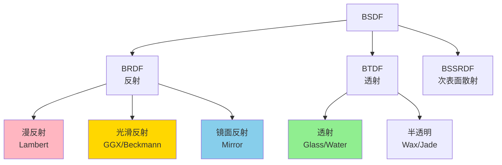
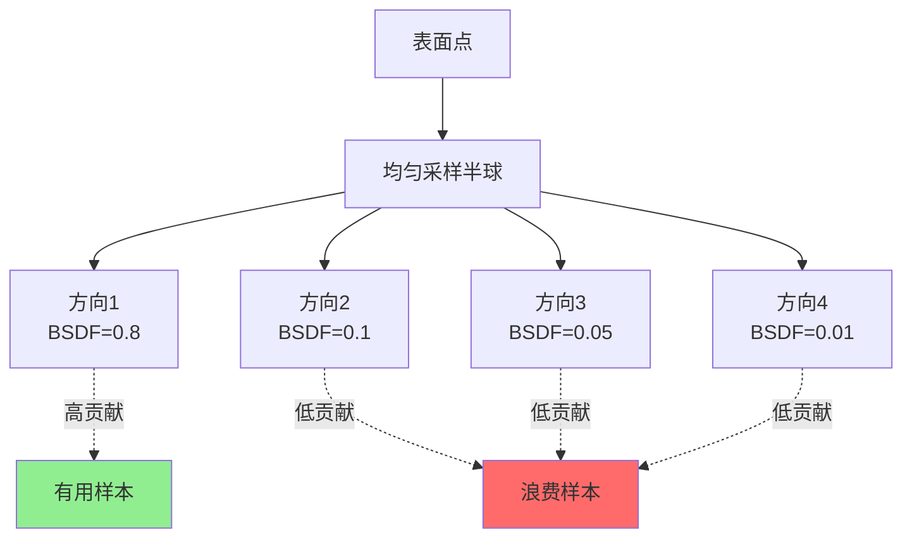
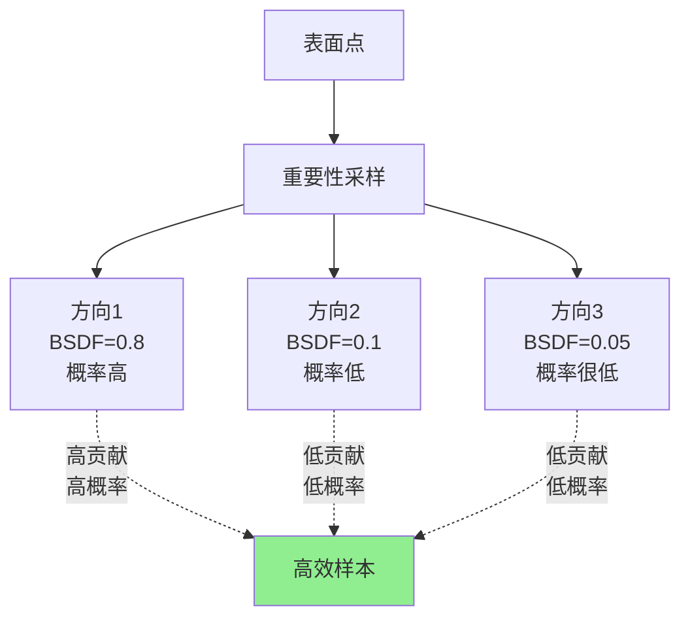
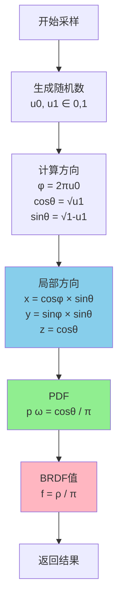

# BSDF采样详解

> **深入理解双向散射分布函数的采样算法和数学原理**

---

## 目录

1. [BSDF基础](#bsdf基础)
2. [重要性采样原理](#重要性采样原理)
3. [Lambert漫反射](#lambert漫反射)
4. [镜面反射](#镜面反射)
5. [微表面模型（GGX）](#微表面模型ggx)
6. [玻璃透射](#玻璃透射)
7. [实现细节](#实现细节)

---

## BSDF基础

### 什么是BSDF？

**BSDF (Bidirectional Scattering Distribution Function)** - 双向散射分布函数

描述光线在表面如何散射的函数：

%20=%20%5Cfrac%7BdL_o(p,%5Comega_o)%7D%7BdE_i(p,%5Comega_i)%7D%20=%20%5Cfrac%7BdL_o(p,%5Comega_o)%7D%7BL_i(p,%5Comega_i)%7C%5Ccos%5Ctheta_i%7Cd%5Comega_i%7D)

**物理意义**：给定入射方向，出射方向的辐射亮度分布。

### BSDF分类



### BSDF属性

| 属性 | 说明 | 示例 |
|------|------|------|
| **互易性** | %20=%20f_r(%5Comega_o,%5Comega_i)) | 大部分材质 |
| **能量守恒** |  | 物理材质 |
| **非负性** |  | 所有材质 |

---

## 重要性采样原理

### 为什么需要重要性采样？

**均匀采样的问题**：



**问题**：大部分样本贡献很小，效率低。

### 重要性采样

**核心思想**：按BSDF的形状采样，高值区域采样更多。



### 数学原理

蒙特卡洛估计器的方差：

%5E2)

**最优PDF**（零方差）：

%20=%20%5Cfrac%7Bf(%5Comega)%7D%7B%5Cint%20f(%5Comega)%20d%5Comega%7D)

**实践**：让PDF尽可能接近被积函数的形状。

---

## Lambert漫反射

### BRDF定义

Lambert模型：完全漫反射，各向同性。


其中 ρ 是反照率（albedo），范围[0, 1]。

### 采样算法

**余弦加权半球采样**：



### 数学推导

**目标**：采样PDF正比于 

**PDF形式**：

%20=%20%5Cfrac%7B%5Ccos%5Ctheta%7D%7B%5Cpi%7D)

**累积分布函数（CDF）**：

%20=%20%5Cint_0%5E%5Ctheta%20%5Cfrac%7B%5Ccos%5Ctheta%27%20%5Csin%5Ctheta%27%7D%7B%5Cpi%7D%20d%5Ctheta%27%20=%20%5Cfrac%7B1%20-%20%5Ccos%5E2%5Ctheta%7D%7B2%7D%20=%20%5Cfrac%7B%5Csin%5E2%5Ctheta%7D%7B2%7D)

**逆变换采样**：

%20%5CRightarrow%20%5Csin%5E2%5Ctheta%20=%202u%20%5CRightarrow%20%5Ccos%5Ctheta%20=%20%5Csqrt%7B1-2u%7D)

简化（令 u'=2u）：


### 代码实现

```cpp
__device__ void sampleLambertBRDF(
    const Vector3D& dirInLocal,  // 入射方向(局部坐标)
    float u0, float u1,          // 随机数
    BSDFSampleResult* result)
{
    // 1. 余弦加权半球采样
    float phi = 2.0f * M_PI * u0;
    float cosTheta = sqrtf(u1);
    float sinTheta = sqrtf(1.0f - u1);
    
    // 2. 计算局部方向
    result->dirLocal = make_float3(
        cosf(phi) * sinTheta,
        sinf(phi) * sinTheta,
        cosTheta
    );
    
    // 3. PDF = cosθ / π
    result->pdf = cosTheta / M_PI;
    
    // 4. BRDF = ρ / π
    result->f = albedo / M_PI;
    
    // 5. 采样类型
    result->sampledBSDFType = BSDFType_DiffuseReflection;
}
```

### 为什么这样采样最优？

渲染方程中的被积函数：

%20=%20f_r%20L_i%20%7C%5Ccos%5Ctheta%7C%20=%20%5Cfrac%7B%5Crho%7D%7B%5Cpi%7D%20L_i%20%5Ccos%5Ctheta)

如果  均匀，则 

**PDF**  正比于被积函数，方差最小！

---

## 镜面反射

### BRDF定义

完美镜面：

%20=%20%5Cfrac%7B%5Crho%7D%7B%7C%5Ccos%5Ctheta_o%7C%7D%20%5Cdelta(%5Comega_o%20-%20%5Comega_r))

其中  是反射方向，δ 是Dirac delta函数。

### 反射定律

```
入射光线和反射光线关于法线对称:

        ↑ N (法线)
        |
   ωi ↙ | ↗ ωo (反射)
       \|/
    ━━━━━━━━━━
     表面

反射方向:
ωo = 2(ωi · N)N - ωi
```

**数学公式**：

%5Cmathbf%7Bn%7D%20-%20%5Comega_i)

### 采样算法

```cpp
__device__ void sampleSpecularBRDF(
    const Vector3D& dirInLocal,  // 入射方向
    BSDFSampleResult* result)
{
    // 1. 计算反射方向 (局部坐标，法线=(0,0,1))
    result->dirLocal = make_float3(
        -dirInLocal.x,
        -dirInLocal.y,
        dirInLocal.z
    );
    
    // 2. Delta分布，PDF=1
    result->pdf = 1.0f;
    
    // 3. BRDF = ρ / |cosθ|
    float cosTheta = fabsf(result->dirLocal.z);
    result->f = albedo / max(cosTheta, 1e-6f);
    
    // 4. 采样类型
    result->sampledBSDFType = BSDFType_SpecularReflection;
}
```

**注意**：
- PDF=1 表示确定性方向（Delta分布）
- 不需要随机数
- BRDF包含 1/|cosθ| 项，与渲染方程中的cosθ抵消

---

## 微表面模型（GGX）

### 微表面理论

真实表面在微观尺度是粗糙的：

```
宏观平滑表面:
━━━━━━━━━━━━━━━━━━

微观粗糙表面:
    /\  /\/\    /\
   /  \/    \  /  \
  /          \/    \
━━━━━━━━━━━━━━━━━━

每个微表面都是完美镜面
宏观BRDF = 微表面的统计平均
```

### GGX BRDF公式

**Cook-Torrance微表面BRDF**：

%20F(%5Comega_o,%5Comega_h)%20G(%5Comega_i,%5Comega_o,%5Comega_h)%7D%7B4%7C%5Ccos%5Ctheta_i%7C%7C%5Ccos%5Ctheta_o%7C%7D)

其中：
- **D**: 法线分布函数（Normal Distribution Function）
- **F**: 菲涅尔项（Fresnel Term）
- **G**: 几何衰减项（Geometry Term）
- : 半程向量（Half Vector）

### GGX法线分布函数

**GGX (Trowbridge-Reitz) NDF**：

%20=%20%5Cfrac%7B%5Calpha%5E2%7D%7B%5Cpi%20%5Cleft(%5Ccos%5E2%5Ctheta_h(%5Calpha%5E2-1)+1%5Cright)%5E2%7D)

其中 α 是粗糙度参数（roughness）。

**形状特征**：

```
α = 0.1 (光滑):          α = 0.5 (中等):          α = 0.9 (粗糙):
      ▲                       ▲                       ▲
     ███                     ███                    █████
    █████                  ███████                ███████
   ███████               █████████              █████████
  █████████            ███████████            ███████████
━━━━━━━━━━━━━━━     ━━━━━━━━━━━━━━━     ━━━━━━━━━━━━━━━
  尖锐高光                宽高光                 接近漫反射
```

### GGX采样算法

**重要性采样GGX分布**：

**PDF**：

%20=%20D(%5Ctheta_h)%20%5Ccos%5Ctheta_h)

**采样公式**：

u%7D%7D)


```cpp
__device__ void sampleGGX_VNDF(
    const Vector3D& dirInLocal,
    float alpha,              // 粗糙度
    float u0, float u1,
    BSDFSampleResult* result)
{
    // 1. 采样半程向量 (GGX分布)
    float phi = 2.0f * M_PI * u0;
    
    float tanThetaSq = alpha * alpha * u1 / (1.0f - u1);
    float cosTheta = 1.0f / sqrtf(1.0f + tanThetaSq);
    float sinTheta = sqrtf(max(0.0f, 1.0f - cosTheta * cosTheta));
    
    Vector3D halfVector = make_float3(
        cosf(phi) * sinTheta,
        sinf(phi) * sinTheta,
        cosTheta
    );
    
    // 2. 计算反射方向
    float dotIH = dot(dirInLocal, halfVector);
    result->dirLocal = 2.0f * dotIH * halfVector - dirInLocal;
    
    // 3. 计算PDF
    float D = evaluateGGX_D(halfVector.z, alpha);
    result->pdf = D * cosTheta / (4.0f * fabsf(dotIH));
    
    // 4. 评估BRDF
    float F = evaluateFresnel(dotIH, ior);
    float G = evaluateGGX_G(dirInLocal, result->dirLocal, alpha);
    
    float cosI = fabsf(dirInLocal.z);
    float cosO = fabsf(result->dirLocal.z);
    
    result->f = (D * F * G) / (4.0f * cosI * cosO);
    
    result->sampledBSDFType = BSDFType_GlossyReflection;
}
```

### GGX各项详解

#### 1. 法线分布函数 D

```cpp
__device__ float evaluateGGX_D(float cosTheta, float alpha) {
    float alpha2 = alpha * alpha;
    float cos2 = cosTheta * cosTheta;
    float tan2 = (1.0f - cos2) / max(cos2, 1e-6f);
    
    float denom = cos2 * (alpha2 + tan2);
    denom = M_PI * denom * denom;
    
    return alpha2 / max(denom, 1e-6f);
}
```

#### 2. 几何项 G (Smith遮蔽函数)

%20=%20G_1(%5Comega_i)%20G_1(%5Comega_o))

%20=%20%5Cfrac%7B2%7D%7B1%20+%20%5Csqrt%7B1%20+%20%5Calpha%5E2%20%5Ctan%5E2%5Ctheta%7D%7D)

```cpp
__device__ float evaluateGGX_G1(float cosTheta, float alpha) {
    float cos2 = cosTheta * cosTheta;
    float tan2 = (1.0f - cos2) / max(cos2, 1e-6f);
    
    float lambda = 0.5f * (-1.0f + sqrtf(1.0f + alpha * alpha * tan2));
    
    return 1.0f / (1.0f + lambda);
}

__device__ float evaluateGGX_G(
    const Vector3D& dirIn,
    const Vector3D& dirOut,
    float alpha)
{
    float G1_i = evaluateGGX_G1(fabsf(dirIn.z), alpha);
    float G1_o = evaluateGGX_G1(fabsf(dirOut.z), alpha);
    
    return G1_i * G1_o;
}
```

#### 3. 菲涅尔项 F (Schlick近似)

%20=%20F_0%20+%20(1-F_0)(1-%5Ccos%5Ctheta)%5E5)

其中  是垂直入射时的反射率。

```cpp
__device__ float evaluateFresnelSchlick(float cosTheta, float F0) {
    float x = 1.0f - cosTheta;
    float x2 = x * x;
    float x5 = x2 * x2 * x;
    
    return F0 + (1.0f - F0) * x5;
}

// 金属的F0 (基于IOR)
// 金: F0 ≈ 0.95
// 银: F0 ≈ 0.97
// 铜: F0 ≈ 0.95
// 塑料: F0 ≈ 0.04
```

---

## 玻璃透射

### Snell定律

光线在介质界面的折射：


```
空气 (ηi = 1.0)
━━━━━━━━━━━━━━━━━━
        ↓ θi
        |
    ━━━━┼━━━━
        |
        ↓ θt
玻璃 (ηt = 1.5)

sin(θt) = (ηi / ηt) × sin(θi)
        = (1.0 / 1.5) × sin(θi)
        = 0.667 × sin(θi)
```

### 全内反射

当光线从高折射率介质射向低折射率介质时：


```
玻璃 → 空气:
  临界角 θc = arcsin(1.0/1.5) ≈ 41.8°
  
  θi < 41.8°: 部分反射 + 部分透射
  θi > 41.8°: 全内反射 (100%反射)
```

### 菲涅尔方程

**Fresnel方程**（精确）：

%7D%7B%5Csin%5E2(%5Ctheta_i+%5Ctheta_t)%7D%20+%20%5Cfrac%7B%5Ctan%5E2(%5Ctheta_i-%5Ctheta_t)%7D%7B%5Ctan%5E2(%5Ctheta_i+%5Ctheta_t)%7D%5Cright%5D)

**Schlick近似**（快速）：

(1-%5Ccos%5Ctheta_i)%5E5)

其中：

%5E2)

### 采样算法

```cpp
__device__ void sampleGlassBSDF(
    const Vector3D& dirInLocal,
    float ior,                // 折射率 (例如1.5)
    float u0, float u1, float u2,
    BSDFSampleResult* result)
{
    float cosI = dirInLocal.z;
    float etaI = cosI > 0.0f ? 1.0f : ior;  // 外侧/内侧
    float etaT = cosI > 0.0f ? ior : 1.0f;
    float eta = etaI / etaT;
    
    // 1. 计算Fresnel反射率
    float Fr = evaluateFresnelDielectric(fabsf(cosI), etaI, etaT);
    
    // 2. 根据Fresnel概率选择反射或透射
    if (u0 < Fr) {
        // 反射
        result->dirLocal = make_float3(
            -dirInLocal.x,
            -dirInLocal.y,
            dirInLocal.z
        );
        result->pdf = Fr;
        result->f = SampledSpectrum(1.0f);  // Delta BSDF
        result->sampledBSDFType = BSDFType_SpecularReflection;
    } else {
        // 透射 (Snell定律)
        float sin2I = 1.0f - cosI * cosI;
        float sin2T = eta * eta * sin2I;
        
        // 检查全内反射
        if (sin2T >= 1.0f) {
            // 全内反射，强制反射
            result->dirLocal = make_float3(-dirInLocal.x, -dirInLocal.y, dirInLocal.z);
            result->pdf = 1.0f;
            result->f = SampledSpectrum(1.0f);
            result->sampledBSDFType = BSDFType_SpecularReflection;
            return;
        }
        
        float cosT = sqrtf(1.0f - sin2T);
        if (cosI < 0.0f) cosT = -cosT;  // 调整符号
        
        result->dirLocal = make_float3(
            -eta * dirInLocal.x,
            -eta * dirInLocal.y,
            cosT
        );
        
        result->pdf = 1.0f - Fr;
        
        // 透射BSDF包含η²项 (非对称散射)
        float factor = (etaT * etaT) / (etaI * etaI);
        result->f = SampledSpectrum(factor);
        
        result->sampledBSDFType = BSDFType_SpecularTransmission;
    }
}
```

### 色散效果

**色散（Dispersion）**：不同波长的折射率不同

```
白光通过棱镜:

白光 ──→  /|
         / |
        /  |  ← 红光 (η=1.51)
       /   |  ← 绿光 (η=1.52)
      /    |  ← 蓝光 (η=1.53)
     /_____|

不同波长分离，形成彩虹
```

**Cauchy公式**（折射率与波长的关系）：

%20=%20A%20+%20%5Cfrac%7BB%7D%7B%5Clambda%5E2%7D)

```cpp
__device__ float getIORForWavelength(float lambda, float baseIOR) {
    // Cauchy公式参数 (玻璃)
    float A = baseIOR;
    float B = 0.01f;  // 色散强度
    
    // lambda单位: nm
    float lambdaMicron = lambda * 1e-3f;
    
    return A + B / (lambdaMicron * lambdaMicron);
}
```

---

## 实现细节

### SampleBSDF Kernel完整流程

```mermaid
flowchart TD
    Start([Kernel启动]) --> GetData[获取PathState<br/>SurfacePoint<br/>Material]
    
    GetData --> BuildContext[构建BSDF上下文<br/>局部坐标系<br/>入射方向]
    
    BuildContext --> GenRandom[生成随机数<br/>u0, u1, u2]
    
    GenRandom --> Sample[BSDF采样<br/>━━━━━━━━━━━━]
    
    Sample --> SwitchType{材质类型?}
    
    SwitchType -->|Matte| Lambert[Lambert采样<br/>余弦加权半球]
    SwitchType -->|Mirror| Mirror[镜面采样<br/>反射方向]
    SwitchType -->|Glossy| GGX[GGX采样<br/>微表面模型]
    SwitchType -->|Glass| Glass[玻璃采样<br/>反射/折射]
    
    Lambert --> Validate
    Mirror --> Validate
    GGX --> Validate
    Glass --> Validate
    
    Validate{PDF > 0?}
    Validate -->|否| Terminate[终止路径]
    
    Validate -->|是| CheckDispersion{色散材质?}
    
    CheckDispersion -->|是| HandleDispersion[处理色散<br/>选择单一波长<br/>PDF /= 4]
    CheckDispersion -->|否| UpdateThroughput
    
    HandleDispersion --> UpdateThroughput[更新吞吐量<br/>throughput *= <br/>f × |cos| / PDF]
    
    UpdateThroughput --> CheckFinite{吞吐量有限?}
    CheckFinite -->|否| Terminate
    
    CheckFinite -->|是| GenRay[生成下一跳光线<br/>origin = 偏移位置<br/>direction = 出射方向]
    
    GenRay --> UpdateState[更新PathState<br/>prevDirPDF<br/>prevSampledType<br/>pathLength++]
    
    UpdateState --> Enqueue[加入下一队列]
    
    Enqueue --> End([返回])
    Terminate --> End
    
    style Sample fill:#DDA0DD
    style UpdateThroughput fill:#FFD700
    style GenRay fill:#90EE90
```

### 吞吐量更新公式

**渲染方程的蒙特卡洛估计**：

%20%7C%5Ccos%5Ctheta_o%7C%7D%7Bp(%5Comega_o)%7D)

```cpp
__device__ void updateThroughput(
    WavefrontPathState& path,
    const BSDFSampleResult& result,
    const Normal3D& geomNormalLocal)
{
    // 1. 计算余弦项
    float cosFactor = dot(result.dirLocal, geomNormalLocal);
    float cosAbs = fabsf(cosFactor);
    
    // 2. 更新吞吐量
    path.throughput *= result.f * (cosAbs / result.pdf);
    
    // 3. 特殊处理: 透射的Adjoint BSDF校正
    if (result.sampledBSDFType == BSDFType_SpecularTransmission) {
        float cosShading = fabsf(result.dirLocal.z);
        float cosGeometric = fabsf(dot(result.dirLocal, geomNormalLocal));
        
        if (cosShading > 1e-6f && cosGeometric > 1e-6f) {
            float correction = cosGeometric / cosShading;
            path.throughput *= correction;
        }
    }
}
```

### 光线偏移（避免自相交）

```cpp
__device__ Point3D offsetRayOriginForNextBounce(
    const SurfacePoint& surfPt,
    float cosFactor)  // dot(outDir, geomNormal)
{
    // 根据方向选择法线
    Normal3D offsetNormal = (cosFactor > 0.0f) ? 
        surfPt.geometricNormal : -surfPt.geometricNormal;
    
    // 偏移量 (自适应)
    float epsilon = 1e-4f * max(1.0f, length(surfPt.position));
    
    return surfPt.position + offsetNormal * epsilon;
}
```

**为什么需要自适应偏移？**

```
场景尺度差异:

小场景 (1m):
  固定ε=1e-4: 合适 ✓

大场景 (1000m):
  固定ε=1e-4: 太小，浮点精度不足 ✗
  自适应ε=1e-1: 合适 ✓
```

---

## 性能优化

### 1. 材质特化

```cpp
// 通用版本 (有分支)
__global__ void sampleBSDF_Generic(...) {
    switch (material.type) {
        case Matte: sampleLambert(); break;
        case Mirror: sampleSpecular(); break;
        case Glossy: sampleGGX(); break;
        // ...
    }
}

// 特化版本 (无分支)
__global__ void sampleBSDF_Matte(...) {
    // 只处理Matte材质
    sampleLambert();
}

__global__ void sampleBSDF_Glossy(...) {
    // 只处理Glossy材质
    sampleGGX();
}
```

**配合路径排序**：

```cpp
// 按材质分组后，调用特化kernel
if (numDiffusePaths > 0) {
    sampleBSDF_Matte<<<...>>>(diffusePathIndices, ...);
}
if (numGlossyPaths > 0) {
    sampleBSDF_Glossy<<<...>>>(glossyPathIndices, ...);
}
```

**预期性能提升**：15-25%

### 2. 查表优化

```cpp
// 预计算的三角函数表
__constant__ float g_sinTable[256];
__constant__ float g_cosTable[256];

__device__ float fastSin(float x) {
    // 将x映射到[0, 2π]
    float normalized = x / (2.0f * M_PI);
    normalized = normalized - floorf(normalized);
    
    // 查表
    uint32_t index = (uint32_t)(normalized * 256.0f) % 256;
    return g_sinTable[index];
}
```

**适用场景**：
- 高频调用的三角函数
- 精度要求不高的场景
- 预计加速：2-3倍

---

## 常见问题

### Q1: 为什么Lambert BRDF有1/π？

**A**: 能量守恒要求

```
半球积分:
∫_Ω f_r |cosθ| dω = ∫_0^2π ∫_0^π/2 (ρ/π) cosθ sinθ dθ dφ
                  = (ρ/π) × 2π × ∫_0^π/2 cosθ sinθ dθ
                  = (ρ/π) × 2π × [sin²θ/2]_0^π/2
                  = (ρ/π) × 2π × 1/2
                  = ρ

要求 ρ ≤ 1 (能量守恒)
```

### Q2: GGX为什么比Phong好？

**A**: 更真实的高光形状

```
Phong:
  - 高光边缘过于锐利
  - 掠射角表现不佳
  - 不符合实测数据

GGX:
  - 长尾分布，高光自然
  - 掠射角正确
  - 匹配真实材质
```

### Q3: 为什么透射要乘η²？

**A**: 非对称散射的Jacobian校正

从立体角到半程向量的变换：

%20+%20%5Ceta_t(%5Comega_o%20%5Ccdot%20%5Comega_h))%5E2%7D)

详见PBRT 9.5.2节。

---

## 数学公式速查

### Lambert漫反射

| 项 | 公式 |
|---|------|
| **BRDF** |  |
| **PDF** | %20=%20%5Cfrac%7B%5Ccos%5Ctheta%7D%7B%5Cpi%7D) |
| **采样** |  |

### 镜面反射

| 项 | 公式 |
|---|------|
| **BRDF** | ) |
| **反射** | %5Cmathbf%7Bn%7D-%5Comega_i) |
| **PDF** |  (Delta分布) |

### GGX微表面

| 项 | 公式 |
|---|------|
| **D (NDF)** | %5Ccos%5E2%5Ctheta+1)%5E2%7D) |
| **G (Smith)** |  |
| **F (Schlick)** | (1-%5Ccos%5Ctheta)%5E5) |
| **BRDF** |  |

### 玻璃透射

| 项 | 公式 |
|---|------|
| **Snell** |  |
| **Fresnel** | %5E2) |
| **折射** | %5Cmathbf%7Bn%7D) |

---

## 代码示例

### 完整的SampleBSDF实现

```cpp
extern "C" __global__ void sampleBSDF(
    WavefrontLaunchParameters* params)
{
    WavefrontLaunchParameters& wlp = *params;
    
    // 1. 获取路径
    uint32_t workIndex = blockIdx.x * blockDim.x + threadIdx.x;
    if (workIndex >= wlp.activePathQueue.size()) return;
    
    uint32_t pathIndex = wlp.activePathQueue.pathIndices[workIndex];
    WavefrontPathState* __restrict__ pathStatePtr = &wlp.pathStateBuffer[pathIndex];
    WavefrontPathState& pathState = *pathStatePtr;
    
    if (!pathState.isActive()) return;
    
    const WavefrontHitInfo& hitInfo = wlp.hitInfoBuffer[pathIndex];
    if (!hitInfo.hasHit() || hitInfo.hitInfinity()) return;
    
    const SurfacePoint& surfPt = wlp.surfacePointBuffer[pathIndex];
    
    // 2. 获取材质
    const GeometryInstance& geomInst = wlp.geomInstBuffer[hitInfo.geomInstIndex];
    const SurfaceMaterialDescriptor& matDesc = 
        wlp.materialDescriptorBuffer[geomInst.materialIndex];
    
    // 3. 构建BSDF上下文
    Vector3D dirInLocal = surfPt.shadingFrame.toLocal(-pathState.direction);
    Normal3D geomNormalLocal = surfPt.shadingFrame.toLocal(surfPt.geometricNormal);
    
    BSDFContext bsdfCtx(matDesc, surfPt, pathState.wls, pathState.singleWlSelected());
    bsdfCtx.geomNormalLocal = geomNormalLocal;
    
    // 4. BSDF采样
    float u0 = pathState.rng.getFloat0cTo1o();
    float u1 = pathState.rng.getFloat0cTo1o();
    float u2 = pathState.rng.getFloat0cTo1o();
    
    BSDFSampleResult result;
    sampleBSDFWithU2(bsdfCtx, dirInLocal, u0, u1, u2, &result);
    
    // 5. 验证结果
    if (result.f == SampledSpectrum::Zero() || result.pdf <= 0.0f) {
        pathState.setTerminated();
        return;
    }
    
    if (!result.f.allFinite()) {
        pathState.setTerminated();
        return;
    }
    
    // 6. 处理色散
    bool isDispersive = isDispersiveBSDFType(result.sampledBSDFType, matDesc);
    if (isDispersive && !pathState.singleWlSelected()) {
        result.pdf /= NumSpectralSamples;
        pathState.setSingleWlSelected();
    }
    
    // 7. 更新吞吐量
    float cosFactor = dot(result.dirLocal, geomNormalLocal);
    float cosAbs = fabsf(cosFactor);
    pathState.throughput *= result.f * (cosAbs / result.pdf);
    
    // 8. Adjoint BSDF校正 (透射)
    if (result.sampledBSDFType == BSDFType_SpecularTransmission) {
        float cosShading = fabsf(result.dirLocal.z);
        float cosGeometric = fabsf(dot(result.dirLocal, geomNormalLocal));
        if (cosShading >= 1e-6f && cosGeometric >= 1e-6f) {
            float correction = cosGeometric / cosShading;
            pathState.throughput *= correction;
        }
    }
    
    // 9. 验证吞吐量
    if (!pathState.throughput.allFinite()) {
        pathState.setTerminated();
        return;
    }
    
    // 10. 生成下一跳光线
    Vector3D dirOut = surfPt.shadingFrame.toWorld(result.dirLocal);
    pathState.origin = offsetRayOriginForNextBounce(surfPt, cosFactor);
    pathState.direction = dirOut;
    
    // 11. 更新历史
    pathState.prevDirPDF = result.pdf;
    pathState.prevSampledType = bsdfTypeToDirectionType(result.sampledBSDFType);
    
    // 12. 加入下一队列
    wlp.nextActivePathQueue.enqueue(pathIndex);
}
```

---

## 可视化对比

### 不同采样策略的效果

```
场景: 光滑金属球, 64采样

均匀半球采样:
┌─────────────────────┐
│  ░░░░░░░░░░░░░░░░  │  噪声极大
│  ░▓▓██▓▓░░░░░░░░░  │  高光模糊
│  ░░▓▓░░░░░░░░░░░░  │  暗区噪声
│  ░░░░░░░░░░░░░░░░  │
└─────────────────────┘

余弦加权采样:
┌─────────────────────┐
│  ░░░░░░░░░░░░░░░░  │  噪声大
│  ░░███░░░░░░░░░░░  │  高光稍好
│  ░░░█░░░░░░░░░░░░  │  仍有噪声
│  ░░░░░░░░░░░░░░░░  │
└─────────────────────┘

GGX重要性采样:
┌─────────────────────┐
│  ░░░░░░░░░░░░░░░░  │  噪声低
│  ░░███░░░░░░░░░░░  │  高光清晰
│  ░░░█░░░░░░░░░░░░  │  平滑
│  ░░░░░░░░░░░░░░░░  │
└─────────────────────┘

效率对比:
  均匀采样: 1x (基准)
  余弦采样: 3x
  GGX采样: 10-20x
```

---

## 下一步

### 继续学习

1. **[06_optimizations.md](06_optimizations.md)**
   - 学习如何优化BSDF计算
   - 理解材质特化技术

2. **[07_getting_started.md](07_getting_started.md)**
   - 实践：创建自己的材质
   - 实践：修改BSDF参数

### 实践练习

1. **实现Phong BRDF**：对比GGX和Phong
2. **添加粗糙度参数**：可调节的材质外观
3. **实现各向异性**：拉丝金属效果
4. **性能测试**：对比不同采样策略

---

## 参考资料

### 论文

1. **Walter et al. (2007)** - "Microfacet Models for Refraction through Rough Surfaces"
   - GGX模型的原始论文

2. **Heitz (2014)** - "Understanding the Masking-Shadowing Function in Microfacet-Based BRDFs"
   - 几何项的详细分析

3. **Burley (2012)** - "Physically-Based Shading at Disney"
   - Disney BRDF

### 书籍

1. **PBRT Chapter 9** - "Reflection Models"
2. **Real-Time Rendering Chapter 9** - "Physically Based Shading"

### 代码参考

- **BSDF采样**: `libVLR/GPU_kernels/sample_bsdf.cu`
- **BSDF评估**: `libVLR/shared/bsdf_common.h`
- **材质类型**: `libVLR/shared/material_types.h`

---

**上一篇**: [04_lighting_algorithms.md](04_lighting_algorithms.md)  
**下一篇**: [06_optimizations.md - 优化技术详解](06_optimizations.md) →

---

**版本**: 1.0  
**更新日期**: 2026-03-07  
**作者**: VLR开发团队
