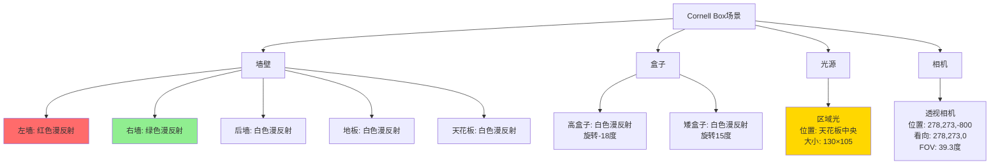
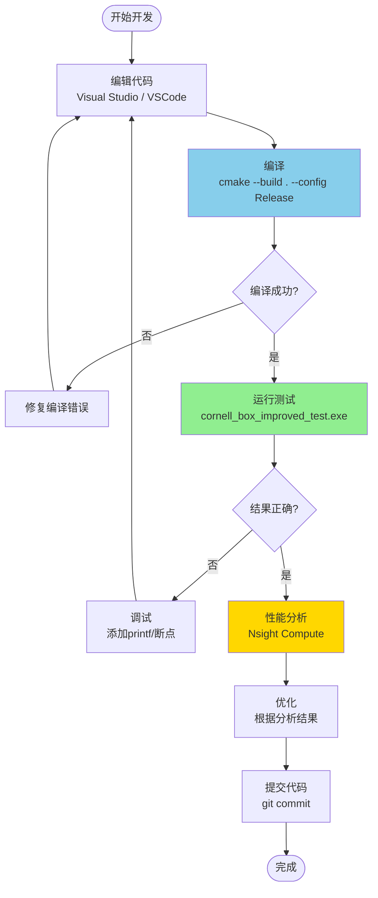
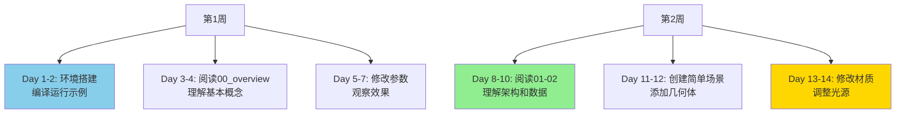
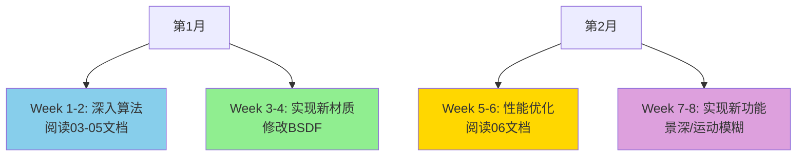

# 入门教程

> **从零开始：编译、运行、创建你的第一个渲染场景**

---

## 目录

1. [环境准备](#环境准备)
2. [编译项目](#编译项目)
3. [运行示例](#运行示例)
4. [创建第一个场景](#创建第一个场景)
5. [常见问题](#常见问题)
6. [进阶实践](#进阶实践)

---

## 环境准备

### 系统要求

```mermaid
graph TB
    System[系统要求] --> HW[硬件要求]
    System --> SW[软件要求]
    
    HW --> GPU[GPU<br/>NVIDIA RTX 20系列+<br/>4GB显存最低]
    HW --> CPU[CPU<br/>任意x64处理器<br/>4核心推荐]
    HW --> RAM[内存<br/>8GB最低<br/>16GB推荐]
    
    SW --> OS[操作系统<br/>Windows 10/11 64位]
    SW --> CUDA[CUDA Toolkit<br/>12.5或更高]
    SW --> OptiX[OptiX SDK<br/>8.0.0]
    SW --> VS[Visual Studio<br/>2022 (MSVC 19.41+)]
    SW --> CMake[CMake<br/>3.18或更高]
    
    style GPU fill:#76B900
    style CUDA fill:#00758F
    style OptiX fill:#FF6B00
```

### 1. 安装CUDA Toolkit

```bash
# 下载地址
https://developer.nvidia.com/cuda-downloads

# 选择版本
CUDA Toolkit 12.5 或更高

# 安装后验证
nvcc --version

# 预期输出:
# nvcc: NVIDIA (R) Cuda compiler driver
# Copyright (c) 2005-2024 NVIDIA Corporation
# Built on ...
# Cuda compilation tools, release 12.5, V12.5.XX
```

### 2. 安装OptiX SDK

```bash
# 下载地址 (需要NVIDIA开发者账号)
https://developer.nvidia.com/optix

# 安装OptiX 8.0.0
# 默认安装路径: C:\ProgramData\NVIDIA Corporation\OptiX SDK 8.0.0

# 设置环境变量
setx OptiX_INSTALL_DIR "C:\ProgramData\NVIDIA Corporation\OptiX SDK 8.0.0"
```

### 3. 安装Visual Studio 2022

```bash
# 下载地址
https://visualstudio.microsoft.com/downloads/

# 必需组件:
- Desktop development with C++
- Windows 10/11 SDK
- MSVC v143 或更高
```

### 4. 安装CMake

```bash
# 下载地址
https://cmake.org/download/

# 安装后验证
cmake --version

# 预期输出:
# cmake version 3.28.x
```

---

## 编译项目

### 步骤1: 克隆仓库

```bash
# 克隆项目
git clone https://github.com/trianglestrip/VLR_WF.git
cd VLR_WF
```

### 步骤2: 配置CMake

```bash
# 创建构建目录
mkdir build
cd build

# 配置项目 (Release模式)
cmake .. -G "Visual Studio 17 2022" -A x64 ^
  -DCMAKE_BUILD_TYPE=Release ^
  -DOptiX_INSTALL_DIR="C:\ProgramData\NVIDIA Corporation\OptiX SDK 8.0.0"

# 如果OptiX路径不同，修改上面的路径
```

**可能的输出**：

```
-- The C compiler identification is MSVC 19.41.34120.0
-- The CXX compiler identification is MSVC 19.41.34120.0
-- The CUDA compiler identification is NVIDIA 12.5.82
-- Detecting CUDA compile features - done
-- Found OptiX: C:/ProgramData/NVIDIA Corporation/OptiX SDK 8.0.0
-- Configuring done
-- Generating done
-- Build files have been written to: F:/project/VLR_WF/build
```

### 步骤3: 编译

```bash
# 编译项目
cmake --build . --config Release

# 或者在Visual Studio中打开VLR.sln并编译
```

**编译输出**：

```
[1/15] Building CUDA object libVLR/CMakeFiles/VLR.dir/...
[2/15] Building CXX object libVLR/CMakeFiles/VLR.dir/...
...
[14/15] Linking CUDA shared library ..\bin\VLR.dll
[15/15] Building CXX object test/CMakeFiles/cornell_box_improved_test.dir/...

Build succeeded.
```

### 步骤4: 验证编译

```bash
# 检查生成的文件
dir ..\bin

# 应该看到:
# VLR.dll
# cornell_box_improved_test.exe
```

---

## 运行示例

### 运行Cornell Box测试

```bash
# 进入bin目录
cd ..\bin

# 运行测试程序（使用默认配置）
.\cornell_box_improved_test.exe

# 或者使用预设配置
.\cornell_box_improved_test.exe config_presets\preview.ini      # 快速预览
.\cornell_box_improved_test.exe config_presets\benchmark.ini    # 性能测试
.\cornell_box_improved_test.exe config_presets\high_quality.ini # 高质量

# 或者使用自定义配置
.\cornell_box_improved_test.exe my_config.ini
```

### 配置文件说明

项目支持通过INI配置文件调整所有渲染和性能参数，无需重新编译：

**预设配置**：

| 配置文件 | 用途 | 分辨率 | 采样 | 时间 |
|---------|------|--------|------|------|
| preview.ini | 快速预览 | 512×512 | 16 | ~0.2秒 |
| benchmark.ini | 性能测试 | 512×512 | 1024 | ~8秒 |
| high_quality.ini | 高质量渲染 | 1920×1080 | 2048 | ~120秒 |
| debug.ini | 调试 | 256×256 | 4 | ~0.05秒 |

**可配置参数**：
- 图像分辨率、采样数、深度
- CPU-GPU同步间隔（SyncInterval）
- 路径压缩阈值（CompressionThreshold）
- Kernel线程块大小（BlockSize）
- 早期终止参数（EarlyTermination）
- 所有优化开关（排序、压缩、融合kernel等）

📖 **完整配置指南**: [../docs/CONFIGURATION_GUIDE.md](../docs/CONFIGURATION_GUIDE.md)

### 预期输出

```
[VLR] Initializing context...
[VLR] CUDA Device: GeForce RTX 2060 SUPER
[VLR] Compute Capability: 7.5
[VLR] Total Memory: 8192 MB

[VLR] Creating scene...
[VLR] Building acceleration structure...
[VLR] BVH build time: 12.5 ms

[VLR] Allocating wavefront buffers...
[VLR] PathState buffer: 37.7 MB
[VLR] HitInfo buffer: 8.4 MB
[VLR] SurfacePoint buffer: 33.6 MB
[VLR] Total GPU memory: 96 MB

[VLR] Starting render (512x512, 64 samples)...

Sample 1/64: 0.125s (8.0 samp/s)
Sample 2/64: 0.120s (8.3 samp/s)
...
Sample 64/64: 0.118s (8.5 samp/s)

[VLR] Render complete!
[VLR] Total time: 7.992s
[VLR] Throughput: 33.6 Msamp/s
[VLR] Saving image: cornell_box_improved.png

Done!
```

### 查看结果

```bash
# 输出图像位置
bin\cornell_box_improved.png

# 使用任意图片查看器打开
```

---

## 创建第一个场景

### 最小示例

创建文件 `test/my_first_scene.cpp`：

```cpp
#include <vlr/vlr.h>
#include <stdio.h>

int main() {
    // 1. 创建上下文
    VLRContext ctx = nullptr;
    vlrCreateContext(nullptr, 0, &ctx);
    
    // 2. 创建场景
    VLRScene scene = nullptr;
    vlrCreateScene(ctx, &scene);
    
    // 3. 创建材质
    VLRMaterial matWhite = nullptr;
    vlrCreateMatteMaterial(ctx, &matWhite);
    vlrSetMaterialAlbedo(matWhite, 0.8f, 0.8f, 0.8f);
    
    // 4. 创建几何体 (球体)
    VLRGeometry sphere = nullptr;
    vlrCreateSphere(ctx, &sphere, 1.0f);  // 半径1.0
    
    // 5. 创建实例
    VLRInstance inst = nullptr;
    vlrCreateInstance(ctx, &inst, sphere, matWhite);
    vlrSetInstanceTransform(inst, 
        1, 0, 0, 0,  // 单位矩阵
        0, 1, 0, 0,
        0, 0, 1, 0);
    vlrAddInstanceToScene(scene, inst);
    
    // 6. 创建相机
    VLRCamera camera = nullptr;
    vlrCreatePerspectiveCamera(ctx, &camera);
    vlrSetCameraPosition(camera, 0, 0, 5);   // 位置
    vlrSetCameraLookAt(camera, 0, 0, 0);     // 看向原点
    vlrSetCameraFOV(camera, 45.0f);          // 视场角
    
    // 7. 设置相机到场景
    vlrSetSceneCamera(scene, camera);
    
    // 8. 创建光源
    VLRLight light = nullptr;
    vlrCreatePointLight(ctx, &light);
    vlrSetLightPosition(light, 2, 3, 4);
    vlrSetLightIntensity(light, 100.0f, 100.0f, 100.0f);
    vlrAddLightToScene(scene, light);
    
    // 9. 渲染
    printf("Rendering...\n");
    vlrRender(ctx, scene, 512, 512, 64, VLRRenderer_WavefrontPathTracing);
    
    // 10. 保存图像
    vlrSaveImage(ctx, "my_first_render.png");
    
    // 11. 清理
    vlrDestroyLight(light);
    vlrDestroyCamera(camera);
    vlrDestroyInstance(inst);
    vlrDestroyGeometry(sphere);
    vlrDestroyMaterial(matWhite);
    vlrDestroyScene(scene);
    vlrDestroyContext(ctx);
    
    printf("Done! Check my_first_render.png\n");
    
    return 0;
}
```

### 添加到CMake

编辑 `CMakeLists.txt`，添加：

```cmake
# 添加你的测试程序
add_executable(my_first_scene
    test/my_first_scene.cpp
)

target_link_libraries(my_first_scene
    PRIVATE VLR
)

set_target_properties(my_first_scene PROPERTIES
    RUNTIME_OUTPUT_DIRECTORY "${CMAKE_BINARY_DIR}/../bin"
)
```

### 编译并运行

```bash
# 重新配置
cmake ..

# 编译
cmake --build . --config Release

# 运行
cd ..\bin
.\my_first_scene.exe
```

---

## 场景配置

### Cornell Box场景解析



### 场景参数

```cpp
// Cornell Box尺寸
const float ROOM_SIZE = 552.8f;

// 墙壁顶点
Point3D vertices[] = {
    // 地板
    {0, 0, 0}, {ROOM_SIZE, 0, 0}, 
    {ROOM_SIZE, 0, ROOM_SIZE}, {0, 0, ROOM_SIZE},
    
    // 左墙 (红色)
    {0, 0, 0}, {0, 0, ROOM_SIZE},
    {0, ROOM_SIZE, ROOM_SIZE}, {0, ROOM_SIZE, 0},
    
    // 右墙 (绿色)
    {ROOM_SIZE, 0, 0}, {ROOM_SIZE, ROOM_SIZE, 0},
    {ROOM_SIZE, ROOM_SIZE, ROOM_SIZE}, {ROOM_SIZE, 0, ROOM_SIZE},
    
    // ... 其他墙壁
};

// 材质
Material redMaterial = {
    .type = MaterialType_Matte,
    .albedo = {0.63f, 0.065f, 0.05f}  // 红色
};

Material greenMaterial = {
    .type = MaterialType_Matte,
    .albedo = {0.14f, 0.45f, 0.091f}  // 绿色
};

Material whiteMaterial = {
    .type = MaterialType_Matte,
    .albedo = {0.725f, 0.71f, 0.68f}  // 白色
};

// 光源
AreaLight ceilingLight = {
    .position = {278, 548.7f, 279.5f},
    .size = {130, 105},
    .emission = {15.0f, 15.0f, 15.0f}  // 白光
};
```

---

## 参数调整

### 渲染参数

```cpp
// 基本参数
uint32_t width = 512;        // 图像宽度
uint32_t height = 512;       // 图像高度
uint32_t numSamples = 64;    // 采样数 (越多越清晰)
uint32_t maxDepth = 8;       // 最大反弹次数

// 质量 vs 速度权衡
┌──────────────┬──────────┬──────────┬──────────┐
│ 配置         │ 采样数   │ 渲染时间 │ 质量     │
├──────────────┼──────────┼──────────┼──────────┤
│ 快速预览     │ 16       │ 0.2秒    │ 噪声大   │
│ 中等质量     │ 64       │ 0.8秒    │ 轻微噪声 │
│ 高质量       │ 256      │ 3.2秒    │ 清晰     │
│ 照片级       │ 1024     │ 12.8秒   │ 完美     │
└──────────────┴──────────┴──────────┴──────────┘
```

### 相机参数

```cpp
// 相机位置和朝向
struct CameraConfig {
    Point3D position;     // 相机位置
    Point3D lookAt;       // 看向的点
    Vector3D up;          // 上方向 (通常是(0,1,0))
    float fov;            // 视场角 (度)
    float aspectRatio;    // 宽高比
};

// Cornell Box相机
CameraConfig camera = {
    .position = {278, 273, -800},
    .lookAt = {278, 273, 0},
    .up = {0, 1, 0},
    .fov = 39.3f,
    .aspectRatio = 1.0f  // 正方形图像
};
```

### 材质参数

```cpp
// Matte材质 (漫反射)
struct MatteParams {
    float3 albedo;  // 反照率 (0-1)
};

// Glossy材质 (光滑反射)
struct GlossyParams {
    float3 albedo;
    float roughness;  // 粗糙度 (0=镜面, 1=漫反射)
    float ior;        // 折射率
};

// Glass材质 (玻璃)
struct GlassParams {
    float3 transmittance;  // 透射率
    float ior;             // 折射率 (1.5 for glass)
    float roughness;       // 粗糙度
};
```

---

## 实践示例

### 示例1: 修改材质颜色

```cpp
// 将左墙改为蓝色
Material blueMaterial = {
    .type = MaterialType_Matte,
    .albedo = {0.1f, 0.2f, 0.8f}  // 蓝色
};

// 应用到左墙
vlrSetInstanceMaterial(leftWallInstance, blueMaterial);
```

### 示例2: 添加镜面球

```cpp
// 创建镜面材质
VLRMaterial mirrorMat = nullptr;
vlrCreateSpecularMaterial(ctx, &mirrorMat);
vlrSetMaterialAlbedo(mirrorMat, 0.95f, 0.95f, 0.95f);

// 创建球体
VLRGeometry sphere = nullptr;
vlrCreateSphere(ctx, &sphere, 80.0f);  // 半径80

// 创建实例并设置位置
VLRInstance sphereInst = nullptr;
vlrCreateInstance(ctx, &sphereInst, sphere, mirrorMat);

// 变换矩阵 (平移到(370, 80, 150))
float transform[12] = {
    1, 0, 0, 370,  // X轴 + 平移X
    0, 1, 0, 80,   // Y轴 + 平移Y
    0, 0, 1, 150   // Z轴 + 平移Z
};
vlrSetInstanceTransform(sphereInst, transform);

// 添加到场景
vlrAddInstanceToScene(scene, sphereInst);
```

### 示例3: 调整光源

```cpp
// 增加光源强度
vlrSetLightIntensity(light, 30.0f, 30.0f, 30.0f);  // 更亮

// 改变光源颜色
vlrSetLightIntensity(light, 30.0f, 20.0f, 10.0f);  // 暖色调

// 移动光源位置
vlrSetLightPosition(light, 278, 500, 279);  // 降低高度
```

---

## 渲染配置文件

### 使用INI配置

创建 `render_config.ini`：

```ini
[Render]
Width = 512
Height = 512
Samples = 64
MaxDepth = 8
OutputFile = output.png

[Camera]
PositionX = 278
PositionY = 273
PositionZ = -800
LookAtX = 278
LookAtY = 273
LookAtZ = 0
FOV = 39.3

[Performance]
EnablePathSorting = true
EnableStreamCompaction = true
SyncInterval = 4
BlockSizeGenerate = 256
BlockSizeProcess = 256
BlockSizeSampleLights = 128
BlockSizeSampleBSDF = 256
```

### 读取配置

```cpp
#include <fstream>
#include <string>

struct RenderConfig {
    uint32_t width, height, samples, maxDepth;
    std::string outputFile;
    // ... 其他参数
};

RenderConfig loadConfig(const char* filename) {
    RenderConfig config;
    std::ifstream file(filename);
    std::string line;
    
    while (std::getline(file, line)) {
        if (line.find("Width") != std::string::npos) {
            sscanf(line.c_str(), "Width = %u", &config.width);
        }
        // ... 解析其他参数
    }
    
    return config;
}

// 使用
RenderConfig config = loadConfig("render_config.ini");
vlrRender(ctx, scene, config.width, config.height, 
          config.samples, VLRRenderer_WavefrontPathTracing);
```

---

## 调试技巧

### 1. 启用调试输出

```cpp
// 在编译时定义
#define VLR_DEBUG_PRINT

// 或在CMake中
add_definitions(-DVLR_DEBUG_PRINT)

// 代码中使用
#ifdef VLR_DEBUG_PRINT
printf("[Debug] PathState[%u]: throughput=(%.3f, %.3f, %.3f)\n",
       pathIndex, tp.x, tp.y, tp.z);
#endif
```

### 2. 单像素调试

```cpp
// 只渲染中心像素
#define DEBUG_PIXEL_X 256
#define DEBUG_PIXEL_Y 256

__global__ void debugKernel(...) {
    uint32_t px = pathState.pixelX;
    uint32_t py = pathState.pixelY;
    
    if (px == DEBUG_PIXEL_X && py == DEBUG_PIXEL_Y) {
        printf("[Pixel %u,%u] Depth %u: hit at (%.3f, %.3f, %.3f)\n",
               px, py, pathState.pathLength,
               hitPos.x, hitPos.y, hitPos.z);
    }
}
```

### 3. 可视化调试

```cpp
// 输出调试图像
enum DebugMode {
    DebugMode_Normal,      // 正常渲染
    DebugMode_Depth,       // 深度可视化
    DebugMode_Normals,     // 法线可视化
    DebugMode_MaterialID,  // 材质ID可视化
};

// 在accumulate kernel中
if (debugMode == DebugMode_Normals) {
    // 将法线映射到RGB
    float3 color = (normal + 1.0f) * 0.5f;
    output = color;
}
```

---

## 性能测试

### 基准测试脚本

```cpp
void runBenchmark() {
    const uint32_t resolutions[][2] = {
        {256, 256},
        {512, 512},
        {1024, 1024},
        {1920, 1080}
    };
    
    const uint32_t samples[] = {16, 64, 256, 1024};
    
    printf("Resolution\tSamples\tTime(s)\tThroughput(Msamp/s)\n");
    printf("━━━━━━━━━━━━━━━━━━━━━━━━━━━━━━━━━━━━━━━━━━━━━━━━\n");
    
    for (auto [w, h] : resolutions) {
        for (uint32_t spp : samples) {
            auto start = std::chrono::high_resolution_clock::now();
            
            vlrRender(ctx, scene, w, h, spp, VLRRenderer_WavefrontPathTracing);
            
            auto end = std::chrono::high_resolution_clock::now();
            float seconds = std::chrono::duration<float>(end - start).count();
            
            float totalSamples = w * h * spp;
            float throughput = (totalSamples / seconds) / 1e6f;
            
            printf("%ux%u\t%u\t%.2f\t%.2f\n", 
                   w, h, spp, seconds, throughput);
        }
    }
}
```

### 性能对比

```bash
# 运行基准测试
.\benchmark.exe

# 输出示例:
Resolution  Samples Time(s) Throughput(Msamp/s)
━━━━━━━━━━━━━━━━━━━━━━━━━━━━━━━━━━━━━━━━━━━━━━━━
256x256     16      0.02    32.8
256x256     64      0.08    33.6
256x256     256     0.32    33.6
512x512     16      0.08    33.6
512x512     64      0.32    33.6
512x512     1024    7.99    33.6
1024x1024   64      1.28    33.6
1920x1080   64      2.56    32.8
```

---

## 常见问题

### Q1: 编译错误 - 找不到OptiX

```
CMake Error: Could not find OptiX
```

**解决方案**：

```bash
# 设置OptiX路径
cmake .. -DOptiX_INSTALL_DIR="C:\ProgramData\NVIDIA Corporation\OptiX SDK 8.0.0"

# 或设置环境变量
setx OptiX_INSTALL_DIR "C:\ProgramData\NVIDIA Corporation\OptiX SDK 8.0.0"
```

### Q2: 运行时错误 - CUDA初始化失败

```
[CUDA Error] no CUDA-capable device is detected
```

**检查**：

```bash
# 检查CUDA设备
nvidia-smi

# 应该看到你的GPU信息
# 如果没有，检查驱动程序
```

### Q3: 渲染结果全黑

**可能原因**：

1. **光源未添加**：检查是否调用了`vlrAddLightToScene`
2. **相机位置错误**：相机在几何体内部
3. **材质问题**：albedo为0

**调试**：

```cpp
// 打印场景信息
printf("Num instances: %u\n", vlrGetNumInstances(scene));
printf("Num lights: %u\n", vlrGetNumLights(scene));
printf("Camera position: (%.1f, %.1f, %.1f)\n", 
       camera.position.x, camera.position.y, camera.position.z);
```

### Q4: 性能比预期慢

**检查**：

```cpp
// 1. 确认使用Release模式
cmake --build . --config Release  // 不是Debug!

// 2. 检查GPU占用率
nvidia-smi dmon

// 3. 检查是否启用优化
#ifdef _DEBUG
#error "Should build in Release mode for performance!"
#endif
```

---

## 进阶实践

### 实践1: 添加玻璃球

```cpp
// 创建玻璃材质
VLRMaterial glassMat = nullptr;
vlrCreateGlassMaterial(ctx, &glassMat);
vlrSetMaterialIOR(glassMat, 1.5f);  // 玻璃折射率
vlrSetMaterialTransmittance(glassMat, 0.95f, 0.95f, 0.95f);

// 创建球体实例
VLRGeometry sphere = nullptr;
vlrCreateSphere(ctx, &sphere, 100.0f);

VLRInstance glassInst = nullptr;
vlrCreateInstance(ctx, &glassInst, sphere, glassMat);
vlrSetInstancePosition(glassInst, 370, 100, 150);
vlrAddInstanceToScene(scene, glassInst);

// 渲染 (需要更多采样以减少噪声)
vlrRender(ctx, scene, 512, 512, 256, VLRRenderer_WavefrontPathTracing);
```

### 实践2: 添加纹理

```cpp
// 加载纹理
VLRTexture texture = nullptr;
vlrLoadTexture(ctx, &texture, "checkerboard.png");

// 创建纹理材质
VLRMaterial texMat = nullptr;
vlrCreateMatteMaterial(ctx, &texMat);
vlrSetMaterialAlbedoTexture(texMat, texture);

// 应用到几何体
vlrSetInstanceMaterial(floorInstance, texMat);
```

### 实践3: 景深效果

```cpp
// 启用景深 (Depth of Field)
vlrSetCameraAperture(camera, 0.05f);      // 光圈大小
vlrSetCameraFocusDistance(camera, 800.0f); // 对焦距离

// 渲染
vlrRender(ctx, scene, 512, 512, 256, VLRRenderer_WavefrontPathTracing);

// 效果: 对焦点清晰，前后模糊
```

### 实践4: 环境光照

```cpp
// 加载HDR环境贴图
VLREnvironmentMap envMap = nullptr;
vlrLoadEnvironmentMap(ctx, &envMap, "studio.hdr");

// 设置到场景
vlrSetSceneEnvironment(scene, envMap);
vlrSetEnvironmentIntensity(envMap, 1.5f);  // 强度

// 渲染 (环境光提供间接光照)
vlrRender(ctx, scene, 512, 512, 128, VLRRenderer_WavefrontPathTracing);
```

---

## 项目结构

```
VLR_WF/
├─ libVLR/                    # 核心库
│  ├─ context.cpp             # 渲染上下文
│  ├─ context.h               # 接口定义
│  ├─ GPU_kernels/            # CUDA/OptiX内核
│  │  ├─ kernel_launch.cu     # 光线生成
│  │  ├─ trace_rays.cu        # OptiX追踪
│  │  ├─ sample_lights.cu     # 光源采样
│  │  ├─ sample_bsdf.cu       # BSDF采样
│  │  └─ compact.cu           # CUB压缩/排序
│  └─ shared/                 # 共享头文件
│     ├─ path_types.h         # 数据结构
│     └─ performance_config.h # 性能配置
│
├─ test/                      # 测试程序
│  └─ cornell_box_improved_test.cpp
│
├─ bin/                       # 可执行文件
│  ├─ VLR.dll
│  └─ cornell_box_improved_test.exe
│
├─ docs/                      # 技术文档
│  ├─ WAVEFRONT_IMPLEMENTATION.md
│  ├─ PERFORMANCE_REPORT.md
│  └─ wavefront_design.md
│
├─ tools/                     # 教学文档
│  ├─ 00_overview.md
│  ├─ 01_wavefront_architecture.md
│  ├─ 02_data_structures.md
│  ├─ 03_kernel_pipeline.md
│  ├─ 04_lighting_algorithms.md
│  ├─ 05_bsdf_sampling.md
│  ├─ 06_optimizations.md
│  └─ 07_getting_started.md  # 本文档
│
└─ CMakeLists.txt             # 构建配置
```

---

## 开发工作流

### 典型开发流程



### Git工作流

```bash
# 1. 创建功能分支
git checkout -b feature/my-new-feature

# 2. 开发和测试
# ... 编辑代码 ...

# 3. 提交更改
git add libVLR/GPU_kernels/my_kernel.cu
git commit -m "Add new kernel for feature X"

# 4. 推送到远程
git push origin feature/my-new-feature

# 5. 创建Pull Request
# 在GitHub上创建PR
```

---

## 学习路径

### 初学者路径（1-2周）



### 进阶路径（1-2个月）



---

## 推荐资源

### 在线教程

1. **GAMES101 - 现代计算机图形学入门**
   - 讲师：闫令琪
   - 链接：[https://sites.cs.ucsb.edu/~lingqi/teaching/games101.html](https://sites.cs.ucsb.edu/~lingqi/teaching/games101.html)
   - 中文授课，适合入门

2. **Ray Tracing in One Weekend**
   - 作者：Peter Shirley
   - 链接：[https://raytracing.github.io/](https://raytracing.github.io/)
   - 快速上手路径追踪

3. **CUDA Training Series**
   - NVIDIA官方教程
   - 链接：[https://www.nvidia.com/en-us/training/](https://www.nvidia.com/en-us/training/)

### 书籍

1. **"Physically Based Rendering" (PBRT)**
   - 作者：Matt Pharr, Wenzel Jakob, Greg Humphreys
   - 第4版包含Wavefront实现
   - 在线免费：[https://pbr-book.org/](https://pbr-book.org/)

2. **"Real-Time Rendering"**
   - 作者：Tomas Akenine-Möller et al.
   - 第4版
   - GPU架构和优化

3. **"Ray Tracing Gems"**
   - NVIDIA编辑
   - 免费下载：[https://www.realtimerendering.com/raytracinggems/](https://www.realtimerendering.com/raytracinggems/)

### 社区

1. **Shadertoy**
   - 实时渲染实验
   - [https://www.shadertoy.com/](https://www.shadertoy.com/)

2. **NVIDIA Developer Forums**
   - OptiX和CUDA讨论
   - [https://forums.developer.nvidia.com/](https://forums.developer.nvidia.com/)

---

## 快速参考

### 常用命令

```bash
# 配置项目
cmake .. -G "Visual Studio 17 2022" -A x64

# 编译
cmake --build . --config Release

# 运行测试
cd ..\bin
.\cornell_box_improved_test.exe

# 清理构建
cmake --build . --target clean

# 重新配置
rm -rf build
mkdir build
cd build
cmake ..
```

### 常用API

```cpp
// 上下文管理
vlrCreateContext(nullptr, 0, &ctx);
vlrDestroyContext(ctx);

// 场景管理
vlrCreateScene(ctx, &scene);
vlrAddInstanceToScene(scene, inst);
vlrDestroyScene(scene);

// 材质创建
vlrCreateMatteMaterial(ctx, &mat);
vlrCreateSpecularMaterial(ctx, &mat);
vlrCreateGlassMaterial(ctx, &mat);

// 几何体创建
vlrCreateSphere(ctx, &geom, radius);
vlrCreateBox(ctx, &geom, width, height, depth);
vlrCreateMesh(ctx, &geom, vertices, indices, numVerts, numTris);

// 渲染
vlrRender(ctx, scene, width, height, samples, VLRRenderer_WavefrontPathTracing);
vlrSaveImage(ctx, "output.png");
```

---

## 下一步

### 完成入门后

1. ✅ 成功编译和运行示例
2. ✅ 创建自己的简单场景
3. ✅ 理解基本概念和架构

### 继续深入

1. **阅读算法文档**：
   - [04_lighting_algorithms.md](04_lighting_algorithms.md)
   - [05_bsdf_sampling.md](05_bsdf_sampling.md)

2. **研究内核实现**：
   - 阅读 `libVLR/GPU_kernels/` 下的源码
   - 理解每个kernel的具体实现

3. **性能优化**：
   - [06_optimizations.md](06_optimizations.md)
   - 使用Nsight工具分析

4. **贡献代码**：
   - 修复bug
   - 添加新功能
   - 提交Pull Request

---

## 示例代码库

### 完整示例列表

```
test/cornell_box_improved_test.cpp
  - 经典Cornell Box场景
  - 包含完整的场景构建代码
  - 推荐作为学习起点

test/simple_sphere_test.cpp (待添加)
  - 最简单的场景
  - 单个球体 + 单个光源
  - 适合快速测试

test/glass_scene_test.cpp (待添加)
  - 玻璃球和色散效果
  - 演示透射材质

test/material_showcase_test.cpp (待添加)
  - 展示所有材质类型
  - 对比不同参数效果
```

---

## 社区贡献

### 如何贡献


### 贡献方向

1. **新功能**：
   - 新材质类型（布料、皮肤）
   - 新光源类型（IES、环境光）
   - 体积渲染（雾、烟）

2. **性能优化**：
   - 材质特化kernel
   - 异步执行
   - 多GPU支持

3. **工具**：
   - 场景编辑器
   - 实时预览
   - 性能分析工具

4. **文档**：
   - 翻译文档
   - 添加示例
   - 改进教程

---

## 联系方式

- **项目主页**: [https://github.com/trianglestrip/VLR_WF](https://github.com/trianglestrip/VLR_WF)
- **问题反馈**: [Issues](https://github.com/trianglestrip/VLR_WF/issues)
- **讨论**: [Discussions](https://github.com/trianglestrip/VLR_WF/discussions)

---

## 致谢

感谢以下项目和资源：

- **NVIDIA OptiX**: 硬件加速光线追踪
- **NVIDIA CUB**: GPU算法库
- **PBRT-v4**: Wavefront参考实现
- **所有贡献者**: 感谢每一位贡献者的努力

---

**恭喜！** 你已经完成了VLR Wavefront的入门教程。

现在你可以：
- ✅ 编译和运行项目
- ✅ 创建简单场景
- ✅ 理解基本架构
- ✅ 开始深入学习

**继续探索**：
- 阅读其他技术文档
- 实验不同场景和参数
- 贡献你的代码和想法

**祝你在离线渲染的旅程中收获满满！** 🚀

---

**上一篇**: [06_optimizations.md](06_optimizations.md)  
**下一篇**: [README.md - 返回文档索引](README.md)

---

**版本**: 1.0  
**更新日期**: 2026-03-07  
**作者**: VLR开发团队
