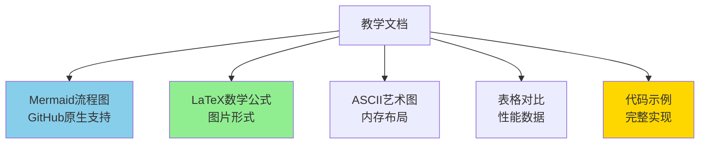
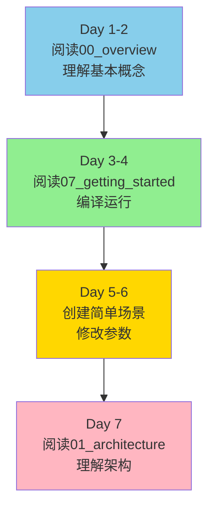
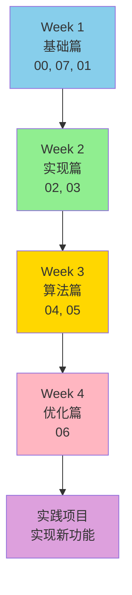
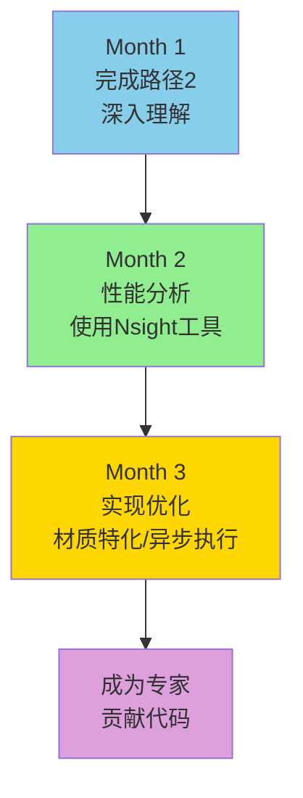
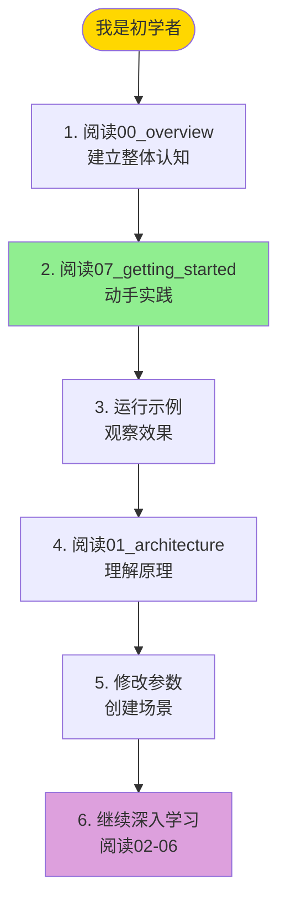
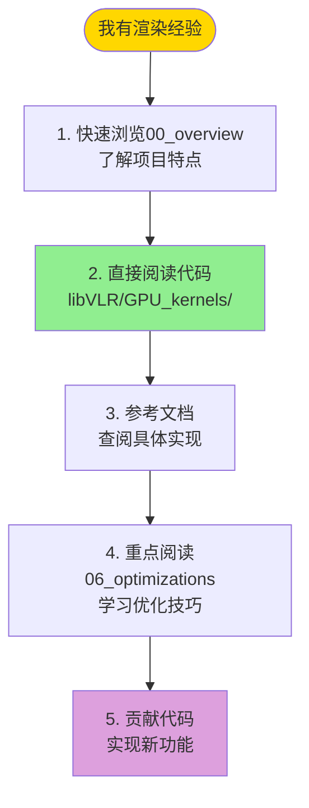
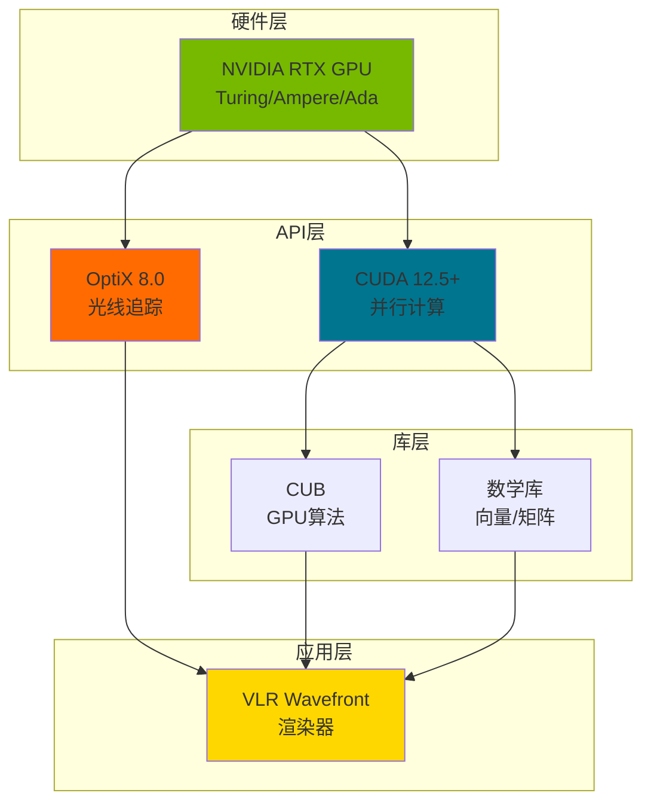

# VLR Wavefront 教学文档

> **面向初学者的离线渲染完整教程**  
> 从基础概念到高级优化，系统学习现代GPU加速的物理渲染技术

---

## 📖 文档导航

### 🎯 快速开始

**如果你是第一次接触离线渲染**，建议按以下顺序阅读：


---

## 📚 文档列表

### 基础篇

#### [00_overview.md](00_overview.md) - 渲染器总览 ⭐

**适合人群**：完全初学者  
**阅读时间**：30分钟  
**难度**：⭐

**内容概要**：
- 什么是离线渲染？
- 什么是路径追踪？
- Wavefront架构概览
- 完整渲染管线流程图
- 核心概念速查
- 学习路径建议

**关键收获**：
- 理解离线渲染的基本概念
- 了解路径追踪的工作原理
- 掌握Wavefront的核心思想
- 建立整体认知框架


---

#### [07_getting_started.md](07_getting_started.md) - 入门教程 ⭐

**适合人群**：想要动手实践的初学者  
**阅读时间**：1-2小时  
**难度**：⭐⭐

**内容概要**：
- 环境搭建（CUDA、OptiX、VS2022）
- 编译项目步骤
- 运行示例程序
- 创建第一个场景
- 常见问题解答
- 调试技巧

**关键收获**：
- 成功编译和运行项目
- 创建自己的简单场景
- 掌握基本API使用
- 解决常见问题

**实践练习**：
1. 编译并运行Cornell Box示例
2. 修改材质颜色
3. 添加新的几何体
4. 调整相机参数

---

### 架构篇

#### [01_wavefront_architecture.md](01_wavefront_architecture.md) - Wavefront架构详解 ⭐⭐

**适合人群**：理解基础概念后的学习者  
**阅读时间**：45分钟  
**难度**：⭐⭐

**内容概要**：
- 递归 vs Wavefront执行模型对比
- 为什么Wavefront更快？
- GPU架构基础（Warp、SM）
- 分支发散问题和解决方案
- 性能分析和实测数据

**关键收获**：
- 深入理解Wavefront的性能优势
- 掌握GPU执行模型
- 理解分支发散的影响
- 学会分析性能瓶颈

**核心图表**：
- 执行模型对比序列图
- GPU占用率变化图
- 性能提升分解饼图

---

#### [02_data_structures.md](02_data_structures.md) - 数据结构详解 ⭐⭐

**适合人群**：准备深入代码的学习者  
**阅读时间**：40分钟  
**难度**：⭐⭐

**内容概要**：
- WavefrontPathState详解（144字节）
- WavefrontHitInfo详解（32字节）
- SurfacePoint详解（128字节）
- 工作队列管理（Ping-Pong模式）
- 内存布局优化（AoS vs SoA）
- 内存对齐原理

**关键收获**：
- 理解每个字段的作用
- 掌握内存布局设计
- 学会队列管理技巧
- 理解对齐的重要性

**核心图表**：
- 数据结构关系图
- 内存布局可视化
- Ping-Pong队列流程图

---

### 实现篇

#### [03_kernel_pipeline.md](03_kernel_pipeline.md) - 内核管线详解 ⭐⭐⭐

**适合人群**：准备修改内核代码的开发者  
**阅读时间**：1小时  
**难度**：⭐⭐⭐

**内容概要**：
- 7个核心内核详细实现
- GenerateRays: 生成相机光线
- TraceRays: OptiX光线追踪
- ProcessHits: 处理命中点
- SampleLights: NEE直接光照
- SampleBSDF: BSDF采样
- CompactPaths: CUB压缩和排序
- Accumulate: 累积结果

**关键收获**：
- 理解每个内核的具体实现
- 掌握OptiX和CUDA的协作
- 学会内核间数据传递
- 理解同步和性能权衡

**核心图表**：
- 完整管线流程图
- 各阶段耗时分布
- 数据依赖关系图

**代码示例**：
- 每个内核的伪代码
- 完整的kernel实现模板
- 主机端调用代码

---

### 算法篇

#### [04_lighting_algorithms.md](04_lighting_algorithms.md) - 光照算法详解 ⭐⭐⭐

**适合人群**：想要理解光照计算的学习者  
**阅读时间**：50分钟  
**难度**：⭐⭐⭐

**内容概要**：
- 渲染方程和蒙特卡洛积分
- Next Event Estimation (NEE)
- Multiple Importance Sampling (MIS)
- 光源采样算法
- 隐式光源采样
- 立体角与面积PDF转换

**关键收获**：
- 理解NEE的数学原理
- 掌握MIS的使用场景
- 学会光源采样技术
- 理解PDF转换

**数学公式**：
- 渲染方程
- NEE完整公式
- MIS Power Heuristic
- 几何项公式

**核心图表**：
- NEE算法流程图
- MIS效果对比
- 光源采样示意图

---

#### [05_bsdf_sampling.md](05_bsdf_sampling.md) - BSDF采样详解 ⭐⭐⭐

**适合人群**：想要实现新材质的开发者  
**阅读时间**：50分钟  
**难度**：⭐⭐⭐

**内容概要**：
- BSDF基础理论
- 重要性采样原理
- Lambert漫反射采样
- 镜面反射采样
- GGX微表面模型
- 玻璃透射和色散
- 吞吐量更新公式

**关键收获**：
- 理解BSDF的物理意义
- 掌握重要性采样技术
- 学会实现各种材质
- 理解能量守恒

**数学公式**：
- BSDF定义
- Lambert BRDF
- GGX NDF/G/F项
- Snell定律和Fresnel方程

**核心图表**：
- BSDF分类树
- 微表面示意图
- 采样流程图

---

### 优化篇

#### [06_optimizations.md](06_optimizations.md) - 优化技术详解 ⭐⭐⭐⭐

**适合人群**：追求极致性能的开发者  
**阅读时间**：1小时  
**难度**：⭐⭐⭐⭐

**内容概要**：
- 优化历程和性能提升分解
- CUB库集成（排序/压缩）
- **内存对齐问题深度解析** ⚠️
- 路径排序优化
- 流压缩优化
- 其他优化技术（`__restrict__`、共享内存）
- 性能调优指南

**关键收获**：
- 理解CUB库的使用
- **掌握内存对齐的关键性** ⚠️
- 学会性能分析工具
- 掌握优化技巧

**核心图表**：
- 优化历程时间线
- 性能提升分解图
- 内存带宽分析

**重点内容**：
- ⚠️ **CUB内存对齐问题**：详细的bug分析和修复过程
- 实测性能数据
- 优化检查清单

---

## 📊 文档特点

### 可视化丰富

所有文档都包含：



### GitHub友好

- ✅ **Mermaid流程图**：GitHub原生渲染
- ✅ **LaTeX公式图片**：使用codecogs服务
- ✅ **ASCII艺术**：纯文本，兼容性好
- ✅ **代码高亮**：支持C++/CUDA语法
- ✅ **表格**：清晰的数据对比

---

## 🎓 学习路径

### 路径1: 快速上手（1周）



**目标**：能够运行和修改示例场景

---

### 路径2: 深入理解（1个月）



**目标**：理解所有核心概念，能够修改内核代码

---

### 路径3: 精通优化（3个月）



**目标**：掌握性能优化技术，能够贡献高质量代码

---

## 📋 文档详情

### 基础篇（必读）

| 文档 | 主题 | 难度 | 时间 | 关键内容 |
|------|------|------|------|---------|
| [00_overview.md](00_overview.md) | 总览 | ⭐ | 30分钟 | 离线渲染基础、路径追踪原理、Wavefront概览 |
| [07_getting_started.md](07_getting_started.md) | 入门 | ⭐⭐ | 1-2小时 | 环境搭建、编译运行、创建场景 |
| [01_wavefront_architecture.md](01_wavefront_architecture.md) | 架构 | ⭐⭐ | 45分钟 | 执行模型、性能优势、GPU基础 |

**完成后你将**：
- ✅ 理解离线渲染的基本概念
- ✅ 成功编译和运行项目
- ✅ 理解Wavefront架构的优势
- ✅ 能够创建简单场景

---

### 实现篇（核心）

| 文档 | 主题 | 难度 | 时间 | 关键内容 |
|------|------|------|------|---------|
| [02_data_structures.md](02_data_structures.md) | 数据结构 | ⭐⭐ | 40分钟 | PathState、HitInfo、队列管理、内存布局 |
| [03_kernel_pipeline.md](03_kernel_pipeline.md) | 内核管线 | ⭐⭐⭐ | 1小时 | 7个内核详细实现、OptiX集成、同步机制 |

**完成后你将**：
- ✅ 理解核心数据结构设计
- ✅ 掌握内存布局优化
- ✅ 理解每个内核的实现细节
- ✅ 能够修改和扩展内核

---

### 算法篇（深入）

| 文档 | 主题 | 难度 | 时间 | 关键内容 |
|------|------|------|------|---------|
| [04_lighting_algorithms.md](04_lighting_algorithms.md) | 光照算法 | ⭐⭐⭐ | 50分钟 | NEE、MIS、光源采样、数学推导 |
| [05_bsdf_sampling.md](05_bsdf_sampling.md) | BSDF采样 | ⭐⭐⭐ | 50分钟 | 重要性采样、Lambert、GGX、玻璃 |

**完成后你将**：
- ✅ 理解光照计算的数学原理
- ✅ 掌握MIS的使用方法
- ✅ 理解BSDF采样算法
- ✅ 能够实现新的材质类型

---

### 优化篇（进阶）

| 文档 | 主题 | 难度 | 时间 | 关键内容 |
|------|------|------|------|---------|
| [06_optimizations.md](06_optimizations.md) | 优化技术 | ⭐⭐⭐⭐ | 1小时 | CUB集成、内存对齐、性能调优、实测数据 |

**完成后你将**：
- ✅ 掌握CUB库的使用
- ✅ 理解内存对齐的关键性
- ✅ 学会使用性能分析工具
- ✅ 能够优化渲染性能

**重点警告**：
- ⚠️ **必读**：内存对齐问题章节
- ⚠️ CUB库要求16字节对齐
- ⚠️ 未对齐会导致崩溃

---

## 🔍 按主题查找

### 我想学习...

#### 基础概念

- **什么是离线渲染？** → [00_overview.md - 离线渲染基础](00_overview.md#什么是离线渲染)
- **什么是路径追踪？** → [00_overview.md - 路径追踪原理](00_overview.md#什么是路径追踪)
- **渲染方程是什么？** → [00_overview.md - 渲染方程](00_overview.md#渲染方程)

#### 架构设计

- **Wavefront为什么更快？** → [01_wavefront_architecture.md - 性能优势](01_wavefront_architecture.md#为什么wavefront更快)
- **GPU如何执行代码？** → [01_wavefront_architecture.md - GPU架构基础](01_wavefront_architecture.md#gpu架构基础)
- **什么是分支发散？** → [01_wavefront_architecture.md - 减少分支发散](01_wavefront_architecture.md#1-减少分支发散warp-divergence)

#### 数据结构

- **PathState包含什么？** → [02_data_structures.md - PathState详解](02_data_structures.md#wavefrontpathstate详解)
- **队列如何管理？** → [02_data_structures.md - 工作队列管理](02_data_structures.md#工作队列管理)
- **为什么需要对齐？** → [02_data_structures.md - 内存对齐](02_data_structures.md#内存对齐)

#### 内核实现

- **如何生成光线？** → [03_kernel_pipeline.md - GenerateRays](03_kernel_pipeline.md#阶段1-generaterays)
- **OptiX如何追踪？** → [03_kernel_pipeline.md - TraceRays](03_kernel_pipeline.md#阶段2-tracerays)
- **如何采样BSDF？** → [03_kernel_pipeline.md - SampleBSDF](03_kernel_pipeline.md#阶段5-samplebsdf)

#### 光照算法

- **什么是NEE？** → [04_lighting_algorithms.md - NEE详解](04_lighting_algorithms.md#next-event-estimation-nee)
- **为什么需要MIS？** → [04_lighting_algorithms.md - MIS详解](04_lighting_algorithms.md#multiple-importance-sampling-mis)
- **如何采样光源？** → [04_lighting_algorithms.md - 光源采样](04_lighting_algorithms.md#光源采样算法)

#### 材质实现

- **如何实现漫反射？** → [05_bsdf_sampling.md - Lambert](05_bsdf_sampling.md#lambert漫反射)
- **如何实现镜面？** → [05_bsdf_sampling.md - 镜面反射](05_bsdf_sampling.md#镜面反射)
- **如何实现玻璃？** → [05_bsdf_sampling.md - 玻璃透射](05_bsdf_sampling.md#玻璃透射)
- **什么是GGX？** → [05_bsdf_sampling.md - GGX](05_bsdf_sampling.md#微表面模型ggx)

#### 性能优化

- **如何使用CUB库？** → [06_optimizations.md - CUB集成](06_optimizations.md#cub库集成)
- **内存对齐问题？** → [06_optimizations.md - 对齐问题](06_optimizations.md#内存对齐问题) ⚠️
- **如何分析性能？** → [06_optimizations.md - 性能分析工具](06_optimizations.md#性能分析工具)
- **如何调优参数？** → [06_optimizations.md - 调优指南](06_optimizations.md#性能调优指南)

#### 实践操作

- **如何编译项目？** → [07_getting_started.md - 编译项目](07_getting_started.md#编译项目)
- **如何创建场景？** → [07_getting_started.md - 创建场景](07_getting_started.md#创建第一个场景)
- **如何调试？** → [07_getting_started.md - 调试技巧](07_getting_started.md#调试技巧)

---

## 💡 学习建议

### 对于初学者



**建议**：
- 不要跳过基础文档
- 边学边实践
- 遇到问题查阅FAQ
- 加入社区讨论

---

### 对于有经验的开发者



**建议**：
- 重点关注Wavefront特有的设计
- 深入研究CUB集成
- 关注性能优化细节
- 考虑贡献新功能

---

## 📈 性能基准

### 快速参考

```
硬件: NVIDIA GeForce RTX 2060 SUPER (8GB)
场景: Cornell Box
分辨率: 512×512
采样数: 1024

性能指标:
┌─────────────────────────────────────┐
│ 渲染时间:    7.992秒                │
│ 吞吐量:      33.6 Msamp/s           │
│ GPU占用率:   88%                    │
│ 内存使用:    96 MB                  │
│ 分支效率:    92%                    │
└─────────────────────────────────────┘

vs 递归路径追踪:
  速度: 2.56倍提升 ✓
  效率: 96%提升 ✓
```

详细数据请参考：[06_optimizations.md - 性能基准](06_optimizations.md#性能基准测试)

---

## 🔧 技术栈



---

## 🎯 核心概念速查

### 架构概念

| 概念 | 说明 | 参考文档 |
|------|------|---------|
| **Wavefront** | 批处理执行模型 | 01_architecture |
| **Warp** | GPU的32线程执行单元 | 01_architecture |
| **分支发散** | Warp内线程执行不同代码 | 01_architecture |
| **流压缩** | 移除终止路径 | 06_optimizations |
| **路径排序** | 按材质分组 | 06_optimizations |

### 数据结构

| 结构 | 大小 | 用途 | 参考文档 |
|------|------|------|---------|
| **PathState** | 144 bytes | 路径状态 | 02_data_structures |
| **HitInfo** | 32 bytes | 命中信息 | 02_data_structures |
| **SurfacePoint** | 128 bytes | 表面属性 | 02_data_structures |
| **WorkQueue** | 可变 | 路径队列 | 02_data_structures |

### 算法概念

| 概念 | 说明 | 参考文档 |
|------|------|---------|
| **NEE** | 显式光源采样 | 04_lighting |
| **MIS** | 多重重要性采样 | 04_lighting |
| **BSDF** | 双向散射分布函数 | 05_bsdf |
| **重要性采样** | 按分布形状采样 | 05_bsdf |

### 优化技术

| 技术 | 提升 | 难度 | 参考文档 |
|------|------|------|---------|
| **Wavefront架构** | +67% | ⭐⭐⭐⭐⭐ | 01_architecture |
| **减少同步** | +49% | ⭐⭐ | 06_optimizations |
| **CUB排序** | +10% | ⭐⭐⭐ | 06_optimizations |
| **CUB压缩** | +5% | ⭐⭐⭐ | 06_optimizations |
| **`__restrict__`** | +7% | ⭐ | 06_optimizations |

---

## 📐 数学公式索引

### 渲染方程

%20=%20L_e(p,%5Comega_o)%20+%20%5Cint_%7B%5COmega%7D%20f_r(p,%5Comega_i,%5Comega_o)%20L_i(p,%5Comega_i)%20%7C%5Ccos%5Ctheta_i%7C%20d%5Comega_i)

**位置**：[00_overview.md](00_overview.md#渲染方程)

### 蒙特卡洛估计

%20L_i(%5Comega_i)%20%7C%5Ccos%5Ctheta_i%7C%7D%7Bp(%5Comega_i)%7D)

**位置**：[00_overview.md](00_overview.md#蒙特卡洛积分)

### MIS权重


**位置**：[04_lighting_algorithms.md](04_lighting_algorithms.md#power-heuristic推荐)

### GGX BRDF


**位置**：[05_bsdf_sampling.md](05_bsdf_sampling.md#ggx-brdf公式)

---

## 🚀 快速链接

### 代码参考

- **主渲染循环**: `libVLR/context.cpp:1180-1379`
- **PathState定义**: `libVLR/shared/path_types.h:50-122`
- **GenerateRays**: `libVLR/GPU_kernels/kernel_launch.cu`
- **TraceRays**: `libVLR/GPU_kernels/trace_rays.cu`
- **SampleLights**: `libVLR/GPU_kernels/sample_lights.cu:77-242`
- **SampleBSDF**: `libVLR/GPU_kernels/sample_bsdf.cu:38-200`
- **CUB集成**: `libVLR/GPU_kernels/compact.cu:96-340`

### 外部资源

- **项目主页**: [GitHub - VLR_WF](https://github.com/trianglestrip/VLR_WF)
- **NVIDIA OptiX**: [https://developer.nvidia.com/optix](https://developer.nvidia.com/optix)
- **CUB文档**: [https://nvlabs.github.io/cub/](https://nvlabs.github.io/cub/)
- **PBRT在线书**: [https://pbr-book.org/](https://pbr-book.org/)

---

## ⚠️ 重要提示

### 必读章节

1. **内存对齐问题** - [06_optimizations.md](06_optimizations.md#内存对齐问题)
   - ⚠️ CUB库要求16字节对齐
   - ⚠️ 未对齐会导致崩溃
   - ⚠️ 使用 `(size + 15) & ~15` 对齐

2. **GPU架构基础** - [01_wavefront_architecture.md](01_wavefront_architecture.md#gpu架构基础)
   - 理解Warp和SM
   - 理解分支发散
   - 理解内存合并

3. **MIS使用** - [04_lighting_algorithms.md](04_lighting_algorithms.md#multiple-importance-sampling-mis)
   - 必须在同一空间比较PDF
   - 需要PDF转换
   - Power Heuristic (β=2)

---

## 📞 获取帮助

### 遇到问题？

1. **查阅FAQ**：每个文档末尾都有"常见问题"章节
2. **搜索Issues**：[GitHub Issues](https://github.com/trianglestrip/VLR_WF/issues)
3. **提问**：[GitHub Discussions](https://github.com/trianglestrip/VLR_WF/discussions)
4. **查看代码**：源码是最好的文档

### 报告Bug

```markdown
## Bug描述
简要描述问题

## 重现步骤
1. 编译项目
2. 运行 cornell_box_improved_test.exe
3. 观察到...

## 预期行为
应该...

## 实际行为
实际...

## 环境信息
- GPU: RTX 2060 SUPER
- CUDA: 12.5
- OptiX: 8.0.0
- OS: Windows 10

## 错误日志
```
[粘贴错误信息]
```
```

---

## 🎉 开始你的旅程

### 推荐起点

**完全新手**：
1. 阅读 [00_overview.md](00_overview.md)
2. 阅读 [07_getting_started.md](07_getting_started.md)
3. 编译并运行示例
4. 创建你的第一个场景

**有经验的开发者**：
1. 快速浏览 [00_overview.md](00_overview.md)
2. 深入阅读 [01_wavefront_architecture.md](01_wavefront_architecture.md)
3. 研究 [03_kernel_pipeline.md](03_kernel_pipeline.md)
4. 重点学习 [06_optimizations.md](06_optimizations.md)

**研究人员**：
1. 阅读所有算法文档（04-05）
2. 研究源码实现
3. 对比PBRT-v4实现
4. 实验新的优化技术

---

## 📊 文档统计

```
文档总数: 8个
总字数: ~50,000字
代码示例: ~100个
流程图: ~40个
数学公式: ~50个
性能数据: ~30组

预计学习时间:
  快速浏览: 2-3小时
  深入学习: 1-2周
  精通掌握: 1-3个月
```

---

## 🔄 文档更新

### 版本历史

- **v1.0** (2026-03-07): 初始版本
  - 完整的8篇教学文档
  - GitHub友好的Mermaid流程图
  - LaTeX公式图片支持
  - 实测性能数据

### 未来计划

- [ ] 添加视频教程
- [ ] 添加交互式示例
- [ ] 翻译为英文版本
- [ ] 添加更多实践案例

---

## 📝 反馈

### 文档有帮助吗？

如果这些文档对你有帮助，请：
- ⭐ 给项目加星
- 📢 分享给朋友
- 💬 留下反馈
- 🤝 贡献改进

### 改进建议

发现错误或有改进建议？
- 提交Issue：[报告问题](https://github.com/trianglestrip/VLR_WF/issues/new)
- 提交PR：[贡献改进](https://github.com/trianglestrip/VLR_WF/pulls)

---

## 🏆 致谢

### 特别感谢

- **NVIDIA**：OptiX和CUB库
- **Matt Pharr团队**：PBRT-v4 Wavefront实现
- **Samuli Laine**：Wavefront论文
- **所有贡献者**：感谢每一位贡献者

### 参考项目

- [PBRT-v4](https://github.com/mmp/pbrt-v4) - Wavefront参考实现
- [OptiX Samples](https://github.com/NVIDIA/OptiX_Apps) - OptiX示例
- [CUB](https://github.com/NVIDIA/cub) - GPU算法库

---

## 📖 推荐阅读顺序

### 完整学习路径

```
第1阶段: 基础入门 (1周)
├─ 00_overview.md           ⭐ 必读
├─ 07_getting_started.md    ⭐ 必读
└─ 01_wavefront_architecture.md  ⭐⭐ 推荐

第2阶段: 实现理解 (1-2周)
├─ 02_data_structures.md    ⭐⭐ 推荐
└─ 03_kernel_pipeline.md    ⭐⭐⭐ 重要

第3阶段: 算法深入 (1-2周)
├─ 04_lighting_algorithms.md  ⭐⭐⭐ 重要
└─ 05_bsdf_sampling.md        ⭐⭐⭐ 重要

第4阶段: 性能优化 (1-2周)
└─ 06_optimizations.md      ⭐⭐⭐⭐ 必读

总计: 4-8周完整学习
```

---

## 🌟 开始学习

准备好了吗？从这里开始：

### 👉 [00_overview.md - 渲染器总览](00_overview.md)

或者直接动手：

### 👉 [07_getting_started.md - 入门教程](07_getting_started.md)

---

**祝你学习愉快！**

如有任何问题，欢迎在GitHub上提问或讨论。

---

**版本**: 1.0  
**更新日期**: 2026-03-07  
**维护者**: VLR开发团队  
**许可证**: MIT License

---

## 📄 其他文档

### 技术文档（docs/）

项目还包含更详细的技术文档：

- **WAVEFRONT_IMPLEMENTATION.md**: 实现细节和代码分析
- **PERFORMANCE_REPORT.md**: 性能优化报告和bug修复
- **wavefront_design.md**: 原始设计文档
- **CONFIGURATION_GUIDE.md**: 完整的配置参数和调优指南 ⭐ 新增

### 配置系统

- **bin/render_config.ini**: 主配置文件（可调整所有性能参数）
- **bin/config_presets/**: 预设配置文件
  - `preview.ini`: 快速预览（~0.2秒）
  - `high_quality.ini`: 高质量渲染（~120秒）
  - `benchmark.ini`: 性能测试（~8秒）
  - `debug.ini`: 调试配置

📖 **配置指南**: [../docs/CONFIGURATION_GUIDE.md](../docs/CONFIGURATION_GUIDE.md)

### 项目README

- **README.md**: 项目主页，包含快速开始和架构概述

---

**开始你的离线渲染之旅！** 🚀
